# Hermes Agent 源码结构分析

## 1. 分析范围

本文基于仓库 `/hermes-agent` 的当前源码结构，对 hermes-agent 做第一阶段结构分析。重点不是逐行解释实现，而是先建立可继续深入阅读的地图：

- 顶层入口与运行方式
- 核心 Agent 调用链
- 工具系统与 toolset 暴露机制
- CLI、TUI、Dashboard、Gateway 分层
- 插件、技能、provider 扩展体系
- 测试目录与后续阅读优先级

## 2. 顶层结构概览

仓库整体是一个 Python Agent 核心加多端 UI、消息网关、插件、技能和工具沙箱的单体项目。顶层关键文件与目录如下：

```text
hermes-agent/
├── run_agent.py          # AIAgent 核心对话循环
├── cli.py                # 传统交互式 CLI
├── model_tools.py        # 工具定义过滤、参数修正、工具分发
├── toolsets.py           # 工具集定义与解析
├── hermes_state.py       # SQLite session store
├── hermes_constants.py   # HERMES_HOME/profile-aware 路径
├── hermes_logging.py     # 日志初始化
├── hermes_cli/           # hermes 命令入口、配置、setup、dashboard server 等
├── agent/                # Agent 内部组件：provider adapter、memory、compression 等
├── tools/                # 工具实现与 registry
├── gateway/              # 多平台消息网关
├── tui_gateway/          # Ink TUI 与 Python Agent 的 JSON-RPC 后端
├── ui-tui/               # Node/React/Ink TUI 前端
├── web/                  # Dashboard React 前端
├── plugins/              # 插件系统
├── skills/               # 默认内置技能
├── optional-skills/      # 可选技能
├── cron/                 # 定时任务
├── acp_adapter/          # ACP server/editor integration
├── tests/                # pytest 测试
└── website/              # Docusaurus 文档站点
```

核心特征：顶层有多个超大协调器文件，外围功能再拆到目录模块中。理解源码时不要平均阅读全部文件，应先抓核心链路。

## 3. Hermes Agent 总体架构图

下面这张图从源码目录视角概括 Hermes Agent 的整体架构。它不是运行时类图，而是帮助阅读源码的“分层地图”：

```mermaid
flowchart TB
    subgraph EntryLayer["入口层"]
        MainCLI["hermes_cli/main.py<br/>hermes 命令入口"]
        ClassicCLI["cli.py<br/>传统交互 CLI"]
        DirectAgent["run_agent.py::main<br/>hermes-agent"]
        GatewayRun["gateway/run.py<br/>多平台消息网关"]
        TuiGateway["tui_gateway/server.py<br/>TUI Python 后端"]
        ACP["acp_adapter/entry.py<br/>编辑器 ACP 集成"]
        Batch["batch_runner.py<br/>批处理入口"]
    end

    subgraph UILayer["交互与展示层"]
        InkTUI["ui-tui/<br/>Ink React TUI"]
        Dashboard["web/ + hermes_cli/web_server.py<br/>Dashboard / PTY bridge"]
        GatewayPlatforms["gateway/platforms/<br/>Telegram / Slack / Discord / ..."]
    end

    subgraph AgentCore["Agent 核心层"]
        AIAgent["run_agent.py::AIAgent"]
        MainLoop["run_conversation()<br/>主对话循环"]
        PromptBuilder["agent/prompt_builder.py<br/>system prompt / context files"]
        ContextEngine["agent/context_engine.py<br/>ContextEngine ABC"]
        Compressor["agent/context_compressor.py<br/>默认上下文压缩"]
        MemoryManager["agent/memory_manager.py<br/>外部 memory 编排"]
        ErrorClassifier["agent/error_classifier.py<br/>错误分类 / fallback 信号"]
        AuxClient["agent/auxiliary_client.py<br/>摘要 / 标题 / 辅助模型"]
    end

    subgraph ModelLayer["模型与 Provider 层"]
        RuntimeProvider["hermes_cli/runtime_provider.py<br/>运行时 provider 解析"]
        ProviderPlugins["plugins/model-providers/<br/>ProviderProfile 插件"]
        Transports["agent/transports/<br/>chat_completions / anthropic / bedrock"]
        Adapters["agent/*_adapter.py<br/>Gemini / Codex / Claude 等适配"]
        LLM["LLM Provider API"]
    end

    subgraph ToolLayer["工具系统层"]
        ModelTools["model_tools.py<br/>schema 暴露 / dispatch"]
        Toolsets["toolsets.py<br/>工具集解析"]
        Registry["tools/registry.py<br/>工具注册中心"]
        ToolFiles["tools/*.py<br/>terminal / file / web / memory / skills / ..."]
        Environments["tools/environments/<br/>local / docker / ssh / modal / ..."]
    end

    subgraph StateLayer["状态与长期上下文层"]
        SessionDB["hermes_state.py<br/>SQLite session store / FTS"]
        Config["hermes_cli/config.py<br/>config.yaml / defaults"]
        Constants["hermes_constants.py<br/>HERMES_HOME / profile-aware paths"]
        Logging["hermes_logging.py<br/>agent.log / errors.log / gateway.log"]
        MemoryFiles["$HERMES_HOME/memories/<br/>MEMORY.md / USER.md"]
        SkillsHome["$HERMES_HOME/skills/<br/>用户技能 / usage sidecar"]
    end

    subgraph ExtensionLayer["扩展系统层"]
        GeneralPlugins["hermes_cli/plugins.py<br/>general plugin hooks/tools"]
        MemoryPlugins["plugins/memory/<br/>memory provider 插件"]
        ContextPlugins["plugins/context_engine/<br/>context engine 插件"]
        ImagePlugins["plugins/image_gen/<br/>图片生成 provider"]
        Skills["skills/ + optional-skills/<br/>内置与可选 skills"]
        Cron["cron/<br/>scheduled jobs"]
        Curator["agent/curator.py<br/>skill lifecycle curator"]
    end

    MainCLI --> ClassicCLI
    MainCLI --> GatewayRun
    MainCLI --> Dashboard
    MainCLI --> Cron
    ClassicCLI --> AIAgent
    DirectAgent --> AIAgent
    GatewayRun --> AIAgent
    TuiGateway --> AIAgent
    ACP --> AIAgent
    Batch --> AIAgent

    InkTUI --> TuiGateway
    Dashboard --> InkTUI
    Dashboard --> TuiGateway
    GatewayPlatforms --> GatewayRun

    AIAgent --> MainLoop
    MainLoop --> PromptBuilder
    MainLoop --> ModelTools
    MainLoop --> ContextEngine
    ContextEngine --> Compressor
    MainLoop --> MemoryManager
    MainLoop --> ErrorClassifier
    MainLoop --> AuxClient

    AIAgent --> RuntimeProvider
    RuntimeProvider --> ProviderPlugins
    RuntimeProvider --> Transports
    Transports --> Adapters
    Adapters --> LLM
    Transports --> LLM

    ModelTools --> Toolsets
    ModelTools --> Registry
    Registry --> ToolFiles
    ToolFiles --> Environments
    MainLoop --> ModelTools

    AIAgent --> SessionDB
    AIAgent --> Config
    Config --> Constants
    AIAgent --> Logging
    MemoryManager --> MemoryFiles
    ToolFiles --> SkillsHome

    GeneralPlugins --> ModelTools
    GeneralPlugins --> AIAgent
    MemoryPlugins --> MemoryManager
    ContextPlugins --> ContextEngine
    ImagePlugins --> ToolFiles
    Skills --> PromptBuilder
    Cron --> AIAgent
    Curator --> SkillsHome
```



从这张图可以看出，Hermes Agent 是一个“核心 Agent + 多入口壳层 + 工具注册系统 + 可插拔 provider/context/memory + SQLite 状态层”的单体架构。阅读源码时优先顺序建议是：

1. 先看入口如何创建 `AIAgent`。
2. 再看 `run_conversation()` 主循环。
3. 再看工具 schema 如何暴露、tool call 如何 dispatch。
4. 然后按主题深入 memory、context、gateway、plugins、skills、curator。

其中 `curator` 是后台技能库维护器，属于自进化/技能生命周期治理链路：即时 self-improvement review 负责把经验沉淀成 memory 或 skill，Curator 负责定期整理 agent 自主创建的 skills，做 stale/archive/reactivate 与 umbrella consolidation。结构总览只需要知道它在扩展与长期上下文治理层的位置，详细机制见 [[phase6_self_evolution_mechanism_analysis]]。

## 4. 项目入口

`pyproject.toml` 中声明了三个主要命令入口：

```toml
[project.scripts]
hermes = "hermes_cli.main:main"
hermes-agent = "run_agent:main"
hermes-acp = "acp_adapter.entry:main"
```

对应含义：

- `hermes`：主 CLI 入口，进入 `hermes_cli/main.py`
- `hermes-agent`：直接运行 Agent，进入 `run_agent.py`
- `hermes-acp`：编辑器集成相关 ACP server，进入 `acp_adapter/entry.py`

`hermes_cli/main.py` 会在非常早的阶段处理 profile、加载 `.env`、桥接配置项到环境变量，然后根据 subcommand 分发到 setup、chat、gateway、dashboard、cron、model、tools 等功能。

## 5. 核心调用链

最重要的运行链路如下：

```text
hermes_cli/main.py / cli.py / gateway/run.py / tui_gateway/server.py
        ↓
run_agent.py::AIAgent
        ↓
AIAgent.run_conversation()
        ↓
模型 API 调用
        ↓
assistant tool_calls
        ↓
AIAgent._execute_tool_calls()
        ↓
model_tools.handle_function_call()
        ↓
tools.registry.dispatch()
        ↓
tools/*.py 具体工具实现
```

其中 `run_agent.py` 是核心。`AIAgent.run_conversation()` 负责：

- 初始化 session 和 system prompt
- 拼接历史消息
- 注入 memory、skills、context files
- 做上下文压缩 preflight
- 调用模型 API
- 解析 assistant 消息和 tool calls
- 顺序或并发执行工具
- 将工具结果写回 messages
- 处理 streaming、fallback、interrupt、retry、trajectory、session DB

工具调用既可以顺序执行，也可以在安全条件满足时并发执行。并发路径会检查工具类型和文件路径重叠，避免明显冲突。

## 6. 工具系统结构

工具系统由三个核心文件共同决定：

```text
tools/registry.py  # 工具注册中心
tools/*.py         # 每个工具模块自注册
model_tools.py     # 对 Agent 暴露工具定义和 dispatch API
toolsets.py        # 控制哪些工具属于哪些工具集
```

### 6.1 tools/registry.py

`tools/registry.py` 是低层注册中心。每个工具文件通过顶层 `registry.register(...)` 声明：

- tool name
- toolset
- schema
- handler
- availability check
- requires_env
- result size limit

自动发现逻辑会扫描 `tools/*.py`，只导入包含顶层 `registry.register(...)` 的模块。

### 6.2 model_tools.py

`model_tools.py` 是 Agent 使用工具系统的公共 API，主要职责：

- `get_tool_definitions(...)`：按 enabled/disabled toolsets 过滤工具 schema
- `coerce_tool_args(...)`：根据 schema 修正字符串参数类型
- `handle_function_call(...)`：调用 registry dispatch，并触发插件 hook
- 缓存工具定义，避免 gateway 长进程重复计算

### 6.3 toolsets.py

`toolsets.py` 决定工具是否暴露给模型。即使某个工具已经在 `tools/*.py` 中注册，如果没有出现在某个 toolset 中，也不会进入 Agent 可见工具列表。

核心默认工具集合 `_HERMES_CORE_TOOLS` 包含 web、terminal、file、vision、browser、tts、todo、memory、session_search、clarify、execute_code、delegate_task、cronjob、send_message、kanban、computer_use 等。

新增核心工具通常需要两步：

1. 新增 `tools/your_tool.py` 并 `registry.register(...)`
2. 在 `toolsets.py` 中加入对应 toolset 或 `_HERMES_CORE_TOOLS`

## 7. Agent 内部模块 agent/

`agent/` 目录承载 `run_agent.py` 之外的 Agent 内部能力：

```text
agent/
├── transports/              # 不同 provider API transport
├── context_compressor.py    # 上下文压缩
├── context_engine.py        # context engine 抽象
├── memory_manager.py        # memory provider 协调
├── memory_provider.py       # memory provider ABC
├── prompt_builder.py        # prompt 构建
├── skill_commands.py        # skill slash command 加载
├── skill_preprocessing.py   # skill 预处理
├── curator.py               # 后台技能库维护器 / skill 生命周期治理
├── credential_pool.py       # 凭证池
├── auxiliary_client.py      # 辅助模型客户端
├── image_routing.py         # 图片能力路由
├── error_classifier.py      # 错误分类
├── rate_limit_tracker.py    # 限流追踪
└── usage_pricing.py         # usage/pricing 估算
```

`agent/transports/` 是模型 API 层抽象，包含 chat completions、anthropic、bedrock、codex 等 transport。provider 插件注册的是 provider profile，实际请求路径会结合这些 transport 和 adapter。

`agent/curator.py` 是自进化链路里的后台技能库维护器。它只治理 agent 自主创建并带有 provenance 标记的 skills，根据使用情况做 `stale`、`archive`、`reactivate`，也可以 fork 后台 review agent 合并过窄或重复的 skills。它不属于主对话循环的实时任务处理路径，详细分析见 [[phase6_self_evolution_mechanism_analysis]]。

## 8. CLI、TUI 与 Dashboard

### 8.1 传统 CLI

传统 CLI 主要在：

- `cli.py`
- `hermes_cli/commands.py`
- `hermes_cli/config.py`
- `hermes_cli/runtime_provider.py`
- `hermes_cli/model_switch.py`

`cli.py` 中 `HermesCLI` 负责交互式输入、slash command、agent 初始化、状态栏、审批 UI、图片附件、background task、manual compression 等。

`hermes_cli/commands.py` 是 slash command 的中央注册表。CLI、Gateway help、Telegram command menu、Slack subcommand、autocomplete 都从同一个 registry 派生，避免命令定义分散。

### 8.2 TUI

TUI 分为 TypeScript 前端和 Python 后端：

```text
ui-tui/src/          # Ink/React TUI
tui_gateway/server.py # Python JSON-RPC 后端
```

流程：

```text
Node Ink UI
  ↕ stdio JSON-RPC
tui_gateway/server.py
  ↕
AIAgent
```

`tui_gateway/server.py` 创建 `AIAgent` 时会解析 runtime provider、模型、reasoning config、toolsets、session DB、checkpoint 等，并把 tool progress、approval、clarify、reasoning、stream delta 回调映射成 TUI 事件。

### 8.3 Dashboard

Dashboard 前端在 `web/`，后端在 `hermes_cli/web_server.py`。

重要架构点：Dashboard 的 `/chat` 不重新实现聊天 UI，而是通过 `hermes_cli/pty_bridge.py` 嵌入真实 `hermes --tui`。React 只做外围界面，例如配置、日志、session、model、plugins、profile、sidebar 状态等。

## 9. Gateway 多平台消息层

`gateway/` 是异步消息平台运行层。核心文件：

- `gateway/run.py`：`GatewayRunner` 主协调器
- `gateway/session.py`：session 管理
- `gateway/platforms/base.py`：平台 adapter 基类
- `gateway/platforms/*.py`：Telegram、Discord、Slack、Feishu、WeCom、Matrix、Signal、Webhook、API Server 等平台实现

典型流程：

```text
平台收到消息
        ↓
PlatformAdapter 生成 MessageEvent
        ↓
GatewayRunner._handle_message()
        ↓
命令/权限/会话/媒体处理
        ↓
GatewayRunner._run_agent()
        ↓
AIAgent.run_conversation()
        ↓
adapter.send_message()
```

Gateway 复杂度主要来自：

- 多平台鉴权和群聊/私聊规则
- session key 映射与恢复
- 媒体下载、图片、语音、TTS
- slash commands
- interrupt、busy session、background task
- gateway restart 和 pending event drain
- Telegram topic/thread 特殊处理

## 10. 插件系统 plugins/

插件目录包含多个扩展面：

```text
plugins/
├── model-providers/   # 模型 provider profile
├── memory/            # memory provider
├── image_gen/         # 图片生成 provider
├── platforms/         # 额外平台 adapter
├── observability/     # tracing/metrics/logging
├── kanban/            # 多 agent kanban
├── spotify/
├── google_meet/
└── disk-cleanup/
```

通用插件由 `hermes_cli/plugins.py` 发现，支持：

- lifecycle hooks
- pre/post tool call hooks
- transform tool result hooks
- register tool
- register CLI subcommand

模型 provider 插件是单独的 lazy discovery 系统，位于 `providers/` 和 `plugins/model-providers/`。memory provider 也有单独抽象，主要通过 `agent/memory_provider.py` 和 `agent/memory_manager.py` 接入。

## 11. 技能系统 skills/ 与 optional-skills/

技能分为默认内置和可选安装：

- `skills/`：默认可加载技能
- `optional-skills/`：重依赖、小众或场景化技能，默认不启用

技能通常以 `SKILL.md` 为核心，包含 frontmatter 和工作流说明。与插件相比，技能更偏 prompt、流程、知识和脚本资源，不一定引入运行时代码。

## 12. 状态、配置与日志

基础设施文件：

- `hermes_constants.py`：profile-aware 的 `get_hermes_home()`、`display_hermes_home()`
- `hermes_logging.py`：`agent.log`、`errors.log`、`gateway.log`
- `hermes_state.py`：SQLite session DB，含 FTS 搜索
- `hermes_cli/config.py`：默认配置、`.env` 变量元信息、配置合并
- `cron/jobs.py`、`cron/scheduler.py`：定时任务

配置加载路径需要特别注意：

- CLI 交互路径使用 `cli.py::load_cli_config()`
- 大多数 CLI 子命令使用 `hermes_cli/config.py::load_config()`
- Gateway runtime 有直接 YAML 读取路径

因此新增配置项时，要确认它在哪条路径中生效，不能只改一个 loader。

## 13. 测试结构

`tests/` 覆盖范围很广，基本按源码目录拆分：

```text
tests/
├── run_agent/       # Agent loop、tool calling、fallback、compression
├── tools/           # 工具实现
├── gateway/         # 多平台网关
├── hermes_cli/      # CLI、配置、provider、dashboard
├── agent/           # Agent 内部组件
├── tui_gateway/     # TUI 后端协议
├── plugins/         # 插件
├── providers/       # provider discovery/profile
├── cron/            # 定时任务
└── integration/     # 外部服务相关集成测试
```

`pyproject.toml` 中默认 pytest 配置：

```toml
testpaths = ["tests"]
addopts = "-m 'not integration' -n auto"
```

说明默认排除 integration，并使用 xdist 并发。

## 14. 第一阶段结论

hermes-agent 的源码结构可以概括为：

```text
超大 Agent/CLI/Gateway 协调器
        +
模块化工具系统
        +
多 UI 前端
        +
插件/技能/provider 扩展层
        +
高覆盖测试体系
```

阅读源码时建议优先按以下顺序深入：

1. `run_agent.py::AIAgent.run_conversation()`：理解主循环。
2. `run_agent.py::_execute_tool_calls*()`：理解工具执行、并发、interrupt。
3. `model_tools.py` + `tools/registry.py` + `toolsets.py`：理解工具如何暴露给模型。
4. `hermes_cli/main.py` + `cli.py::HermesCLI`：理解 CLI 启动与交互路径。
5. `gateway/run.py::GatewayRunner`：理解消息平台如何桥接 Agent。
6. `tui_gateway/server.py` + `ui-tui/src`：理解 TUI 协议与前端状态。
7. `plugins/`、`providers/`、`skills/`：理解扩展机制。
8. `agent/curator.py`：理解 agent 自主创建 skills 的后台生命周期治理，详细见 [[phase6_self_evolution_mechanism_analysis]]。

后续如果继续深入，建议第二篇从 `AIAgent.run_conversation()` 开始，画出一次用户输入到最终响应的完整时序图。
