# 第二阶段：AIAgent 主循环深入分析

## 1. 阅读入口与源码链接

本阶段聚焦 `run_agent.py::AIAgent.run_conversation()`。它是 hermes-agent 一次用户输入从进入 Agent 到返回最终响应的核心执行单元。

源码入口：

- Markdown 相对链接：[run_agent.py:10978](../run_agent.py#L10978)
- Obsidian URI：[打开 run_agent.py](obsidian://open?path=/Users/chenglin.pu/Project/github/hermes-agent/run_agent.py)
- 关键函数：`AIAgent.run_conversation()`，定义起点在 `run_agent.py:10978`

相关函数：

- `AIAgent._build_api_kwargs()`：[run_agent.py:8800](../run_agent.py#L8800)
- `AIAgent._build_assistant_message()`：[run_agent.py:9134](../run_agent.py#L9134)
- `AIAgent._execute_tool_calls()`：[run_agent.py:9799](../run_agent.py#L9799)
- `AIAgent._execute_tool_calls_concurrent()`：[run_agent.py:9951](../run_agent.py#L9951)
- `AIAgent._execute_tool_calls_sequential()`：[run_agent.py:10352](../run_agent.py#L10352)
- `AIAgent._handle_max_iterations()`：[run_agent.py:10784](../run_agent.py#L10784)
- `model_tools.handle_function_call()`：[model_tools.py:679](../model_tools.py#L679)
- `tools.registry.ToolRegistry.dispatch()`：[tools/registry.py](../tools/registry.py)

> Obsidian 说明：Obsidian URI 通常只能直接打开文件，不能稳定跳到源码行。因此本文每个关键段落都保留 `文件名:行号`，在 Obsidian 内打开源码后可用搜索或编辑器跳转定位。

## 2. 主循环整体定位

### 2.1 概念边界：主循环处理的是一次用户请求

先区分几个容易混用的词：

| 概念 | 在 Hermes 源码里的含义 |
| --- | --- |
| `session` | 一段持续会话，包含多次用户输入、多次 turn，最终持久化到 session DB/log |
| `turn` | 用户发出一条消息后，Agent 从接收到返回最终响应的完整处理轮次 |
| `run_conversation()` | Hermes 对单个 turn 的执行入口；名字叫 conversation，但语义更接近“处理当前这条用户请求” |
| 主循环 / tool-calling loop | 一个 turn 内部的 `LLM -> tool -> LLM -> ... -> final_response` 循环 |
| iteration / API call | 主循环内部的一次模型调用尝试；一次 turn 里可以有很多 iteration |
| tool call | 某次 iteration 中模型要求执行的工具调用 |

因此，本阶段说的 **AIAgent 主循环** 不是整个聊天 session 的外层无限循环，而是一次用户请求内部的 Agent 执行循环：

```text
Session
  ├─ 用户请求 1
  │   └─ run_conversation()
  │       └─ 主循环：LLM -> Tool -> LLM -> Final
  ├─ 用户请求 2
  │   └─ run_conversation()
  │       └─ 主循环：LLM -> Final
  └─ 用户请求 3
      └─ run_conversation()
          └─ 主循环：LLM -> Tool -> Tool -> LLM -> Final
```

换句话说：

```text
一个 session 可以包含很多 turn；
一个 turn 对应一次用户请求；
一次 run_conversation() 处理一个 turn；
主循环是在这个 turn 内部反复调用模型和工具，直到得到 final_response。
```

这也是为什么 `agent.max_turns` 这个配置名容易误导：它不是限制整个 session 最多聊多少轮，而是限制**单次用户请求内部最多多少次 tool-calling iteration**。源码中它最终会传成 `AIAgent(max_iterations=self.max_turns)`。

### 2.2 执行结构

`run_conversation()` 不是单纯的 “while 调模型直到没有工具调用”。它实际包含三层循环/恢复结构：

```text
run_conversation()
├── turn 初始化阶段
│   ├── session/log/context 初始化
│   ├── user message 入队
│   ├── system prompt 构建或复用
│   ├── preflight context compression
│   ├── plugin pre_llm_call
│   └── memory provider prefetch
│
├── 外层 tool-calling loop
│   ├── iteration budget 检查
│   ├── api_messages 构建
│   ├── 内层 API retry/fallback loop
│   ├── response normalize
│   ├── if assistant.tool_calls: 执行工具并 continue
│   └── else: 进入最终响应分支并 break
│
└── turn 收尾阶段
    ├── max-iteration summary fallback
    ├── trajectory/session persist
    ├── transform_llm_output/post_llm_call hooks
    ├── memory sync/background review
    └── 返回 result dict
```

主循环本体从 `run_agent.py:11317` 开始，外层循环条件在 `run_agent.py:11367`。

## 3. 关键源码摘录

### 3.1 初始化主循环状态

位置：[run_agent.py:11317](../run_agent.py#L11317)

```python
# Main conversation loop
api_call_count = 0
final_response = None
interrupted = False
codex_ack_continuations = 0
length_continue_retries = 0
truncated_tool_call_retries = 0
truncated_response_prefix = ""
compression_attempts = 0
_turn_exit_reason = "unknown"  # Diagnostic: why the loop ended

# Record the execution thread so interrupt()/clear_interrupt() can
# scope the tool-level interrupt signal to THIS agent's thread only.
self._execution_thread_id = threading.current_thread().ident
```

这里能看到主循环不仅追踪 API 次数，还追踪：

- `final_response`：是否已经得到最终答案
- `interrupted`：用户或外部事件是否中断
- `codex_ack_continuations`：Codex Responses 中间确认继续次数
- `length_continue_retries`：输出被截断后的续写次数
- `truncated_tool_call_retries`：工具调用参数被截断后的重试次数
- `compression_attempts`：上下文压缩恢复次数
- `_turn_exit_reason`：收尾诊断用，解释本轮为什么结束

### 3.2 外层 loop 条件

位置：[run_agent.py:11367](../run_agent.py#L11367)

```python
while (api_call_count < self.max_iterations and self.iteration_budget.remaining > 0) or self._budget_grace_call:
    # Reset per-turn checkpoint dedup so each iteration can take one snapshot
    self._checkpoint_mgr.new_turn()

    # Check for interrupt request (e.g., user sent new message)
    if self._interrupt_requested:
        interrupted = True
        _turn_exit_reason = "interrupted_by_user"
        if not self.quiet_mode:
            self._safe_print("\n⚡ Breaking out of tool loop due to interrupt...")
        break

    api_call_count += 1
    self._api_call_count = api_call_count
    self._touch_activity(f"starting API call #{api_call_count}")
```

外层循环退出条件有三种主要来源：

1. `api_call_count >= self.max_iterations`
2. `self.iteration_budget.remaining <= 0`
3. `self._interrupt_requested`

还有一个特殊路径：`self._budget_grace_call`。这允许预算耗尽后给模型一次额外机会总结或收束。

### 3.2.1 `max_iterations` 与 `iteration_budget` 的配置来源

`max_iterations` 是主循环的显式上限；`iteration_budget` 是运行期预算对象，默认由 `max_iterations` 派生，不是独立的用户配置项。

```text
用户配置 agent.max_turns / --max-turns
    -> CLI/Gateway 解析成 max_iterations
    -> AIAgent(max_iterations=...)
    -> IterationBudget(max_iterations)
    -> while 条件同时检查 api_call_count 与 iteration_budget.remaining
```

#### AIAgent 默认值

源码位置：[run_agent.py:1062](../run_agent.py#L1062)、[run_agent.py:1168](../run_agent.py#L1168)

```python
# run_agent.py:1062
def __init__(
    self,
    ...
    max_iterations: int = 90,
    ...
    iteration_budget: "IterationBudget" = None,
):
    ...
    self.max_iterations = max_iterations
    self.iteration_budget = iteration_budget or IterationBudget(max_iterations)
```

每个 turn 开始时会重置预算：

```python
# run_agent.py:11094
self.iteration_budget = IterationBudget(self.max_iterations)
```

也就是说，如果调用方没有显式传 `iteration_budget`，它就是 `max_iterations` 的运行期计数器。

#### CLI 主 Agent：`agent.max_turns`

源码位置：[hermes_cli/config.py:402](../hermes_cli/config.py#L402)、[cli.py:2372](../cli.py#L2372)、[cli.py:3984](../cli.py#L3984)

默认配置：

```python
# hermes_cli/config.py:402
"agent": {
    "max_turns": 90,
}
```

CLI 解析优先级：

```python
# cli.py:2372
# Max turns priority: CLI arg > config file > env var > default
if max_turns is not None:
    self.max_turns = max_turns
elif CLI_CONFIG["agent"].get("max_turns"):
    self.max_turns = CLI_CONFIG["agent"]["max_turns"]
elif os.getenv("HERMES_MAX_ITERATIONS"):
    self.max_turns = int(os.getenv("HERMES_MAX_ITERATIONS", ""))
else:
    self.max_turns = 90
```

最终传给 `AIAgent`：

```python
# cli.py:3984
self.agent = AIAgent(
    ...
    max_iterations=self.max_turns,
)
```

命令行参数是：

```python
# hermes_cli/_parser.py:320
chat_parser.add_argument(
    "--max-turns",
    type=int,
    default=None,
    metavar="N",
    help="Maximum tool-calling iterations per conversation turn ...",
)
```

因此 CLI 主 Agent 的配置方式是：

```yaml
agent:
  max_turns: 90
```

或临时使用：

```bash
hermes chat --max-turns 120
```

#### Gateway 主 Agent：`agent.max_turns` bridge 到 `HERMES_MAX_ITERATIONS`

源码位置：[gateway/run.py:324](../gateway/run.py#L324)、[gateway/run.py:9505](../gateway/run.py#L9505)

Gateway 启动时会把 `config.yaml` 的 `agent.max_turns` 桥接到环境变量：

```python
# gateway/run.py:324
agent_cfg = cfg.get("agent", {})
if isinstance(agent_cfg, dict) and "max_turns" in agent_cfg:
    os.environ["HERMES_MAX_ITERATIONS"] = str(agent_cfg["max_turns"])
```

创建 Agent 时再读取：

```python
# gateway/run.py:9505
max_iterations = int(os.getenv("HERMES_MAX_ITERATIONS", "90"))
agent = AIAgent(
    ...
    max_iterations=max_iterations,
)
```

所以 Gateway 的用户配置仍然是：

```yaml
agent:
  max_turns: 90
```

`HERMES_MAX_ITERATIONS` 是兼容和桥接路径，不是推荐的长期配置入口。

#### 子 Agent：`delegation.max_iterations`

源码位置：[hermes_cli/config.py:1007](../hermes_cli/config.py#L1007)、[tools/delegate_tool.py:1928](../tools/delegate_tool.py#L1928)

delegation 子 Agent 不使用父 Agent 的 `agent.max_turns`，而是有自己的配置：

```python
# hermes_cli/config.py:1007
"delegation": {
    "max_iterations": 50,
}
```

`delegate_task` 会使用 config 中的值，并忽略模型通过工具参数传入的 `max_iterations`：

```python
# tools/delegate_tool.py:1928
default_max_iter = cfg.get("max_iterations", DEFAULT_MAX_ITERATIONS)
# Model-supplied max_iterations is ignored — the config value is authoritative
effective_max_iter = default_max_iter
```

因此子 Agent 配置方式是：

```yaml
delegation:
  max_iterations: 50
```

#### 配置关系总结

| 对象 | 配置入口 | 默认值 | 是否单独配置 `iteration_budget` |
| --- | --- | ---: | --- |
| CLI 主 Agent | `agent.max_turns` 或 `--max-turns` | `90` | 否，由 `max_iterations` 创建 |
| Gateway 主 Agent | `agent.max_turns`，启动时桥接到 `HERMES_MAX_ITERATIONS` | `90` | 否，由 `max_iterations` 创建 |
| Delegation 子 Agent | `delegation.max_iterations` | `50` | 否，由子 Agent 的 `max_iterations` 创建 |

### 3.3 每次 API 调用前构建请求消息

位置：[run_agent.py:11478](../run_agent.py#L11478)

核心动作：

- 修复损坏的 tool call arguments
- 修复 message role alternation
- 构建 `api_messages`
- 将 memory prefetch 和 plugin context 注入当前 user message
- 将 reasoning 字段转成 provider 可接受字段
- 加 system prompt
- 加 prefill messages
- 应用 Anthropic prompt caching
- 清理 orphan tool results / thinking-only assistant turns
- 归一化 whitespace 和 tool-call JSON

关键源码：

```python
api_messages = []
for idx, msg in enumerate(messages):
    api_msg = msg.copy()

    # Inject ephemeral context into the current turn's user message.
    if idx == current_turn_user_idx and msg.get("role") == "user":
        _injections = []
        if _ext_prefetch_cache:
            _fenced = build_memory_context_block(_ext_prefetch_cache)
            if _fenced:
                _injections.append(_fenced)
        if _plugin_user_context:
            _injections.append(_plugin_user_context)
        if _injections:
            _base = api_msg.get("content", "")
            if isinstance(_base, str):
                api_msg["content"] = _base + "\n\n" + "\n\n".join(_injections)

    self._copy_reasoning_content_for_api(msg, api_msg)
    if "reasoning" in api_msg:
        api_msg.pop("reasoning")
    ...
    api_messages.append(api_msg)

effective_system = active_system_prompt or ""
if self.ephemeral_system_prompt:
    effective_system = (effective_system + "\n\n" + self.ephemeral_system_prompt).strip()
if effective_system:
    api_messages = [{"role": "system", "content": effective_system}] + api_messages
```

关键点：`messages` 是持久化历史，`api_messages` 是本次 API 调用副本。memory/plugin 注入是 API-call-time only，不直接污染持久历史。

### 3.4 API kwargs 构建按 api_mode 分派

位置：[run_agent.py:8800](../run_agent.py#L8800)

```python
def _build_api_kwargs(self, api_messages: list) -> dict:
    """Build the keyword arguments dict for the active API mode."""
    if self.api_mode == "anthropic_messages":
        _transport = self._get_transport()
        anthropic_messages = self._prepare_anthropic_messages_for_api(api_messages)
        ...
        return _transport.build_kwargs(...)

    if self.api_mode == "bedrock_converse":
        _bt = self._get_transport()
        return _bt.build_kwargs(...)

    if self.api_mode == "codex_responses":
        _ct = self._get_transport()
        ...
        return _ct.build_kwargs(...)

    # chat_completions default
    _ct = self._get_transport()
    ...
    return _ct.build_kwargs(...)
```

这说明主循环本身尽量不直接拼 provider-specific payload，而是通过 transport/profile 分发：

- `anthropic_messages`
- `bedrock_converse`
- `codex_responses`
- 默认 `chat_completions`

默认 chat completions 分支又会优先使用 provider profile；没有 profile 时才走 legacy flag path。

### 3.5 内层 API retry/fallback loop

位置：[run_agent.py:11699](../run_agent.py#L11699)、[run_agent.py:11747](../run_agent.py#L11747)

```python
while retry_count < max_retries:
    try:
        self._reset_stream_delivery_tracking()
        api_kwargs = self._build_api_kwargs(api_messages)
        if self._force_ascii_payload:
            _sanitize_structure_non_ascii(api_kwargs)
        if self.api_mode == "codex_responses":
            api_kwargs = self._get_transport().preflight_kwargs(api_kwargs, allow_stream=False)

        ...

        _use_streaming = True
        if getattr(self, "_disable_streaming", False):
            _use_streaming = False
        elif self.provider == "copilot-acp" or ...:
            _use_streaming = False
        elif not self._has_stream_consumers():
            from unittest.mock import Mock
            if isinstance(getattr(self, "client", None), Mock):
                _use_streaming = False

        if _use_streaming:
            response = self._interruptible_streaming_api_call(
                api_kwargs, on_first_delta=_stop_spinner
            )
        else:
            response = self._interruptible_api_call(api_kwargs)

        api_duration = time.time() - api_start_time
```

内层 retry loop 负责处理：

- malformed/empty response
- streaming fallback
- auth refresh
- credential pool rotation
- rate limit / retry-after
- context overflow
- payload too large
- image rejection
- image too large shrink
- fallback provider activation
- retry backoff 中断

主循环默认偏向 streaming，即使没有 UI/TTS consumer，也用 streaming 获得健康检查能力，避免 provider SSE 连接挂住。

### 3.6 response normalize

位置：[run_agent.py:13603](../run_agent.py#L13603)

```python
_transport = self._get_transport()
_normalize_kwargs = {}
if self.api_mode == "anthropic_messages":
    _normalize_kwargs["strip_tool_prefix"] = self._is_anthropic_oauth
normalized = _transport.normalize_response(response, **_normalize_kwargs)
assistant_message = normalized
finish_reason = normalized.finish_reason

# Normalize content to string
if assistant_message.content is not None and not isinstance(assistant_message.content, str):
    raw = assistant_message.content
    if isinstance(raw, dict):
        assistant_message.content = raw.get("text", "") or raw.get("content", "") or json.dumps(raw)
    elif isinstance(raw, list):
        ...
    else:
        assistant_message.content = str(raw)
```

模型响应先被 transport 归一化为统一的 `assistant_message`，再进入统一分支：

```text
if assistant_message.tool_calls:
    工具调用路径
else:
    最终文本路径
```

## 4. 工具调用路径

### 4.1 tool_calls 分支入口

位置：[run_agent.py:13779](../run_agent.py#L13779)

```python
if assistant_message.tool_calls:
    if not self.quiet_mode:
        self._vprint(f"{self.log_prefix}🔧 Processing {len(assistant_message.tool_calls)} tool call(s)...")

    # Validate tool call names - detect model hallucinations
    # Repair mismatched tool names before validating
    for tc in assistant_message.tool_calls:
        if tc.function.name not in self.valid_tool_names:
            repaired = self._repair_tool_call(tc.function.name)
            if repaired:
                print(f"{self.log_prefix}🔧 Auto-repaired tool name: '{tc.function.name}' -> '{repaired}'")
                tc.function.name = repaired
```

这里先处理 tool name hallucination。可修复则修复，不可修复则给模型注入 tool error，让模型下一轮自我修正。

### 4.2 工具参数 JSON 校验

位置：[run_agent.py:13840](../run_agent.py#L13840)

```python
invalid_json_args = []
for tc in assistant_message.tool_calls:
    args = tc.function.arguments
    if isinstance(args, (dict, list)):
        tc.function.arguments = json.dumps(args)
        continue
    if args is not None and not isinstance(args, str):
        tc.function.arguments = str(args)
        args = tc.function.arguments
    if not args or not args.strip():
        tc.function.arguments = "{}"
        continue
    try:
        json.loads(args)
    except json.JSONDecodeError as e:
        invalid_json_args.append((tc.function.name, str(e)))
```

空参数会被规范成 `{}`。JSON 错误分两类：

- 像截断：拒绝执行，返回 partial
- 非截断格式错误：最多重试，之后注入 tool error results 给模型修复

### 4.3 执行工具并继续外层循环

位置：[run_agent.py:13996](../run_agent.py#L13996)、[run_agent.py:14011](../run_agent.py#L14011)

```python
messages.append(assistant_msg)
self._emit_interim_assistant_message(assistant_msg)

if self.stream_delta_callback:
    try:
        self.stream_delta_callback(None)
    except Exception:
        pass

self._execute_tool_calls(assistant_message, messages, effective_task_id, api_call_count)
...
# Continue loop for next response
continue
```

工具执行完成后不会直接返回用户，而是把 tool result 追加到 `messages`，然后 `continue` 外层 loop，让模型读取工具结果并决定下一步。

### 4.4 工具执行调度

位置：[run_agent.py:9799](../run_agent.py#L9799)

```python
def _execute_tool_calls(self, assistant_message, messages: list, effective_task_id: str, api_call_count: int = 0) -> None:
    """Execute tool calls from the assistant message and append results to messages.

    Dispatches to concurrent execution only for batches that look
    independent: read-only tools may always share the parallel path, while
    file reads/writes may do so only when their target paths do not overlap.
    """
    tool_calls = assistant_message.tool_calls

    self._executing_tools = True
    try:
        if not _should_parallelize_tool_batch(tool_calls):
            return self._execute_tool_calls_sequential(
                assistant_message, messages, effective_task_id, api_call_count
            )

        return self._execute_tool_calls_concurrent(
            assistant_message, messages, effective_task_id, api_call_count
        )
    finally:
        self._executing_tools = False
```

工具执行有两个路径：

- sequential：单工具、交互型工具、存在冲突风险的工具
- concurrent：可安全并行的工具批次

最终所有工具结果都会按 OpenAI tool result 格式追加到 `messages`。

## 5. 最终响应路径

### 5.1 no tool_calls 分支入口

位置：[run_agent.py:14093](../run_agent.py#L14093)

```python
else:
    # No tool calls - this is the final response
    final_response = assistant_message.content or ""

    self._mute_post_response = False

    # Check if response only has think block with no actual content after it
    if not self._has_content_after_think_block(final_response):
        ...
```

没有工具调用时，并不一定立即完成。代码还会处理多种异常响应：

- partial stream recovery
- 上一轮 content + housekeeping tool 的 fallback
- tool 后 empty response nudge
- thinking-only prefill continuation
- empty response retry
- empty response fallback provider
- empty terminal sentinel

### 5.2 成功文本响应

位置：[run_agent.py:14399](../run_agent.py#L14399)

```python
final_response = self._strip_think_blocks(final_response).strip()

final_msg = self._build_assistant_message(assistant_message, finish_reason)

while (
    messages
    and isinstance(messages[-1], dict)
    and (
        messages[-1].get("_thinking_prefill")
        or messages[-1].get("_empty_recovery_synthetic")
        or messages[-1].get("_empty_terminal_sentinel")
    )
):
    messages.pop()

messages.append(final_msg)

_turn_exit_reason = f"text_response(finish_reason={finish_reason})"
if not self.quiet_mode:
    self._safe_print(f"🎉 Conversation completed after {api_call_count} OpenAI-compatible API call(s)")
break
```

成功最终响应前会清理私有恢复脚手架，避免后续 session resume 时把 recovery synthetic message 当成真实对话历史。

## 6. 收尾阶段

位置：[run_agent.py:14476](../run_agent.py#L14476)

```python
if final_response is None and (
    api_call_count >= self.max_iterations
    or self.iteration_budget.remaining <= 0
):
    _turn_exit_reason = f"max_iterations_reached({api_call_count}/{self.max_iterations})"
    self._emit_status(
        f"⚠️ Iteration budget exhausted ({api_call_count}/{self.max_iterations}) "
        "— asking model to summarise"
    )
    final_response = self._handle_max_iterations(messages, api_call_count)

completed = final_response is not None and api_call_count < self.max_iterations

self._save_trajectory(messages, _summarize_user_message_for_log(user_message), completed)
self._cleanup_task_resources(effective_task_id)
self._drop_trailing_empty_response_scaffolding(messages)
self._persist_session(messages, conversation_history)
```

主循环收尾并不是只返回文本，还会：

- max iteration 时请求一次 toolless summary
- 保存 trajectory
- 清理 task 资源，例如 VM/browser
- 清理 empty-response recovery scaffold
- 持久化 session 到 JSON log 和 SQLite
- 记录 turn exit diagnostic
- 运行 `transform_llm_output`
- 运行 `post_llm_call`
- 提取当前 turn 的 last reasoning
- 同步 external memory
- 触发后台 memory/skill review
- 运行 `on_session_end`

最终返回结果在 `run_agent.py:14614`：

```python
result = {
    "final_response": final_response,
    "last_reasoning": last_reasoning,
    "messages": messages,
    "api_calls": api_call_count,
    "completed": completed,
    "turn_exit_reason": _turn_exit_reason,
    "partial": False,
    "interrupted": interrupted,
    "response_previewed": getattr(self, "_response_was_previewed", False),
    "model": self.model,
    "provider": self.provider,
    "base_url": self.base_url,
    ...
}
```

## 7. 完整时序图

```mermaid
sequenceDiagram
    autonumber
    actor User as User
    participant Surface as CLI/TUI/Gateway
    participant Agent as AIAgent.run_conversation
    participant DB as SessionDB/Logs
    participant Memory as MemoryManager
    participant Plugins as Plugin Hooks
    participant Compressor as ContextCompressor
    participant Transport as ProviderTransport
    participant LLM as Model Provider
    participant ToolExec as Tool Executor
    participant Registry as tools.registry
    participant Tool as Concrete Tool

    User->>Surface: 输入消息
    Surface->>Agent: run_conversation(user_message, history, callbacks)

    Agent->>DB: _ensure_db_session(), set_session_context()
    Agent->>Agent: sanitize user input, reset retry counters
    Agent->>Agent: create effective_task_id
    Agent->>Agent: messages = conversation_history + user message

    Agent->>DB: 读取或复用 cached system prompt
    alt 新 session
        Agent->>Agent: _build_system_prompt()
        Agent->>Plugins: on_session_start
        Agent->>DB: update_system_prompt()
    else 继续 session
        DB-->>Agent: stored system_prompt
    end

    opt preflight context too large
        Agent->>Compressor: estimate_request_tokens_rough()
        Agent->>Compressor: _compress_context()
        Compressor-->>Agent: compressed messages + active_system_prompt
        Agent->>Agent: conversation_history = None
    end

    Agent->>Plugins: pre_llm_call()
    Plugins-->>Agent: ephemeral user context
    Agent->>Memory: on_turn_start()
    Agent->>Memory: prefetch_all(original_user_message)
    Memory-->>Agent: external memory context

    loop 外层 tool-calling loop: max_iterations + iteration_budget
        Agent->>Agent: checkpoint new_turn(), interrupt check
        Agent->>Agent: consume iteration budget
        Agent->>Surface: step_callback(api_call_count, previous tools)
        Agent->>Agent: drain pending /steer into latest tool result

        Agent->>Agent: build api_messages copy
        Agent->>Agent: inject memory/plugin context into current user msg
        Agent->>Agent: copy reasoning_content, strip internal fields
        Agent->>Agent: prepend system prompt and prefill messages
        Agent->>Agent: apply prompt cache, sanitize role/tool sequence

        loop 内层 API retry/fallback loop
            Agent->>Transport: _build_api_kwargs(api_messages)
            Agent->>Plugins: pre_api_request()
            alt streaming path
                Agent->>LLM: _interruptible_streaming_api_call(api_kwargs)
            else non-streaming path
                Agent->>LLM: _interruptible_api_call(api_kwargs)
            end
            LLM-->>Agent: raw response or error

            alt API success
                Agent->>Transport: validate/normalize_response()
                Transport-->>Agent: assistant_message + finish_reason
                Agent->>Plugins: post_api_request()
                Agent->>Agent: retry loop exits with successful response
            else retryable/provider error
                Agent->>Agent: classify_api_error()
                alt credential pool can recover
                    Agent->>Agent: rotate credential/client
                else context/payload too large
                    Agent->>Compressor: _compress_context()
                    Compressor-->>Agent: compressed messages
                    Agent->>Agent: refund iteration and restart outer API attempt
                    Agent->>Agent: mark compressed restart
                else fallback available
                    Agent->>Agent: _try_activate_fallback()
                else retry allowed
                    Agent->>Agent: jittered_backoff / Retry-After
                else exhausted
                    Agent->>DB: _persist_session()
                    Agent-->>Surface: failed result
                end
            else interrupted
                Agent->>DB: _persist_session()
                Agent-->>Surface: interrupted result
            end
        end

        alt restart after compression/continuation
            Agent->>Agent: decrement api_call_count, refund budget, continue
        else no successful response
            Agent->>DB: _persist_session()
            Agent->>Agent: exit outer loop
        end

        alt assistant_message has tool_calls
            Agent->>Agent: repair/validate tool names
            Agent->>Agent: validate JSON arguments
            Agent->>Agent: _build_assistant_message()
            Agent->>DB: append interim assistant message
            Agent->>ToolExec: _execute_tool_calls()

            alt safe parallel batch
                ToolExec->>ToolExec: _execute_tool_calls_concurrent()
            else sequential/interacting/risky batch
                ToolExec->>ToolExec: _execute_tool_calls_sequential()
            end

            loop each tool call
                ToolExec->>Registry: handle_function_call()/registry.dispatch()
                Registry->>Tool: handler(args, task_id, ...)
                Tool-->>Registry: JSON string result
                Registry-->>ToolExec: result
                ToolExec->>Agent: append role=tool message
            end

            opt context now above threshold
                Agent->>Compressor: _compress_context()
                Compressor-->>Agent: compressed messages
            end

            Agent->>DB: _save_session_log(messages)
            Agent->>Agent: continue outer loop so model reads tool results
        else no tool_calls
            Agent->>Agent: final_response = assistant content
            alt empty/thinking-only/tool-followup edge case
                Agent->>Agent: partial stream recovery OR nudge OR prefill OR retry OR fallback
                Agent->>Agent: continue outer loop when recoverable
            else usable final text
                Agent->>Agent: strip think blocks
                Agent->>Agent: remove private recovery scaffolding
                Agent->>Agent: append final assistant message
                Agent->>Agent: break outer loop
            end
        end
    end

    alt final_response missing due to max iterations/budget
        Agent->>LLM: _handle_max_iterations() with tools stripped
        LLM-->>Agent: summary final_response
    end

    Agent->>DB: _save_trajectory()
    Agent->>Agent: _cleanup_task_resources()
    Agent->>DB: _persist_session()
    Agent->>Plugins: transform_llm_output()
    Agent->>Plugins: post_llm_call()
    Agent->>Memory: _sync_external_memory_for_turn()

    opt memory/skill nudge triggered
        Agent->>Agent: _spawn_background_review()
    end

    Agent->>Plugins: on_session_end()
    Agent-->>Surface: result dict
    Surface-->>User: final_response / status / tool progress
```



## 8. 主循环伪代码

下面是去掉大量恢复细节后的核心伪代码：

```python
def run_conversation(user_message, history):
    setup_session_logging_context()
    reset_turn_counters()
    messages = copy(history)
    messages.append({"role": "user", "content": user_message})

    active_system_prompt = load_or_build_system_prompt()
    messages = preflight_compress_if_needed(messages)

    plugin_context = invoke_pre_llm_call()
    memory_context = memory_manager.prefetch_all(user_message)

    api_call_count = 0
    final_response = None

    while within_iteration_budget_or_grace_call():
        if interrupted:
            break

        api_call_count += 1
        consume_iteration_budget()

        api_messages = build_api_messages(
            messages,
            active_system_prompt,
            plugin_context,
            memory_context,
            prefill_messages,
        )

        response = call_model_with_retry_fallback_and_compression(api_messages)
        if response is None:
            break

        assistant_message = transport.normalize_response(response)

        if assistant_message.tool_calls:
            validate_and_repair_tool_calls(assistant_message)
            messages.append(build_assistant_message(assistant_message))
            execute_tool_calls_and_append_tool_results(messages)
            maybe_compress_after_tool_results(messages)
            save_incremental_session_log(messages)
            continue

        final_response = recover_or_accept_final_text(assistant_message, messages)
        if final_response_is_recoverable_empty_case:
            continue
        messages.append(build_final_assistant_message(assistant_message))
        break

    if final_response is None and budget_exhausted:
        final_response = handle_max_iterations_summary(messages)

    cleanup_task_resources()
    persist_session(messages)
    run_post_llm_hooks()
    sync_memory()
    maybe_spawn_background_review()
    return result
```

## 9. 关键状态变量说明

| 变量 | 作用 |
| --- | --- |
| `messages` | 持久化对话历史，最终写入 session DB/log |
| `api_messages` | 每次 API 调用的临时副本，可注入 memory/plugin/system/prefill |
| `active_system_prompt` | 当前 turn 使用的 system prompt，压缩后可能更新 |
| `api_call_count` | 外层 loop 的 API 调用计数 |
| `max_iterations` | 当前 Agent 的 API/tool-calling loop 上限；主 Agent 来自 `agent.max_turns`，子 Agent 来自 `delegation.max_iterations` |
| `iteration_budget` | 当前 turn 的运行期预算计数器，默认 `IterationBudget(self.max_iterations)`，防止工具调用无限循环 |
| `_budget_grace_call` | 预算耗尽后的 one-shot 宽限模型调用，用于让模型总结工具结果 |
| `final_response` | 最终返回给调用方的文本 |
| `interrupted` | 是否被用户或平台中断 |
| `_turn_exit_reason` | 本轮结束原因，用于日志和结果诊断 |
| `_last_content_with_tools` | assistant 同时返回 content + housekeeping tools 时的 fallback 文本 |
| `_thinking_prefill_retries` | thinking-only response 的 continuation 计数 |
| `_empty_content_retries` | 空响应重试计数 |
| `compression_attempts` | context/payload 过大后的压缩恢复次数 |
| `restart_with_compressed_messages` | 压缩后重启本轮 API 尝试 |

## 10. 重要设计判断

### 10.1 messages 与 api_messages 分离

`messages` 是 durable history，`api_messages` 是 per-call view。这个分离非常关键，因为 memory prefetch、plugin context、prefill、provider-specific 字段都不应该污染真实 transcript。

### 10.2 工具调用结果必须回到模型

工具执行后不会直接结束 turn。`_execute_tool_calls()` 只负责把 tool result append 到 `messages`，然后外层循环 `continue`，让模型读取工具结果并生成下一步。

### 10.3 异常恢复优先级很高

主循环对 provider 不稳定做了大量防御：

- empty/malformed response 尝试 fallback
- context overflow 触发 compression
- payload too large 触发 compression
- rate limit 可触发 credential pool/fallback/backoff
- stream drop 给出专门提示
- image rejection 自动 text-only retry
- thinking-only response 使用 prefill continuation
- tool-call JSON 错误通过 tool result 反馈给模型修复

这也是 `run_agent.py` 体积很大的主要原因之一。

### 10.4 主循环同时服务 CLI、Gateway、TUI、Batch、Subagent

主循环不能只按 CLI 心智理解。它通过 callback 适配不同上层：

- CLI：spinner、tool progress、approval、status
- TUI：stream delta、reasoning、tool start/complete events
- Gateway：step callback、long-running heartbeat、interrupt
- Subagent：parent progress relay
- Batch：trajectory/save output

### 10.5 `_turn_exit_reason` 是调试入口

收尾阶段会记录：

```text
Turn ended: reason=... model=... api_calls=... budget=... tool_turns=... last_msg_role=...
```

所以分析“为什么 Agent 停了/卡了/没继续调用工具”时，先查日志里的 `Turn ended:` 是最高收益路径。

## 11. 后续深入建议

第三阶段建议继续拆 `工具执行子系统`，重点阅读：

1. `_execute_tool_calls_concurrent()`：并发工具如何保护 interrupt、approval callback、activity heartbeat。
2. `_execute_tool_calls_sequential()`：顺序工具如何处理 checkpoint、guardrail、tool result persistence。
3. `_invoke_tool()`：agent-level tool 与 registry tool 的分流。
4. `model_tools.handle_function_call()`：plugin hooks、argument coercion、registry dispatch。
5. `tools/registry.py::ToolRegistry.dispatch()`：handler 调用、async bridge、结果限制。

对应源码入口：

- [run_agent.py:9951](../run_agent.py#L9951)
- [run_agent.py:10352](../run_agent.py#L10352)
- [run_agent.py:9836](../run_agent.py#L9836)
- [model_tools.py:679](../model_tools.py#L679)
- [tools/registry.py](../tools/registry.py)
