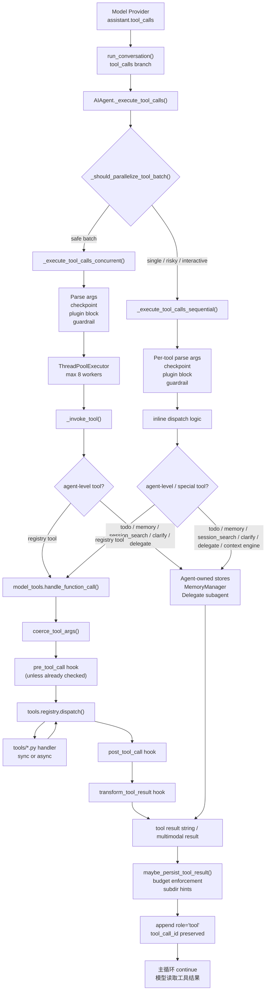
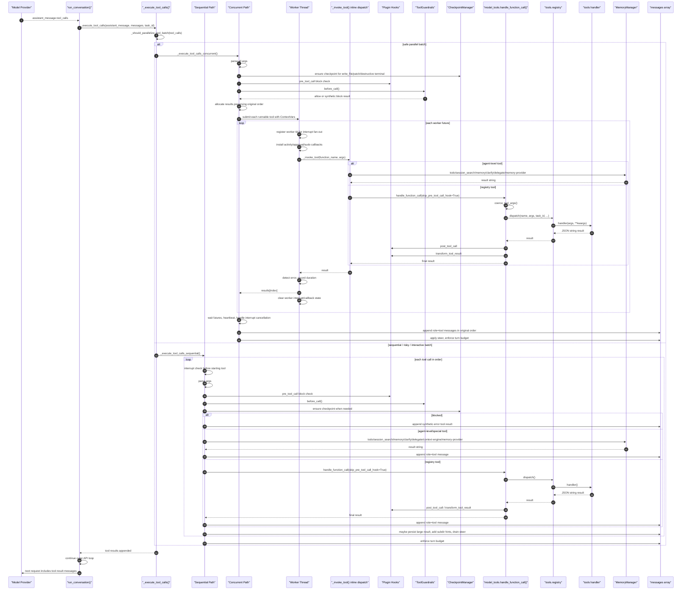

# 第三阶段：工具执行子系统深入分析

## 1. 阅读入口与源码链接

本阶段聚焦 Hermes Agent 的工具执行子系统。它承接第二阶段主循环中的 `assistant_message.tool_calls` 分支，负责把模型生成的工具调用安全、可观测、可恢复地执行完，并将 tool result 重新写回对话上下文。

核心源码入口：

- Obsidian 打开 `run_agent.py`：[run_agent.py](obsidian://open?path=/Users/chenglin.pu/Project/github/hermes-agent/run_agent.py)
- Obsidian 打开 `model_tools.py`：[model_tools.py](obsidian://open?path=/Users/chenglin.pu/Project/github/hermes-agent/model_tools.py)
- Obsidian 打开 `tools/registry.py`：[tools/registry.py](obsidian://open?path=/Users/chenglin.pu/Project/github/hermes-agent/tools/registry.py)

关键函数：

- `AIAgent._execute_tool_calls()`：[run_agent.py:9799](../run_agent.py#L9799)
- `AIAgent._execute_tool_calls_concurrent()`：[run_agent.py:9951](../run_agent.py#L9951)
- `AIAgent._execute_tool_calls_sequential()`：[run_agent.py:10352](../run_agent.py#L10352)
- `AIAgent._invoke_tool()`：[run_agent.py:9841](../run_agent.py#L9841)
- `_should_parallelize_tool_batch()`：[run_agent.py:388](../run_agent.py#L388)
- `model_tools.handle_function_call()`：[model_tools.py:679](../model_tools.py#L679)
- `tools.registry.ToolRegistry.dispatch()`：[tools/registry.py:347](../tools/registry.py#L347)
- `tools.registry.ToolRegistry.register()`：[tools/registry.py:226](../tools/registry.py#L226)
- `tools.registry.discover_builtin_tools()`：[tools/registry.py:57](../tools/registry.py#L57)

> Obsidian URI 通常只能打开文件，不能稳定跳转到行号。本文每段保留 `文件名:行号`，打开源码后可按函数名搜索定位。

## 2. 子系统边界

工具执行子系统的上游是 `run_conversation()` 中的 tool-calls 分支，下游是具体工具 handler。

```text
模型返回 assistant_message.tool_calls
        ↓
run_agent.py::_execute_tool_calls()
        ↓
并发安全判定
        ↓
sequential 或 concurrent 执行路径
        ↓
agent-level tool 分流 或 model_tools.handle_function_call()
        ↓
tools.registry.dispatch()
        ↓
tools/*.py handler
        ↓
生成 role="tool" message
        ↓
回到主循环，下一轮模型读取 tool results
```

核心目标：

- 保持 OpenAI tool-call role alternation 正确。
- 对危险或状态型工具避免不安全并发。
- 支持 CLI/TUI/Gateway 的进度回调。
- 支持 interrupt、approval、sudo、checkpoint、guardrail。
- 支持插件 hook 对工具调用进行拦截、观察和改写结果。
- 支持 agent-level 内部工具和 registry 工具共存。

## 3. 架构图



## 4. 执行入口：_execute_tool_calls()

位置：[run_agent.py:9799](../run_agent.py#L9799)

```python
def _execute_tool_calls(self, assistant_message, messages: list, effective_task_id: str, api_call_count: int = 0) -> None:
    """Execute tool calls from the assistant message and append results to messages.

    Dispatches to concurrent execution only for batches that look
    independent: read-only tools may always share the parallel path, while
    file reads/writes may do so only when their target paths do not overlap.
    """
    tool_calls = assistant_message.tool_calls

    # Allow _vprint during tool execution even with stream consumers
    self._executing_tools = True
    try:
        if not _should_parallelize_tool_batch(tool_calls):
            return self._execute_tool_calls_sequential(
                assistant_message, messages, effective_task_id, api_call_count
            )

        return self._execute_tool_calls_concurrent(
            assistant_message, messages, effective_task_id, api_call_count
        )
    finally:
        self._executing_tools = False
```

入口只做一件事：判定当前 tool call batch 能否并发。

重要设计点：

- `_executing_tools=True` 让工具执行期间的输出路径知道现在不是普通模型 streaming。
- 并发不是默认开启，而是通过 allowlist 和路径冲突检测。
- 两条执行路径最终都必须把 tool result append 到 `messages`。

## 5. 并发安全判定

位置：[run_agent.py:330](../run_agent.py#L330)、[run_agent.py:388](../run_agent.py#L388)

```python
_NEVER_PARALLEL_TOOLS = frozenset({"clarify"})

# Read-only tools with no shared mutable session state.
_PARALLEL_SAFE_TOOLS = frozenset({
    "ha_get_state",
    "ha_list_entities",
    "ha_list_services",
    "read_file",
    "search_files",
    "session_search",
    "skill_view",
    "skills_list",
    "vision_analyze",
    "web_extract",
    "web_search",
})

# File tools can run concurrently when they target independent paths.
_PATH_SCOPED_TOOLS = frozenset({"read_file", "write_file", "patch"})

# Maximum number of concurrent worker threads for parallel tool execution.
_MAX_TOOL_WORKERS = 8
```

判定函数：

```python
def _should_parallelize_tool_batch(tool_calls) -> bool:
    """Return True when a tool-call batch is safe to run concurrently."""
    if len(tool_calls) <= 1:
        return False

    tool_names = [tc.function.name for tc in tool_calls]
    if any(name in _NEVER_PARALLEL_TOOLS for name in tool_names):
        return False

    reserved_paths: list[Path] = []
    for tool_call in tool_calls:
        tool_name = tool_call.function.name
        try:
            function_args = json.loads(tool_call.function.arguments)
        except Exception:
            return False
        if not isinstance(function_args, dict):
            return False

        if tool_name in _PATH_SCOPED_TOOLS:
            scoped_path = _extract_parallel_scope_path(tool_name, function_args)
            if scoped_path is None:
                return False
            if any(_paths_overlap(scoped_path, existing) for existing in reserved_paths):
                return False
            reserved_paths.append(scoped_path)
            continue

        if tool_name not in _PARALLEL_SAFE_TOOLS:
            return False

    return True
```

并发策略是保守的：

- 单个工具不并发。
- `clarify` 永不并发，因为它需要用户交互。
- 未明确列入 `_PARALLEL_SAFE_TOOLS` 的工具不并发。
- `read_file`、`write_file`、`patch` 这类 path-scoped 工具只有在目标路径互不包含/不重叠时才并发。
- JSON args 解析失败直接降级为顺序执行。

## 6. 并发执行路径

### 6.1 并发执行的 preflight

位置：[run_agent.py:9951](../run_agent.py#L9951)

```python
def _execute_tool_calls_concurrent(self, assistant_message, messages: list, effective_task_id: str, api_call_count: int = 0) -> None:
    """Execute multiple tool calls concurrently using a thread pool.

    Results are collected in the original tool-call order and appended to
    messages so the API sees them in the expected sequence.
    """
    tool_calls = assistant_message.tool_calls
    num_tools = len(tool_calls)

    # ── Pre-flight: interrupt check ──────────────────────────────────
    if self._interrupt_requested:
        print(f"{self.log_prefix}⚡ Interrupt: skipping {num_tools} tool call(s)")
        for tc in tool_calls:
            messages.append({
                "role": "tool",
                "name": tc.function.name,
                "content": f"[Tool execution cancelled — {tc.function.name} was skipped due to user interrupt]",
                "tool_call_id": tc.id,
            })
        return
```

并发路径首先保证：即使被中断，也要为每个 pending tool call 写入一个 role=`tool` 的取消结果。这是 role alternation 的硬要求，否则下一轮 API 会看到 assistant tool_calls 后面缺少 tool result。

### 6.2 pre-execution bookkeeping

位置：[run_agent.py:9972](../run_agent.py#L9972)

```python
parsed_calls = []  # list of (tool_call, function_name, function_args)
for tool_call in tool_calls:
    function_name = tool_call.function.name

    # Reset nudge counters
    if function_name == "memory":
        self._turns_since_memory = 0
    elif function_name == "skill_manage":
        self._iters_since_skill = 0

    try:
        function_args = json.loads(tool_call.function.arguments)
    except json.JSONDecodeError:
        function_args = {}
    if not isinstance(function_args, dict):
        function_args = {}

    # Checkpoint for file-mutating tools
    if function_name in ("write_file", "patch") and self._checkpoint_mgr.enabled:
        ...

    # Checkpoint before destructive terminal commands
    if function_name == "terminal" and self._checkpoint_mgr.enabled:
        ...

    block_result = None
    blocked_by_guardrail = False
    try:
        from hermes_cli.plugins import get_pre_tool_call_block_message
        block_message = get_pre_tool_call_block_message(
            function_name, function_args, task_id=effective_task_id or "",
        )
    except Exception:
        block_message = None

    if block_message is not None:
        block_result = json.dumps({"error": block_message}, ensure_ascii=False)
    else:
        guardrail_decision = self._tool_guardrails.before_call(function_name, function_args)
        if not guardrail_decision.allows_execution:
            block_result = self._guardrail_block_result(guardrail_decision)
            blocked_by_guardrail = True

    parsed_calls.append((tool_call, function_name, function_args, block_result, blocked_by_guardrail))
```

并发前会先完成所有不可并发的元操作：

- 解析 args。
- 重置 memory/skill nudge counter。
- 文件写入/patch 前 checkpoint。
- 破坏性 terminal command 前 checkpoint。
- 插件 pre-tool block。
- tool guardrail block。

这样 worker thread 内部只执行真正的工具调用，减少并发竞态。

### 6.3 Worker thread 内部保护

位置：[run_agent.py:10084](../run_agent.py#L10084)

```python
def _run_tool(index, tool_call, function_name, function_args):
    """Worker function executed in a thread."""
    _worker_tid = threading.current_thread().ident
    with self._tool_worker_threads_lock:
        self._tool_worker_threads.add(_worker_tid)

    if self._interrupt_requested:
        try:
            _set_interrupt(True, _worker_tid)
        except Exception:
            pass

    try:
        from tools.environments.base import set_activity_callback
        set_activity_callback(self._touch_activity)
    except Exception:
        pass

    if _parent_approval_cb is not None:
        try:
            _set_approval_callback(_parent_approval_cb)
        except Exception:
            pass
    if _parent_sudo_cb is not None:
        try:
            _set_sudo_password_callback(_parent_sudo_cb)
        except Exception:
            pass

    start = time.time()
    try:
        result = self._invoke_tool(
            function_name,
            function_args,
            effective_task_id,
            tool_call.id,
            messages=messages,
            pre_tool_block_checked=True,
        )
    except Exception as tool_error:
        result = f"Error executing tool '{function_name}': {tool_error}"
        logger.error("_invoke_tool raised for %s: %s", function_name, tool_error, exc_info=True)
    duration = time.time() - start
    is_error, _ = _detect_tool_failure(function_name, result)
    ...
    results[index] = (function_name, function_args, result, duration, is_error, False)
```

并发 worker 需要额外处理四类线程上下文：

- `self._tool_worker_threads`：用于 interrupt fan-out。
- `_set_interrupt(True, worker_tid)`：让 terminal/execute_code 等可中断工具能感知。
- `set_activity_callback(self._touch_activity)`：让长命令发送 heartbeat，避免 gateway inactivity monitor 误杀。
- approval/sudo callback：避免 worker thread 里危险命令 fallback 到 `input()` 导致 prompt_toolkit 死锁。

### 6.4 ThreadPool 执行与 heartbeat

位置：[run_agent.py:10166](../run_agent.py#L10166)

```python
with concurrent.futures.ThreadPoolExecutor(max_workers=max_workers) as executor:
    for i, tc, name, args in runnable_calls:
        # Propagate ContextVars (e.g. _approval_session_key); mirrors asyncio.to_thread.
        ctx = contextvars.copy_context()
        f = executor.submit(ctx.run, _run_tool, i, tc, name, args)
        futures.append(f)

    while True:
        done, not_done = concurrent.futures.wait(
            futures, timeout=5.0,
        )
        if not not_done:
            break

        if self._interrupt_requested:
            ...
            for f in not_done:
                f.cancel()
            concurrent.futures.wait(not_done, timeout=3.0)
            break

        _conc_elapsed = int(time.time() - _conc_start)
        if _conc_elapsed > 0 and _conc_elapsed % 30 < 6:
            ...
            self._touch_activity(
                f"concurrent tools running ({_conc_elapsed}s, "
                f"{len(not_done)} remaining: {', '.join(_still_running[:3])})"
            )
```

这里有两个关键设计：

- 使用 `contextvars.copy_context()` 传播审批 session key 等上下文。
- 每 5 秒 poll，一方面响应 interrupt，一方面约每 30 秒发 heartbeat。

### 6.5 并发结果回写

位置：[run_agent.py:10235](../run_agent.py#L10235)

```python
# ── Post-execution: display per-tool results ─────────────────────
for i, (tc, name, args, block_result, blocked_by_guardrail) in enumerate(parsed_calls):
    r = results[i]
    blocked = False
    if r is None:
        if self._interrupt_requested:
            function_result = f"[Tool execution cancelled — {name} was skipped due to user interrupt]"
        else:
            function_result = f"Error executing tool '{name}': thread did not return a result"
        tool_duration = 0.0
    else:
        function_name, function_args, function_result, tool_duration, is_error, blocked = r

        if not blocked:
            function_result = self._append_guardrail_observation(
                function_name,
                function_args,
                function_result,
                failed=is_error,
            )
    ...
    _tool_content = (
        function_result["content"]
        if _is_multimodal_tool_result(function_result)
        else function_result
    )
    tool_msg = {
        "role": "tool",
        "name": name,
        "content": _tool_content,
        "tool_call_id": tc.id,
    }
    messages.append(tool_msg)
```

并发结果是按原始 tool-call 顺序写回，而不是按完成顺序写回。这样可以保证模型下一轮看到的 tool result 顺序和 assistant.tool_calls 顺序一致。

## 7. 顺序执行路径

顺序路径位于：[run_agent.py:10352](../run_agent.py#L10352)

### 7.1 每个工具调用前检查 interrupt

```python
for i, tool_call in enumerate(assistant_message.tool_calls, 1):
    # SAFETY: check interrupt BEFORE starting each tool.
    # If the user sent "stop" during a previous tool's execution,
    # do NOT start any more tools -- skip them all immediately.
    if self._interrupt_requested:
        remaining_calls = assistant_message.tool_calls[i-1:]
        if remaining_calls:
            self._vprint(f"{self.log_prefix}⚡ Interrupt: skipping {len(remaining_calls)} tool call(s)", force=True)
        for skipped_tc in remaining_calls:
            skipped_name = skipped_tc.function.name
            skip_msg = {
                "role": "tool",
                "name": skipped_name,
                "content": f"[Tool execution cancelled — {skipped_name} was skipped due to user interrupt]",
                "tool_call_id": skipped_tc.id,
            }
            messages.append(skip_msg)
        break
```

顺序路径可以在每个工具之间更细粒度地响应 interrupt，并为尚未执行的工具补取消结果。

### 7.2 顺序路径的 agent-level 分流更多

位置：[run_agent.py:10472](../run_agent.py#L10472)

```python
if _block_msg is not None:
    function_result = json.dumps({"error": _block_msg}, ensure_ascii=False)
    tool_duration = 0.0
elif _guardrail_block_decision is not None:
    function_result = self._guardrail_block_result(_guardrail_block_decision)
    tool_duration = 0.0
elif function_name == "todo":
    ...
elif function_name == "session_search":
    ...
elif function_name == "memory":
    ...
elif function_name == "clarify":
    ...
elif function_name == "delegate_task":
    ...
elif self._context_engine_tool_names and function_name in self._context_engine_tool_names:
    function_result = self.context_compressor.handle_tool_call(function_name, function_args, messages=messages)
elif self._memory_manager and self._memory_manager.has_tool(function_name):
    function_result = self._memory_manager.handle_tool_call(function_name, function_args)
elif self.quiet_mode:
    function_result = handle_function_call(...)
else:
    function_result = handle_function_call(...)
```

顺序路径历史更久，所以保留了更多 inline display/spinner 逻辑。它直接处理：

- plugin block
- guardrail block
- `todo`
- `session_search`
- `memory`
- `clarify`
- `delegate_task`
- context engine tools
- memory provider tools
- registry tools

并发路径则通过 `_invoke_tool()` 统一分流，结构更集中。

### 7.3 顺序结果回写

位置：[run_agent.py:10710](../run_agent.py#L10710)

```python
function_result = maybe_persist_tool_result(
    content=function_result,
    tool_name=function_name,
    tool_use_id=tool_call.id,
    env=get_active_env(effective_task_id),
) if not _is_multimodal_tool_result(function_result) else function_result

subdir_hints = self._subdirectory_hints.check_tool_call(function_name, function_args)
if subdir_hints:
    if _is_multimodal_tool_result(function_result):
        _append_subdir_hint_to_multimodal(function_result, subdir_hints)
    else:
        function_result += subdir_hints

_tool_content = (
    function_result["content"]
    if _is_multimodal_tool_result(function_result)
    else function_result
)
tool_msg = {
    "role": "tool",
    "name": function_name,
    "content": _tool_content,
    "tool_call_id": tool_call.id
}
messages.append(tool_msg)
```

顺序路径和并发路径最终汇合到相同格式：

```python
{
    "role": "tool",
    "name": function_name,
    "content": result,
    "tool_call_id": tool_call.id,
}
```

这就是下一轮 API 调用能满足 tool-call 协议的关键。

## 8. Agent-level 工具分流

并发路径使用 `_invoke_tool()` 做统一分流。位置：[run_agent.py:9841](../run_agent.py#L9841)

```python
def _invoke_tool(self, function_name: str, function_args: dict, effective_task_id: str,
                 tool_call_id: Optional[str] = None, messages: list = None,
                 pre_tool_block_checked: bool = False) -> str:
    """Invoke a single tool and return the result string. No display logic.

    Handles both agent-level tools (todo, memory, etc.) and registry-dispatched
    tools. Used by the concurrent execution path; the sequential path retains
    its own inline invocation for backward-compatible display handling.
    """
    ...
    if function_name == "todo":
        ...
    elif function_name == "session_search":
        ...
    elif function_name == "memory":
        ...
    elif self._memory_manager and self._memory_manager.has_tool(function_name):
        return self._memory_manager.handle_tool_call(function_name, function_args)
    elif function_name == "clarify":
        ...
    elif function_name == "delegate_task":
        return self._dispatch_delegate_task(function_args)
    else:
        return handle_function_call(
            function_name, function_args, effective_task_id,
            tool_call_id=tool_call_id,
            session_id=self.session_id or "",
            enabled_tools=list(self.valid_tool_names) if self.valid_tool_names else None,
            skip_pre_tool_call_hook=True,
        )
```

Agent-level 工具不走普通 registry dispatch，原因是它们需要访问 Agent 内部状态：

| 工具 | 需要的内部状态 |
| --- | --- |
| `todo` | `self._todo_store` |
| `session_search` | `self._session_db`、`self.session_id` |
| `memory` | `self._memory_store`、`self._memory_manager` |
| memory provider tools | `self._memory_manager` |
| `clarify` | `self.clarify_callback` |
| `delegate_task` | `parent_agent=self` |

`model_tools.py` 里也明确阻止 agent-loop tools 被普通 dispatcher 执行：

位置：[model_tools.py:495](../model_tools.py#L495)、[model_tools.py:709](../model_tools.py#L709)

```python
_AGENT_LOOP_TOOLS = {"todo", "memory", "session_search", "delegate_task"}
...
if function_name in _AGENT_LOOP_TOOLS:
    return json.dumps({"error": f"{function_name} must be handled by the agent loop"})
```

## 9. model_tools.handle_function_call()

位置：[model_tools.py:679](../model_tools.py#L679)

```python
def handle_function_call(
    function_name: str,
    function_args: Dict[str, Any],
    task_id: Optional[str] = None,
    tool_call_id: Optional[str] = None,
    session_id: Optional[str] = None,
    user_task: Optional[str] = None,
    enabled_tools: Optional[List[str]] = None,
    skip_pre_tool_call_hook: bool = False,
) -> str:
    """
    Main function call dispatcher that routes calls to the tool registry.
    """
    # Coerce string arguments to their schema-declared types (e.g. "42"→42)
    function_args = coerce_tool_args(function_name, function_args)

    try:
        if function_name in _AGENT_LOOP_TOOLS:
            return json.dumps({"error": f"{function_name} must be handled by the agent loop"})

        if not skip_pre_tool_call_hook:
            ...

        if function_name not in _READ_SEARCH_TOOLS:
            try:
                from tools.file_tools import notify_other_tool_call
                notify_other_tool_call(task_id or "default")
            except Exception:
                pass

        _dispatch_start = time.monotonic()
        if function_name == "execute_code":
            sandbox_enabled = enabled_tools if enabled_tools is not None else _last_resolved_tool_names
            result = registry.dispatch(
                function_name, function_args,
                task_id=task_id,
                enabled_tools=sandbox_enabled,
            )
        else:
            result = registry.dispatch(
                function_name, function_args,
                task_id=task_id,
                user_task=user_task,
            )
        duration_ms = int((time.monotonic() - _dispatch_start) * 1000)
```

这个函数是 Agent 和 registry 之间的适配层，职责包括：

- 根据 schema 修正参数类型。
- 防止 agent-loop tools 误入 registry。
- 执行或跳过 `pre_tool_call` hook。
- 通知 file read-loop tracker。
- 对 `execute_code` 注入当前 session enabled tools。
- 调用 `registry.dispatch()`。
- 触发 `post_tool_call` 和 `transform_tool_result`。
- 捕获异常并返回 JSON error。

### 9.1 post 和 transform hook

位置：[model_tools.py:773](../model_tools.py#L773)

```python
invoke_hook(
    "post_tool_call",
    tool_name=function_name,
    args=function_args,
    result=result,
    task_id=task_id or "",
    session_id=session_id or "",
    tool_call_id=tool_call_id or "",
    duration_ms=duration_ms,
)
...
hook_results = invoke_hook(
    "transform_tool_result",
    tool_name=function_name,
    args=function_args,
    result=result,
    task_id=task_id or "",
    session_id=session_id or "",
    tool_call_id=tool_call_id or "",
    duration_ms=duration_ms,
)
for hook_result in hook_results:
    if isinstance(hook_result, str):
        result = hook_result
        break
```

插件对工具执行有三类插入点：

| Hook | 位置 | 能力 |
| --- | --- | --- |
| `pre_tool_call` | 执行前 | 可以 block |
| `post_tool_call` | 执行后 | 观察结果、记录指标 |
| `transform_tool_result` | 写回上下文前 | 可以替换工具结果 |

注意：`run_agent.py` 里已经做过 pre-tool block 时，会传 `skip_pre_tool_call_hook=True`，保证 pre hook 不会重复触发。

## 10. tools.registry

### 10.1 工具发现

位置：[tools/registry.py:57](../tools/registry.py#L57)

```python
def discover_builtin_tools(tools_dir: Optional[Path] = None) -> List[str]:
    """Import built-in self-registering tool modules and return their module names."""
    tools_path = Path(tools_dir) if tools_dir is not None else Path(__file__).resolve().parent
    module_names = [
        f"tools.{path.stem}"
        for path in sorted(tools_path.glob("*.py"))
        if path.name not in {"__init__.py", "registry.py", "mcp_tool.py"}
        and _module_registers_tools(path)
    ]

    imported: List[str] = []
    for mod_name in module_names:
        try:
            importlib.import_module(mod_name)
            imported.append(mod_name)
        except Exception as e:
            logger.warning("Could not import tool module %s: %s", mod_name, e)
    return imported
```

发现机制不是导入所有 `tools/*.py`，而是 AST 检查模块顶层是否有 `registry.register(...)`。这样 helper 文件不会被误当工具模块导入。

`model_tools.py` 在模块加载时执行发现：

位置：[model_tools.py:180](../model_tools.py#L180)

```python
discover_builtin_tools()
```

MCP 工具 discovery 已经从 module-level side effect 移除，避免 gateway async event loop 被慢 MCP server 阻塞。

### 10.2 工具注册

位置：[tools/registry.py:226](../tools/registry.py#L226)

```python
def register(
    self,
    name: str,
    toolset: str,
    schema: dict,
    handler: Callable,
    check_fn: Callable = None,
    requires_env: list = None,
    is_async: bool = False,
    description: str = "",
    emoji: str = "",
    max_result_size_chars: int | float | None = None,
):
    """Register a tool.  Called at module-import time by each tool file."""
    with self._lock:
        existing = self._tools.get(name)
        if existing and existing.toolset != toolset:
            ...
            return
        self._tools[name] = ToolEntry(
            name=name,
            toolset=toolset,
            schema=schema,
            handler=handler,
            check_fn=check_fn,
            requires_env=requires_env or [],
            is_async=is_async,
            description=description or schema.get("description", ""),
            emoji=emoji,
            max_result_size_chars=max_result_size_chars,
        )
        if check_fn and toolset not in self._toolset_checks:
            self._toolset_checks[toolset] = check_fn
        self._generation += 1
```

注册时记录：

- tool name
- toolset
- OpenAI function schema
- handler
- check_fn
- env requirements
- async flag
- emoji
- result size cap

并且会阻止非 MCP 工具互相 shadow，避免插件/MCP 覆盖内置工具。

### 10.3 工具 schema 输出

位置：[tools/registry.py:310](../tools/registry.py#L310)

```python
def get_definitions(self, tool_names: Set[str], quiet: bool = False) -> List[dict]:
    """Return OpenAI-format tool schemas for the requested tool names.

    Only tools whose ``check_fn()`` returns True (or have no check_fn)
    are included.
    """
    result = []
    check_results: Dict[Callable, bool] = {}
    entries_by_name = {entry.name: entry for entry in self._snapshot_entries()}
    for name in sorted(tool_names):
        entry = entries_by_name.get(name)
        if not entry:
            continue
        if entry.check_fn:
            if entry.check_fn not in check_results:
                check_results[entry.check_fn] = _check_fn_cached(entry.check_fn)
            if not check_results[entry.check_fn]:
                ...
                continue
        schema_with_name = {**entry.schema, "name": entry.name}
        result.append({"type": "function", "function": schema_with_name})
    return result
```

工具能否出现在模型 schema 里，不只取决于 toolset，还取决于 `check_fn()`。例如浏览器、Docker、Modal、Computer Use 这类工具可能因为环境不可用而被过滤。

### 10.4 工具 dispatch

位置：[tools/registry.py:347](../tools/registry.py#L347)

```python
def dispatch(self, name: str, args: dict, **kwargs) -> str:
    """Execute a tool handler by name.

    * Async handlers are bridged automatically via ``_run_async()``.
    * All exceptions are caught and returned as ``{"error": "..."}``
      for consistent error format.
    """
    entry = self.get_entry(name)
    if not entry:
        return json.dumps({"error": f"Unknown tool: {name}"})
    try:
        if entry.is_async:
            from model_tools import _run_async
            return _run_async(entry.handler(args, **kwargs))
        return entry.handler(args, **kwargs)
    except Exception as e:
        logger.exception("Tool %s dispatch error: %s", name, e)
        return json.dumps({"error": f"Tool execution failed: {type(e).__name__}: {e}"})
```

registry 层的 contract 很清楚：

- 输入：`tool name`、`args dict`、运行上下文 kwargs。
- 输出：JSON string。
- async handler 自动桥接。
- 异常统一转成 `{"error": ...}`。

## 11. 完整时序图



## 12. 工具执行后的消息协议

无论并发还是顺序路径，最终都要生成：

```python
tool_msg = {
    "role": "tool",
    "name": function_name,
    "content": _tool_content,
    "tool_call_id": tool_call.id,
}
messages.append(tool_msg)
```

这件事非常关键。模型的上一条 assistant message 中存在 `tool_calls`，那么后续必须为每个 `tool_call_id` 提供对应 `role="tool"` 结果。否则多数 provider 会报 role alternation 或 missing tool result 错误。

中断、block、guardrail、线程未返回等异常路径也会合成 tool result，就是为了维持协议完整。

## 13. 关键设计判断

### 13.1 并发是 allowlist，不是 blocklist

只有明确安全的工具才并发。这个决策牺牲一点速度，换来较少的状态竞态。

### 13.2 并发结果按原始顺序写回

即使工具 A 比工具 B 慢，只要模型先调用 A 再调用 B，写回 `messages` 时也保持 A、B 顺序。这避免模型把结果和 tool_call_id 顺序混淆。

### 13.3 agent-level 工具留在 Agent loop 内

`todo`、`memory`、`session_search`、`delegate_task` 等工具需要访问当前 Agent 实例状态，不能放到普通 registry handler 中独立运行。

### 13.4 插件 hook 是工具治理入口

工具治理有三个层级：

1. `pre_tool_call`：执行前阻止。
2. `post_tool_call`：执行后观察。
3. `transform_tool_result`：写回模型上下文前改写结果。

### 13.5 checkpoint 在执行前做

`write_file`、`patch`、破坏性 terminal 命令执行前会尝试 snapshot。这是 undo/rollback 能工作的基础。

### 13.6 工具结果可能被外部化

`maybe_persist_tool_result()` 会把过大的工具结果保存到环境侧，再把引用写回模型上下文。这样避免工具结果过大导致上下文爆炸。

### 13.7 heartbeat 是 Gateway 场景的稳定性关键

长时间工具执行期间必须持续 `_touch_activity()`。否则 gateway inactivity monitor 可能误判 Agent 卡死。

## 14. 调试指南

### 14.1 工具没有出现在模型 schema 中

优先检查：

1. 工具文件是否顶层调用 `registry.register(...)`
2. `discover_builtin_tools()` 是否会导入该文件
3. 工具是否加入 `toolsets.py`
4. 当前 enabled/disabled toolsets 是否过滤掉它
5. `check_fn()` 是否返回 False

### 14.2 工具被模型调用但执行失败

优先检查：

1. `run_agent.py` 日志里的 `Tool xxx returned error`
2. `model_tools.handle_function_call()` 是否经过 `pre_tool_call` block
3. `tools.registry.dispatch()` 是否返回 `Unknown tool`
4. handler 是否抛异常，被 registry 转成 `Tool execution failed`
5. `transform_tool_result` 是否改写了结果

### 14.3 并发工具行为异常

优先检查：

1. `_should_parallelize_tool_batch()` 是否误判路径重叠
2. 工具是否不该加入 `_PARALLEL_SAFE_TOOLS`
3. worker thread 是否缺少 activity/approval/sudo callback
4. interrupt 是否设置到了 worker thread
5. `results[index]` 是否被正确回填

### 14.4 Agent 执行工具后没有继续

检查最后一条消息：

- 如果最后是 `role="tool"`，说明工具结果已经写回，但主循环没有成功进入下一轮或最终响应。
- 查 `Turn ended: reason=... last_msg_role=tool`。
- 查是否触发了 iteration budget、guardrail halt、interrupt、context compression exhaustion。

## 15. 后续深入建议

第四阶段建议深入分析 `工具注册与工具暴露链路`：

1. `tools/*.py` 的 register pattern。
2. `toolsets.py` 如何决定默认工具。
3. `model_tools.get_tool_definitions()` 如何按 enabled/disabled toolsets 过滤。
4. dynamic MCP tools 如何注册和刷新。
5. plugin tools 如何进入 registry 和 toolset。

推荐源码入口：

- [tools/registry.py:57](../tools/registry.py#L57)
- [tools/registry.py:226](../tools/registry.py#L226)
- [model_tools.py:271](../model_tools.py#L271)
- [toolsets.py:524](../toolsets.py#L524)
- [toolsets.py:575](../toolsets.py#L575)
