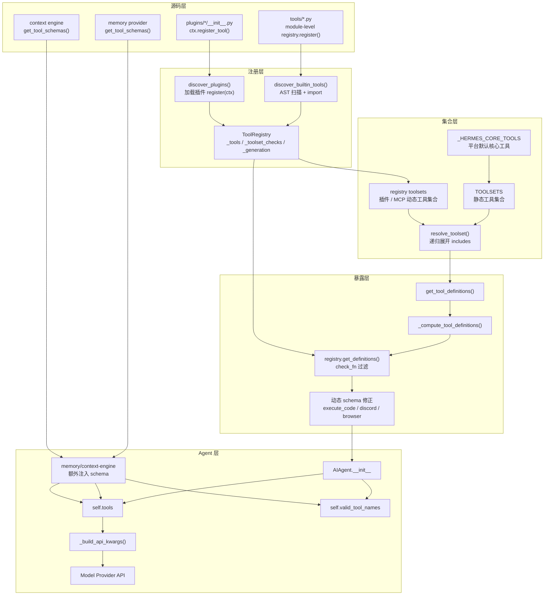
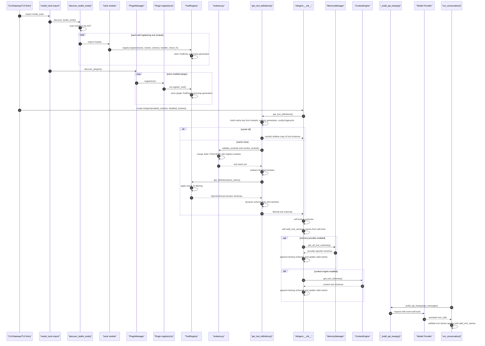

# 第四阶段：工具注册与工具暴露链路深度分析

> 目标：解释 Hermes Agent 中一个工具从“源码文件里的 `registry.register()`”到“最终作为 `tools` 参数暴露给模型”的完整链路。
>
> 本阶段承接：
>
> - [[phase0_source_structure_analysis]]
> - [[phase2_main_loop_analysis]]
> - [[phase3_tool_execution_subsystem]]

---

## 1. 结论先行

Hermes 的工具系统不是“工具文件存在就能被模型调用”，而是分成四层闸门：

1. **注册闸门**：工具模块必须被发现并导入，导入时调用 `registry.register(...)`。
2. **归属闸门**：工具必须属于某个 `toolset`，内置工具通常还要出现在 `toolsets.py` 的静态 toolset 中。
3. **暴露闸门**：`get_tool_definitions()` 根据 `enabled_toolsets` / `disabled_toolsets` 解析工具名集合，再让 registry 返回 schema。
4. **运行闸门**：`check_fn`、动态 schema 修正、memory/context-engine 注入、`valid_tool_names` 校验共同决定本轮模型实际能看到并能调用什么。

一句话：

```text
registry.register() 只是把工具放进全局仓库；
toolsets.py 决定哪些工具集合可以被选择；
get_tool_definitions() 决定当前 Agent 实例暴露哪些 schema；
run_agent.py::_build_api_kwargs() 才把 schema 放进模型请求。
```

---

## 2. 源码跳转索引

以下链接使用普通 Markdown 相对链接，可在 GitHub、Markdown 预览或支持源码跳转的编辑器中直接打开。带行号的位置使用 `#L行号` 锚点。

| 模块                    | 作用                               | Markdown 链接                                                                                           |
| ----------------------- | ---------------------------------- | ------------------------------------------------------------------------------------------------------- |
| `tools/registry.py`     | 全局工具注册中心                   | [registry.py](../tools/registry.py)    |
| `toolsets.py`           | 工具集合定义与解析                 | [toolsets.py](../toolsets.py)          |
| `model_tools.py`        | schema 暴露入口与工具调度 API      | [model_tools.py](../model_tools.py)    |
| `run_agent.py`          | Agent 初始化、模型请求、工具名校验 | [run_agent.py](../run_agent.py)        |
| `hermes_cli/plugins.py` | 插件工具注册入口                   | [plugins.py](../hermes_cli/plugins.py) |

关键函数：

| 函数 / 数据结构                  | 文件位置                                                                                                               | 职责                                      |
| -------------------------------- | ---------------------------------------------------------------------------------------------------------------------- | ----------------------------------------- |
| `discover_builtin_tools()`       | [tools/registry.py:57](../tools/registry.py#L57)          | 扫描并导入内置工具模块                    |
| `ToolRegistry.register()`        | [tools/registry.py:226](../tools/registry.py#L226)         | 写入全局 registry                         |
| `ToolRegistry.get_definitions()` | [tools/registry.py:310](../tools/registry.py#L310)         | 根据工具名集合返回 OpenAI tool schema     |
| `_HERMES_CORE_TOOLS`             | [toolsets.py:31](../toolsets.py#L31)                      | CLI / gateway 默认核心工具清单            |
| `get_toolset()`                  | [toolsets.py:524](../toolsets.py#L524)                     | 静态 toolset 与动态 registry toolset 合并 |
| `resolve_toolset()`              | [toolsets.py:575](../toolsets.py#L575)                     | 递归展开 toolset                          |
| `get_tool_definitions()`         | [model_tools.py:271](../model_tools.py#L271)               | Agent 获取 tool schema 的主入口           |
| `_compute_tool_definitions()`    | [model_tools.py:335](../model_tools.py#L335)               | toolset 过滤、schema 动态修正             |
| `PluginContext.register_tool()`  | [hermes_cli/plugins.py:246](../hermes_cli/plugins.py#L246) | 插件注册工具的 facade                     |
| `AIAgent.__init__` 工具加载      | [run_agent.py:1759](../run_agent.py#L1759)                  | 把 schema 存入 `self.tools`               |
| `_build_api_kwargs()`            | [run_agent.py:8800](../run_agent.py#L8800)                  | 把 `self.tools` 交给 provider transport   |
| 工具名校验                       | [run_agent.py:13788](../run_agent.py#L13788)                 | 防止模型调用未暴露工具                    |

---

## 3. 总体架构图



---

## 4. 第一段链路：工具如何注册进 registry

### 4.1 注册系统的设计意图

`tools/registry.py` 顶部注释直接说明了导入链：

```python
"""Central registry for all hermes-agent tools.

Each tool file calls ``registry.register()`` at module level to declare its
schema, handler, toolset membership, and availability check.  ``model_tools.py``
queries the registry instead of maintaining its own parallel data structures.

Import chain (circular-import safe):
    tools/registry.py  (no imports from model_tools or tool files)
           ^
    tools/*.py  (import from tools.registry at module level)
           ^
    model_tools.py  (imports tools.registry + all tool modules)
           ^
    run_agent.py, cli.py, batch_runner.py, etc.
"""
```

源码位置：[tools/registry.py:1](../tools/registry.py#L1)

这个设计的关键点：

- `tools/registry.py` 不反向依赖 `model_tools.py`，避免循环导入。
- 每个工具文件自己声明 schema、handler、toolset、依赖检查。
- `model_tools.py` 只负责触发 discovery 和对外提供统一 API。

### 4.2 内置工具发现：AST 扫描，而不是盲目 import

```python
def _is_registry_register_call(node: ast.AST) -> bool:
    """Return True when *node* is a ``registry.register(...)`` call expression."""
    if not isinstance(node, ast.Expr) or not isinstance(node.value, ast.Call):
        return False
    func = node.value.func
    return (
        isinstance(func, ast.Attribute)
        and func.attr == "register"
        and isinstance(func.value, ast.Name)
        and func.value.id == "registry"
    )


def _module_registers_tools(module_path: Path) -> bool:
    """Return True when the module contains a top-level ``registry.register(...)`` call.

    Only inspects module-body statements so that helper modules which happen
    to call ``registry.register()`` inside a function are not picked up.
    """
    try:
        source = module_path.read_text(encoding="utf-8")
        tree = ast.parse(source, filename=str(module_path))
    except (OSError, SyntaxError):
        return False

    return any(_is_registry_register_call(stmt) for stmt in tree.body)
```

源码位置：[tools/registry.py:29](../tools/registry.py#L29)

这段逻辑非常重要：Hermes 不是扫描 `tools/*.py` 后全部导入，而是先做 AST 判断：

- 只识别模块顶层的 `registry.register(...)`。
- helper 文件即便内部函数里出现 `registry.register()`，也不会被误导入。
- 这样减少导入副作用，也避免把非工具模块当成工具模块。

真正导入发生在这里：

```python
def discover_builtin_tools(tools_dir: Optional[Path] = None) -> List[str]:
    """Import built-in self-registering tool modules and return their module names."""
    tools_path = Path(tools_dir) if tools_dir is not None else Path(__file__).resolve().parent
    module_names = [
        f"tools.{path.stem}"
        for path in sorted(tools_path.glob("*.py"))
        if path.name not in {"__init__.py", "registry.py", "mcp_tool.py"}
        and _module_registers_tools(path)
    ]

    imported: List[str] = []
    for mod_name in module_names:
        try:
            importlib.import_module(mod_name)
            imported.append(mod_name)
        except Exception as e:
            logger.warning("Could not import tool module %s: %s", mod_name, e)
    return imported
```

源码位置：[tools/registry.py:57](../tools/registry.py#L57)

导入工具模块的副作用就是执行模块顶层的 `registry.register(...)`。

### 4.3 `model_tools.py` 在 import 时触发内置工具和插件发现

```python
# =============================================================================
# Tool Discovery  (importing each module triggers its registry.register calls)
# =============================================================================

discover_builtin_tools()

# MCP tool discovery (external MCP servers from config) used to run here as
# a module-level side effect.  It was removed because discover_mcp_tools()
# internally uses a blocking future.result(timeout=120) wait, and the
# gateway lazy-imports this module from inside the asyncio event loop on
# the first user message — freezing Discord/Telegram heartbeats for up to
# 120s whenever any configured MCP server was slow or unreachable (#16856).
#
# Each entry point now runs discovery explicitly at its own startup:
#   - gateway/run.py            -> start_gateway() uses run_in_executor
#   - cli.py, hermes_cli/*      -> inline on startup (no event loop)
#   - tui_gateway/server.py     -> inline on startup (no event loop)
#   - acp_adapter/server.py     -> asyncio.to_thread on session init

# Plugin tool discovery (user/project/pip plugins)
try:
    from hermes_cli.plugins import discover_plugins
    discover_plugins()
except Exception as e:
    logger.debug("Plugin discovery failed: %s", e)
```

源码位置：[model_tools.py:176](../model_tools.py#L176)

这里有一个工程上的边界：

- 内置工具 discovery 是 `model_tools.py` 的模块级副作用。
- 插件 discovery 也是这里触发。
- MCP discovery 被刻意移出模块级副作用，由各入口显式执行，避免 gateway 的 async event loop 被阻塞。

### 4.4 registry 写入规则：防 shadow、记录 generation、保存 toolset check

```python
def register(
    self,
    name: str,
    toolset: str,
    schema: dict,
    handler: Callable,
    check_fn: Callable = None,
    requires_env: list = None,
    is_async: bool = False,
    description: str = "",
    emoji: str = "",
    max_result_size_chars: int | float | None = None,
):
    """Register a tool.  Called at module-import time by each tool file."""
    with self._lock:
        existing = self._tools.get(name)
        if existing and existing.toolset != toolset:
            # Allow MCP-to-MCP overwrites (legitimate: server refresh,
            # or two MCP servers with overlapping tool names).
            both_mcp = (
                existing.toolset.startswith("mcp-")
                and toolset.startswith("mcp-")
            )
            if both_mcp:
                logger.debug(
                    "Tool '%s': MCP toolset '%s' overwriting MCP toolset '%s'",
                    name, toolset, existing.toolset,
                )
            else:
                # Reject shadowing — prevent plugins/MCP from overwriting
                # built-in tools or vice versa.
                logger.error(
                    "Tool registration REJECTED: '%s' (toolset '%s') would "
                    "shadow existing tool from toolset '%s'. Deregister the "
                    "existing tool first if this is intentional.",
                    name, toolset, existing.toolset,
                )
                return
        self._tools[name] = ToolEntry(
            name=name,
            toolset=toolset,
            schema=schema,
            handler=handler,
            check_fn=check_fn,
            requires_env=requires_env or [],
            is_async=is_async,
            description=description or schema.get("description", ""),
            emoji=emoji,
            max_result_size_chars=max_result_size_chars,
        )
        if check_fn and toolset not in self._toolset_checks:
            self._toolset_checks[toolset] = check_fn
        self._generation += 1
```

源码位置：[tools/registry.py:226](../tools/registry.py#L226)

这个方法体现了几个约束：

- `name` 是全局唯一工具名。
- 非 MCP 工具不允许跨 toolset shadow。
- `toolset` 是暴露链路的核心索引。
- `check_fn` 被提升到 `_toolset_checks`，用于 toolset 可用性展示。
- `_generation` 每次注册变化都会自增，用于 schema 暴露缓存失效。

---

## 5. 第二段链路：工具如何进入 toolset

### 5.1 内置核心工具清单

```python
# Shared tool list for CLI and all messaging platform toolsets.
# Edit this once to update all platforms simultaneously.
_HERMES_CORE_TOOLS = [
    # Web
    "web_search", "web_extract",
    # Terminal + process management
    "terminal", "process",
    # File manipulation
    "read_file", "write_file", "patch", "search_files",
    # Vision + image generation
    "vision_analyze", "image_generate",
    # Skills
    "skills_list", "skill_view", "skill_manage",
    # Browser automation
    "browser_navigate", "browser_snapshot", "browser_click",
    "browser_type", "browser_scroll", "browser_back",
    "browser_press", "browser_get_images",
    "browser_vision", "browser_console", "browser_cdp", "browser_dialog",
    # Text-to-speech
    "text_to_speech",
    # Planning & memory
    "todo", "memory",
    # Session history search
    "session_search",
    # Clarifying questions
    "clarify",
    # Code execution + delegation
    "execute_code", "delegate_task",
    # Cronjob management
    "cronjob",
    # Cross-platform messaging (gated on gateway running via check_fn)
    "send_message",
    # Home Assistant smart home control (gated on HASS_TOKEN via check_fn)
    "ha_list_entities", "ha_get_state", "ha_list_services", "ha_call_service",
    # Kanban multi-agent coordination — only in schema when the agent is
    # spawned as a kanban worker (HERMES_KANBAN_TASK env set), otherwise
    # zero schema footprint. Gated via check_fn in tools/kanban_tools.py.
    "kanban_show", "kanban_complete", "kanban_block", "kanban_heartbeat",
    "kanban_comment", "kanban_create", "kanban_link",
    # Computer use (macOS, gated on cua-driver being installed via check_fn)
    "computer_use",
]
```

源码位置：[toolsets.py:31](../toolsets.py#L31)

这份清单是默认工具面的基线。一个内置工具即便已经 `registry.register()`，如果没有被任何可解析的 toolset 纳入，通常不会暴露给模型。

### 5.2 `TOOLSETS` 是暴露策略，不是注册表

```python
TOOLSETS = {
    # Basic toolsets - individual tool categories
    "web": {
        "description": "Web research and content extraction tools",
        "tools": ["web_search", "web_extract"],
        "includes": []  # No other toolsets included
    },

    "search": {
        "description": "Web search only (no content extraction/scraping)",
        "tools": ["web_search"],
        "includes": []
    },
```

源码位置：[toolsets.py:75](../toolsets.py#L75)

`TOOLSETS` 只说明“哪些工具名属于哪个集合”。它不保存 handler，不保存 schema，也不执行工具。

因此新增内置工具至少需要两步：

1. 在 `tools/your_tool.py` 里 `registry.register(...)`。
2. 在 `toolsets.py` 的某个 toolset 中加入工具名，或者让动态 plugin/MCP toolset 能被解析。

### 5.3 静态 toolset 与动态 registry toolset 的合并

```python
def get_toolset(name: str) -> Optional[Dict[str, Any]]:
    toolset = TOOLSETS.get(name)

    try:
        from tools.registry import registry
    except Exception:
        return toolset if toolset else None

    if toolset:
        merged_tools = sorted(
            set(toolset.get("tools", []))
            | set(registry.get_tool_names_for_toolset(name))
        )
        return {**toolset, "tools": merged_tools}

    registry_toolset = name
    description = f"Plugin toolset: {name}"
    alias_target = registry.get_toolset_alias_target(name)

    if name not in _get_plugin_toolset_names():
        registry_toolset = alias_target
        if not registry_toolset:
            return None
        description = f"MCP server '{name}' tools"
    else:
        reverse_aliases = {
            canonical: alias
            for alias, canonical in _get_registry_toolset_aliases().items()
            if alias not in TOOLSETS
        }
        alias = reverse_aliases.get(name)
        if alias:
            description = f"MCP server '{alias}' tools"

    return {
        "description": description,
        "tools": registry.get_tool_names_for_toolset(registry_toolset),
        "includes": [],
    }
```

源码位置：[toolsets.py:524](../toolsets.py#L524)

这里是工具暴露链路中最容易被忽略的动态部分：

- 如果 `TOOLSETS` 中已有同名 toolset，会把静态工具和 registry 中同 toolset 的工具合并。
- 如果 `TOOLSETS` 中没有，但 registry 里有插件 toolset，也能生成一个虚拟 toolset。
- MCP alias 也通过 registry alias 被映射到 canonical toolset。

### 5.4 toolset 递归展开

```python
def resolve_toolset(name: str, visited: Set[str] = None) -> List[str]:
    if visited is None:
        visited = set()

    # Special aliases that represent all tools across every toolset
    # This ensures future toolsets are automatically included without changes.
    if name in {"all", "*"}:
        all_tools: Set[str] = set()
        for toolset_name in get_toolset_names():
            # Use a fresh visited set per branch to avoid cross-branch contamination
            resolved = resolve_toolset(toolset_name, visited.copy())
            all_tools.update(resolved)
        return sorted(all_tools)

    # Check for cycles / already-resolved (diamond deps).
    # Silently return [] — either this is a diamond (not a bug, tools already
    # collected via another path) or a genuine cycle (safe to skip).
    if name in visited:
        return []

    visited.add(name)

    # Get toolset definition
    toolset = get_toolset(name)
    if not toolset:
        # Auto-generate a toolset for plugin platforms (hermes-<name>).
        # Gives them _HERMES_CORE_TOOLS plus any tools the plugin registered
        # into a toolset matching the platform name.
        if name.startswith("hermes-"):
            platform_name = name[len("hermes-"):]
            try:
                from gateway.platform_registry import platform_registry
                if platform_registry.is_registered(platform_name):
                    plugin_tools = set(_HERMES_CORE_TOOLS)
                    try:
                        from tools.registry import registry
                        plugin_tools.update(
                            e.name for e in registry._tools.values()
                            if e.toolset == platform_name
                        )
                    except Exception:
                        pass
                    return list(plugin_tools)
            except Exception:
                pass

        return []

    # Collect direct tools
    tools = set(toolset.get("tools", []))

    # Recursively resolve included toolsets, sharing the visited set across
    # sibling includes so diamond dependencies are only resolved once and
    # cycle warnings don't fire multiple times for the same cycle.
    for included_name in toolset.get("includes", []):
        included_tools = resolve_toolset(included_name, visited)
        tools.update(included_tools)

    return sorted(tools)
```

源码位置：[toolsets.py:575](../toolsets.py#L575)

`resolve_toolset()` 输出的不是 schema，而是工具名列表。后续还必须经过 registry 的 schema 查询与 `check_fn` 过滤。

---

## 6. 第三段链路：插件工具如何进入同一套系统

插件不会绕开 registry。插件拿到的是 `PluginContext` facade，最终仍然调用 `registry.register(...)`：

```python
def register_tool(
    self,
    name: str,
    toolset: str,
    schema: dict,
    handler: Callable,
    check_fn: Callable | None = None,
    requires_env: list | None = None,
    is_async: bool = False,
    description: str = "",
    emoji: str = "",
) -> None:
    """Register a tool in the global registry **and** track it as plugin-provided."""
    from tools.registry import registry

    registry.register(
        name=name,
        toolset=toolset,
        schema=schema,
        handler=handler,
        check_fn=check_fn,
        requires_env=requires_env,
        is_async=is_async,
        description=description,
        emoji=emoji,
    )
    self._manager._plugin_tool_names.add(name)
    logger.debug("Plugin %s registered tool: %s", self.manifest.name, name)
```

源码位置：[hermes_cli/plugins.py:246](../hermes_cli/plugins.py#L246)

这说明插件工具和内置工具共享：

- 同一个 `_tools` registry。
- 同一个 toolset 解析机制。
- 同一个 schema 暴露入口。
- 同一个执行入口 `handle_function_call()` / `registry.dispatch()`。

区别只在 discovery 来源不同：

- 内置工具：`discover_builtin_tools()` 扫描 `tools/*.py`。
- 插件工具：`discover_plugins()` 加载插件，插件执行 `register(ctx)`，再调用 `ctx.register_tool()`。
- MCP 工具：由各入口显式发现，动态注册到 registry，通常以 `mcp-*` toolset 或 alias 进入解析系统。

---

## 7. 第四段链路：`get_tool_definitions()` 如何决定暴露哪些工具

### 7.1 schema 暴露入口

```python
def get_tool_definitions(
    enabled_toolsets: List[str] = None,
    disabled_toolsets: List[str] = None,
    quiet_mode: bool = False,
) -> List[Dict[str, Any]]:
    """
    Get tool definitions for model API calls with toolset-based filtering.

    All tools must be part of a toolset to be accessible.

    Args:
        enabled_toolsets: Only include tools from these toolsets.
        disabled_toolsets: Exclude tools from these toolsets (if enabled_toolsets is None).
        quiet_mode: Suppress status prints.

    Returns:
        Filtered list of OpenAI-format tool definitions.
    """
```

源码位置：[model_tools.py:271](../model_tools.py#L271)

这个函数是 Agent 初始化工具面的主入口。它的输入是 toolset，不是工具名。

### 7.2 暴露缓存：由 registry generation 和 config 文件指纹驱动

```python
if quiet_mode:
    try:
        from hermes_cli.config import get_config_path
        cfg_path = get_config_path()
        cfg_stat = cfg_path.stat()
        cfg_fp = (cfg_stat.st_mtime_ns, cfg_stat.st_size)
    except (FileNotFoundError, OSError, ImportError):
        cfg_fp = None
    cache_key = (
        frozenset(enabled_toolsets) if enabled_toolsets is not None else None,
        frozenset(disabled_toolsets) if disabled_toolsets else None,
        registry._generation,
        cfg_fp,
    )
    cached = _tool_defs_cache.get(cache_key)
    if cached is not None:
        # Update _last_resolved_tool_names so downstream callers see
        # consistent state even on a cache hit.
        global _last_resolved_tool_names
        _last_resolved_tool_names = [t["function"]["name"] for t in cached]
        # Return a shallow copy of the list but share the dict references —
        # schemas are treated as read-only by all known callers.
        return list(cached)
```

源码位置：[model_tools.py:297](../model_tools.py#L297)

缓存 key 包含：

- `enabled_toolsets`
- `disabled_toolsets`
- `registry._generation`
- config 文件的 `(mtime, size)`

因此：

- 新工具注册会导致 `_generation` 变化，缓存失效。
- config 改动会导致动态 schema 相关缓存失效。
- `quiet_mode=False` 不走缓存，因为会打印工具选择信息。

### 7.3 enabled / disabled toolset 解析

```python
if enabled_toolsets is not None:
    for toolset_name in enabled_toolsets:
        if validate_toolset(toolset_name):
            resolved = resolve_toolset(toolset_name)
            tools_to_include.update(resolved)
            if not quiet_mode:
                print(f"✅ Enabled toolset '{toolset_name}': {', '.join(resolved) if resolved else 'no tools'}")
        elif toolset_name in _LEGACY_TOOLSET_MAP:
            legacy_tools = _LEGACY_TOOLSET_MAP[toolset_name]
            tools_to_include.update(legacy_tools)
            if not quiet_mode:
                print(f"✅ Enabled legacy toolset '{toolset_name}': {', '.join(legacy_tools)}")
        else:
            if not quiet_mode:
                print(f"⚠️  Unknown toolset: {toolset_name}")
else:
    # Default: start with everything
    from toolsets import get_all_toolsets
    for ts_name in get_all_toolsets():
        tools_to_include.update(resolve_toolset(ts_name))

# Always apply disabled toolsets as a subtraction step at the end.
# This ensures that even if a composite toolset (like hermes-cli)
# is enabled, any tools belonging to a disabled toolset are strictly
# stripped out. See issue #17309.
if disabled_toolsets:
    for toolset_name in disabled_toolsets:
        if validate_toolset(toolset_name):
            resolved = resolve_toolset(toolset_name)
            tools_to_include.difference_update(resolved)
            if not quiet_mode:
                print(f"🚫 Disabled toolset '{toolset_name}': {', '.join(resolved) if resolved else 'no tools'}")
```

源码位置：[model_tools.py:344](../model_tools.py#L344)

这里的规则：

- 如果传入 `enabled_toolsets`，从这些 toolset 开始。
- 如果没传，默认从 `get_all_toolsets()` 开始，即“所有已知 toolset”。
- `disabled_toolsets` 永远最后做减法，优先级高。
- legacy toolset 名仍被兼容，但主路径是 `toolsets.py`。

### 7.4 插件工具不走旁路

```python
# Plugin-registered tools are now resolved through the normal toolset
# path — validate_toolset() / resolve_toolset() / get_all_toolsets()
# all check the tool registry for plugin-provided toolsets.  No bypass
# needed; plugins respect enabled_toolsets / disabled_toolsets like any
# other toolset.

# Ask the registry for schemas (only returns tools whose check_fn passes)
filtered_tools = registry.get_definitions(tools_to_include, quiet=quiet_mode)
```

源码位置：[model_tools.py:385](../model_tools.py#L385)

这一点很关键：插件不是“注册了就必然暴露”。插件工具仍然必须通过 toolset 解析和 disabled subtraction。

### 7.5 registry schema 过滤：`check_fn` 决定工具是否可见

```python
def get_definitions(self, tool_names: Set[str], quiet: bool = False) -> List[dict]:
    """Return OpenAI-format tool schemas for the requested tool names.

    Only tools whose ``check_fn()`` returns True (or have no check_fn)
    are included. ``check_fn()`` results are cached for ~30 s via
    :func:`_check_fn_cached` to amortize repeat probes (check_terminal_
    requirements probes modal/docker, browser checks probe playwright,
    etc.); TTL chosen so env-var changes (``hermes tools enable foo``)
    still take effect in near-real-time without forcing a full cache
    flush on every call.
    """
    result = []
    check_results: Dict[Callable, bool] = {}
    entries_by_name = {entry.name: entry for entry in self._snapshot_entries()}
    for name in sorted(tool_names):
        entry = entries_by_name.get(name)
        if not entry:
            continue
        if entry.check_fn:
            if entry.check_fn not in check_results:
                check_results[entry.check_fn] = _check_fn_cached(entry.check_fn)
            if not check_results[entry.check_fn]:
                if not quiet:
                    logger.debug("Tool %s unavailable (check failed)", name)
                continue
        # Ensure schema always has a "name" field — use entry.name as fallback
        schema_with_name = {**entry.schema, "name": entry.name}
        result.append({"type": "function", "function": schema_with_name})
    return result
```

源码位置：[tools/registry.py:310](../tools/registry.py#L310)

这是真正的“最后可见性过滤”：

- toolset 选中了工具名，但 registry 里没有 entry，跳过。
- 工具有 `check_fn`，且检查失败，跳过。
- schema 统一包装成 OpenAI tool 格式：`{"type": "function", "function": schema}`。

### 7.6 暴露后的动态 schema 修正

```python
available_tool_names = {t["function"]["name"] for t in filtered_tools}

# Rebuild execute_code schema to only list sandbox tools that are actually
# available.  Without this, the model sees "web_search is available in
# execute_code" even when the API key isn't configured or the toolset is
# disabled (#560-discord).
if "execute_code" in available_tool_names:
    from tools.code_execution_tool import SANDBOX_ALLOWED_TOOLS, build_execute_code_schema, _get_execution_mode
    sandbox_enabled = SANDBOX_ALLOWED_TOOLS & available_tool_names
    dynamic_schema = build_execute_code_schema(sandbox_enabled, mode=_get_execution_mode())
    for i, td in enumerate(filtered_tools):
        if td.get("function", {}).get("name") == "execute_code":
            filtered_tools[i] = {"type": "function", "function": dynamic_schema}
            break
```

源码位置：[model_tools.py:394](../model_tools.py#L394)

这里体现了一个设计原则：schema 文案也必须和当前实际可用工具一致。

后续还会：

- 根据 Discord bot intents 动态重建 `discord` / `discord_admin` schema。
- 当 web tools 不可用时，移除 `browser_navigate` 描述中的 web tool 交叉引用。
- 对 schema 做 sanitizer，提高不同 provider 的兼容性。

---

## 8. 第五段链路：Agent 初始化如何持有工具面

### 8.1 `AIAgent.__init__` 加载 tool schemas

```python
# Get available tools with filtering
self.tools = get_tool_definitions(
    enabled_toolsets=enabled_toolsets,
    disabled_toolsets=disabled_toolsets,
    quiet_mode=self.quiet_mode,
)

# Show tool configuration and store valid tool names for validation
self.valid_tool_names = set()
if self.tools:
    self.valid_tool_names = {tool["function"]["name"] for tool in self.tools}
    tool_names = sorted(self.valid_tool_names)
    if not self.quiet_mode:
        print(f"🛠️  Loaded {len(self.tools)} tools: {', '.join(tool_names)}")

        # Show filtering info if applied
        if enabled_toolsets:
            print(f"   ✅ Enabled toolsets: {', '.join(enabled_toolsets)}")
        if disabled_toolsets:
            print(f"   ❌ Disabled toolsets: {', '.join(disabled_toolsets)}")
elif not self.quiet_mode:
    print("🛠️  No tools loaded (all tools filtered out or unavailable)")
```

源码位置：[run_agent.py:1758](../run_agent.py#L1758)

此处完成两个动作：

- `self.tools`：用于 provider API 请求的 schema 列表。
- `self.valid_tool_names`：用于后续校验模型返回的 tool call 名称。

这两个集合必须保持一致，否则会出现“模型看得到但运行时不允许”或“模型看不到但运行时允许”的协议错位。

### 8.2 memory provider 工具 schema 是 Agent 层注入

```python
# Inject memory provider tool schemas into the tool surface.
# Skip tools whose names already exist (plugins may register the
# same tools via ctx.register_tool(), which lands in self.tools
# through get_tool_definitions()).  Duplicate function names cause
# 400 errors on providers that enforce unique names (e.g. Xiaomi
# MiMo via Nous Portal).
if self._memory_manager and self.tools is not None:
    _existing_tool_names = {
        t.get("function", {}).get("name")
        for t in self.tools
        if isinstance(t, dict)
    }
    for _schema in self._memory_manager.get_all_tool_schemas():
        _tname = _schema.get("name", "")
        if _tname and _tname in _existing_tool_names:
            continue  # already registered via plugin path
        _wrapped = {"type": "function", "function": _schema}
        self.tools.append(_wrapped)
        if _tname:
            self.valid_tool_names.add(_tname)
            _existing_tool_names.add(_tname)
```

源码位置：[run_agent.py:1963](../run_agent.py#L1963)

这是特殊路径：memory provider 插件不一定通过 `ctx.register_tool()` 进入 registry，也可以在 Agent 初始化后直接注入 `self.tools`。

它的防重逻辑说明：

- 如果同名工具已经通过 registry/plugin path 暴露，就跳过。
- 否则直接 append 到 `self.tools`。
- 同时更新 `self.valid_tool_names`。

### 8.3 context engine 工具 schema 也是 Agent 层注入

```python
# Inject context engine tool schemas (e.g. lcm_grep, lcm_describe, lcm_expand).
# Skip names that are already present — the get_tool_definitions()
# quiet_mode cache returned a shared list pre-#17335, so a stray
# mutation here would poison subsequent agent inits in the same
# Gateway process and trip provider-side 'duplicate tool name'
# errors. Even with the cache fix, dedup is the right defense
# against plugin paths that may register the same schemas via
# ctx.register_tool(). Mirrors the memory tools dedup above.
self._context_engine_tool_names: set = set()
if hasattr(self, "context_compressor") and self.context_compressor and self.tools is not None:
    _existing_tool_names = {
        t.get("function", {}).get("name")
        for t in self.tools
        if isinstance(t, dict)
    }
    for _schema in self.context_compressor.get_tool_schemas():
        _tname = _schema.get("name", "")
        if _tname and _tname in _existing_tool_names:
            continue  # already registered via plugin/cache path
        _wrapped = {"type": "function", "function": _schema}
        self.tools.append(_wrapped)
        if _tname:
            self.valid_tool_names.add(_tname)
            self._context_engine_tool_names.add(_tname)
            _existing_tool_names.add(_tname)
```

源码位置：[run_agent.py:2254](../run_agent.py#L2254)

这说明 Hermes 工具暴露面有两类来源：

1. registry/toolset 主路径：绝大多数内置工具、插件工具、MCP 工具。
2. Agent 层注入路径：memory provider、context engine 等和当前 Agent 实例强绑定的能力。

---

## 9. 第六段链路：schema 如何进入模型请求

`self.tools` 被多个 provider transport 共享使用。核心入口是 `_build_api_kwargs()`：

```python
def _build_api_kwargs(self, api_messages: list) -> dict:
    """Build the keyword arguments dict for the active API mode."""
    if self.api_mode == "anthropic_messages":
        _transport = self._get_transport()
        anthropic_messages = self._prepare_anthropic_messages_for_api(api_messages)
        ctx_len = getattr(self, "context_compressor", None)
        ctx_len = ctx_len.context_length if ctx_len else None
        ephemeral_out = getattr(self, "_ephemeral_max_output_tokens", None)
        if ephemeral_out is not None:
            self._ephemeral_max_output_tokens = None  # consume immediately
        return _transport.build_kwargs(
            model=self.model,
            messages=anthropic_messages,
            tools=self.tools,
            max_tokens=ephemeral_out if ephemeral_out is not None else self.max_tokens,
            reasoning_config=self.reasoning_config,
```

源码位置：[run_agent.py:8800](../run_agent.py#L8800)

`self.tools` 也会传给 Bedrock、Codex Responses、Chat Completions provider profile、legacy path：

```python
return _ct.build_kwargs(
    model=self.model,
    messages=api_messages,
    tools=self.tools,
    reasoning_config=self.reasoning_config,
    session_id=getattr(self, "session_id", None),
    max_tokens=self.max_tokens,
    request_overrides=self.request_overrides,
    is_github_responses=is_github_responses,
    is_codex_backend=is_codex_backend,
    is_xai_responses=is_xai_responses,
    github_reasoning_extra=self._github_models_reasoning_extra_body() if is_github_responses else None,
)
```

源码位置：[run_agent.py:8854](../run_agent.py#L8854)

最终 provider adapter 再负责把 OpenAI-format schema 转成目标 API 需要的格式。

---

## 10. 第七段链路：模型返回工具名后的防线

模型即便看到了 `tools`，仍可能生成不存在的 tool call。Hermes 在主循环里用 `valid_tool_names` 做校验：

```python
# Validate tool call names - detect model hallucinations
# Repair mismatched tool names before validating
for tc in assistant_message.tool_calls:
    if tc.function.name not in self.valid_tool_names:
        repaired = self._repair_tool_call(tc.function.name)
        if repaired:
            print(f"{self.log_prefix}🔧 Auto-repaired tool name: '{tc.function.name}' -> '{repaired}'")
            tc.function.name = repaired
invalid_tool_calls = [
    tc.function.name for tc in assistant_message.tool_calls
    if tc.function.name not in self.valid_tool_names
]
if invalid_tool_calls:
    # Track retries for invalid tool calls
    self._invalid_tool_retries += 1

    # Return helpful error to model — model can self-correct next turn
    available = ", ".join(sorted(self.valid_tool_names))
```

源码位置：[run_agent.py:13788](../run_agent.py#L13788)

所以“工具暴露链路”的终点不是 `self.tools`，而是：

- 模型请求里的 `tools=self.tools`。
- 主循环里的 `self.valid_tool_names`。
- 执行阶段的 `_invoke_tool()` / `handle_function_call()` / registry dispatch。

---

## 11. 完整时序图



---

## 12. 注册到暴露的完整伪代码

```python
# model_tools import side effects
discover_builtin_tools()
discover_plugins()

# tools/foo.py import side effect
registry.register(
    name="foo",
    toolset="bar",
    schema={...},
    handler=foo_handler,
    check_fn=optional_check,
)

# AIAgent.__init__
self.tools = get_tool_definitions(
    enabled_toolsets=enabled_toolsets,
    disabled_toolsets=disabled_toolsets,
)
self.valid_tool_names = {schema["function"]["name"] for schema in self.tools}

# get_tool_definitions
if enabled_toolsets is None:
    selected_toolsets = get_all_toolsets()
else:
    selected_toolsets = enabled_toolsets

tool_names = set()
for toolset in selected_toolsets:
    tool_names |= set(resolve_toolset(toolset))

for disabled in disabled_toolsets:
    tool_names -= set(resolve_toolset(disabled))

schemas = registry.get_definitions(tool_names)
schemas = apply_dynamic_schema_fixes(schemas)
schemas = sanitize_tool_schemas(schemas)

# run_conversation API request
api_kwargs = self._build_api_kwargs(api_messages)
client.chat.completions.create(**api_kwargs)
```

---

## 13. 四类工具来源对比

| 来源                       | 注册位置                                  | 是否进入 registry | 是否走 toolset 过滤 | 是否直接注入 `self.tools` |
| -------------------------- | ----------------------------------------- | ----------------: | ------------------: | ------------------------: |
| 内置工具                   | `tools/*.py` 顶层 `registry.register()`   |                是 |                  是 |                        否 |
| 普通插件工具               | `ctx.register_tool()`                     |                是 |                  是 |                        否 |
| MCP 工具                   | 入口显式 discovery 后动态 register        |                是 |                  是 |                        否 |
| memory/context-engine 工具 | provider / engine 的 `get_tool_schemas()` |            不一定 |              不一定 |                        是 |

关键判断：

- 如果工具需要成为通用工具，应该走 registry + toolset。
- 如果工具强依赖当前 Agent 实例状态，并且只属于当前 session，可能走 Agent 层注入。
- Agent 层注入必须同步更新 `valid_tool_names`，否则主循环会拒绝模型调用。

---

## 14. 为什么工具注册成功但模型看不到

常见原因按概率排序：

1. 工具文件没有模块顶层 `registry.register(...)`，`discover_builtin_tools()` 不会导入它。
2. 工具 register 了，但没有加入任何可解析 toolset。
3. `enabled_toolsets` 没包含该工具所属 toolset。
4. `disabled_toolsets` 最后把它减掉了。
5. `check_fn` 返回 False，`registry.get_definitions()` 过滤掉了它。
6. 同名工具 shadow 被拒绝，registry 里实际没有新工具。
7. quiet-mode schema 缓存尚未因 generation/config 指纹变化失效。
8. memory/context-engine 注入路径只更新了 `self.tools`，没有更新 `self.valid_tool_names`。
9. provider adapter 对 schema 做转换时丢弃了不兼容 schema。

排查顺序：

```text
1. rg -n "registry.register\\(" tools plugins
2. 确认 register 的 toolset 字段
3. 查看 toolsets.py 是否包含该工具名，或 registry 是否暴露动态 toolset
4. 在 get_tool_definitions() 后确认 filtered_tools 是否包含该工具
5. 检查 check_fn 是否失败
6. 检查 AIAgent.self.tools 与 self.valid_tool_names 是否都包含该工具
7. 检查 _build_api_kwargs() 对应 provider path 是否传入 tools=self.tools
```

---

## 15. 设计评价

### 15.1 优点

- **注册与暴露分离**：工具可以先注册进全局 registry，再由 toolset 策略决定是否暴露。
- **插件与内置统一**：插件工具不绕过 registry，因此继承同一套过滤、缓存、执行机制。
- **check_fn 后置过滤**：工具可用性在 schema 暴露时判断，避免模型看到不可用工具。
- **generation 缓存失效清晰**：注册、注销、alias 变化都会让 schema cache 失效。
- **`valid_tool_names` 二次防线**：即便模型幻觉工具名，主循环也会拒绝或修复。

### 15.2 成本

- 工具可见性分散在多个层级：registry、toolsets、model_tools、run_agent。
- Agent 层还有 memory/context-engine 直接注入路径，和 registry 主路径并行。
- 默认 `enabled_toolsets is None` 时从所有 toolset 开始，再由平台/配置约束，理解成本较高。
- 动态 schema 修正逻辑集中在 `model_tools.py`，未来工具多了以后可能继续膨胀。

### 15.3 最重要的不变量

```text
self.tools 中出现的每个工具名，都应该出现在 self.valid_tool_names。
模型看不到的工具，不应该在执行阶段被当作正常工具调用。
registry.register() 不等于暴露；toolset 解析和 check_fn 过滤才决定可见性。
```

---

## 16. 给后续阅读的建议

第五阶段如果继续深入，建议分析：

> “动态工具与插件系统：PluginManager、MCP discovery、memory provider、context engine 如何扩展 Hermes 工具体系”

因为第四阶段已经确认主链路，下一步可以把“动态工具来源”拆开，重点分析：

- `hermes_cli/plugins.py::discover_plugins()`
- MCP 工具动态注册与 deregister
- memory provider plugin 生命周期
- context engine tool schema 生命周期
- gateway / TUI / ACP 各入口显式 discovery 的差异
