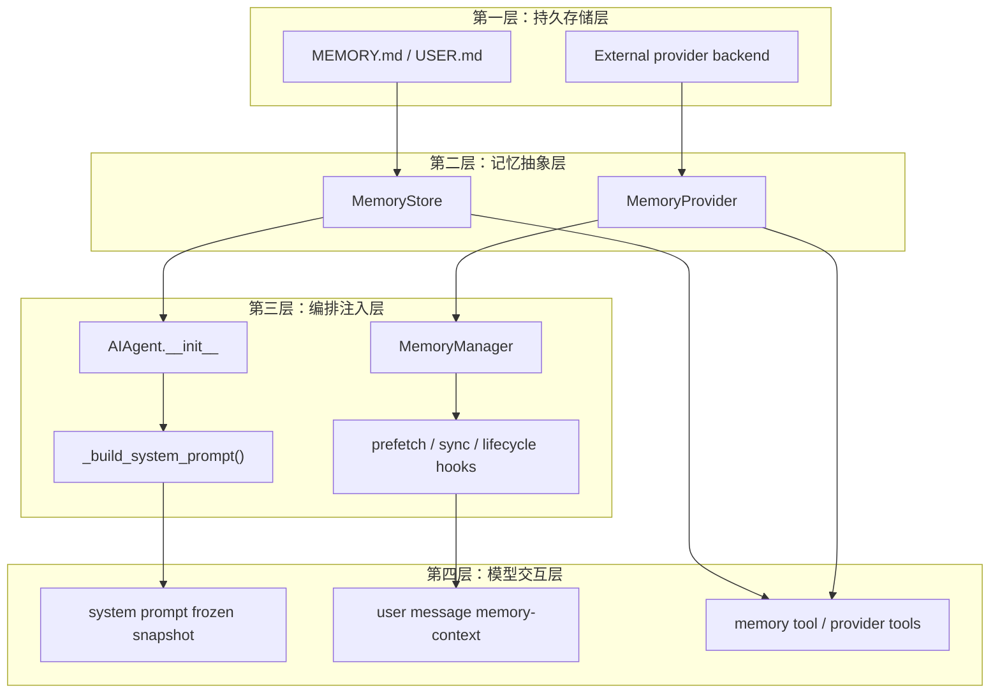
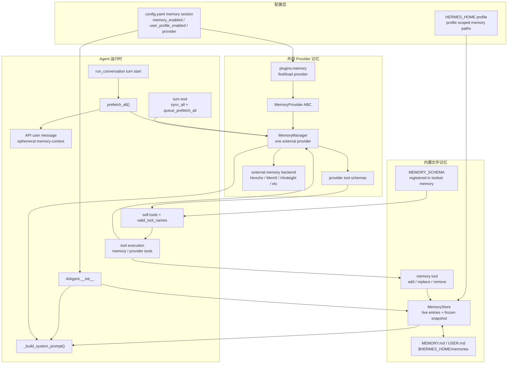
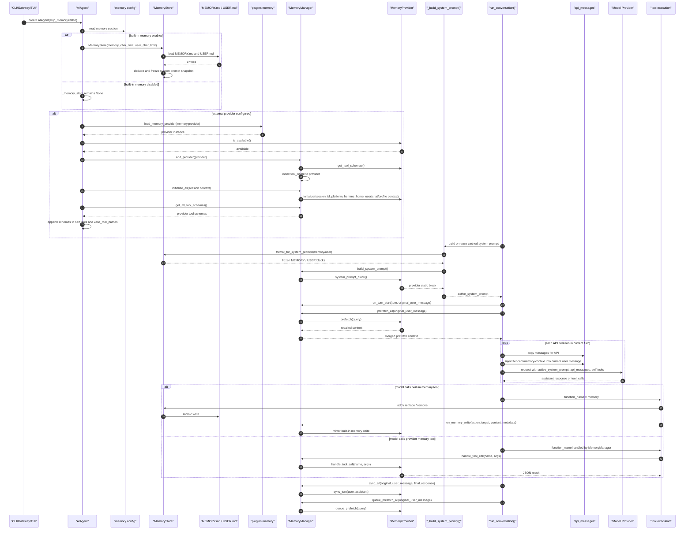

# 第五阶段：Memory 子系统深度分析

> 目标：深入分析 Hermes Agent 的 Memory 体系：内置文件记忆、外部 Memory Provider 插件、系统提示词注入、每轮 prefetch、工具调用写入、turn sync 与 session 生命周期。
>
> 本文档重点回答：
>
> - `MEMORY.md` / `USER.md` 是如何加载、写入、注入系统提示词的？
> - 外部 memory provider 是如何被发现、初始化、暴露工具、参与每轮对话的？
> - 内置 `memory` 工具和 provider 工具在执行路径上有什么不同？
> - Memory 如何兼顾“持久化”和“prompt cache 稳定性”？

---

## 1. 结论先行

Hermes 的 Memory 不是一个单点模块，而是两条并行链路：

1. **内置文件记忆链路**
   - 实现：`tools/memory_tool.py`
   - 存储：`$HERMES_HOME/memories/MEMORY.md` 与 `$HERMES_HOME/memories/USER.md`
   - 暴露：注册为 `memory` tool，属于 `memory` toolset
   - 注入：会在 session 开始时形成 frozen snapshot，进入 system prompt
   - 写入：`memory` 工具调用会立即写磁盘，但不会改变当前 session 的 system prompt

2. **外部 Memory Provider 链路**
   - 抽象：`agent/memory_provider.py::MemoryProvider`
   - 编排：`agent/memory_manager.py::MemoryManager`
   - 发现：`plugins/memory/__init__.py`
   - 激活：`config.yaml` 的 `memory.provider`
   - 注入：可提供 system prompt block，也可在每轮 prefetch 出 recall context 注入用户消息
   - 工具：provider 可通过 `get_tool_schemas()` 暴露额外工具，由 `MemoryManager.handle_tool_call()` 路由
   - 同步：每轮结束后 `sync_all()` + `queue_prefetch_all()`

最核心的不变量：

```text
内置 memory 文件进入 system prompt 的是 session-start frozen snapshot；
外部 provider recall context 进入的是当前 user message 的 ephemeral injection；
二者都不能随意改动已缓存的 system prompt，否则会破坏 prompt cache 和会话一致性。
```

---

## 2. 为什么说是四层记忆架构

这里的“四层记忆架构”是为了理解 Hermes Memory 子系统而抽象出来的分析框架，不是源码里某个明确命名为 `FourLayerMemoryArchitecture` 的类。

Hermes 的 Memory 同时承担“长期保存”“会话召回”“工具写入”“模型上下文注入”几种职责。如果只按文件名看，很容易把 `MemoryStore`、`MemoryManager`、`MemoryProvider`、`memory` tool 混在一起。拆成四层后，边界会更清楚：

```text
存储层 -> 抽象层 -> 编排注入层 -> 模型交互层
```

### 2.1 第一层：持久存储层

这一层回答“记忆最终放在哪里”。

内置文件记忆：

```text
$HERMES_HOME/memories/MEMORY.md
$HERMES_HOME/memories/USER.md
```

外部 provider 记忆：

```text
Honcho / Mem0 / Hindsight / Supermemory / other provider backend
```

对应源码：

- [tools/memory_tool.py:55](obsidian://open?path=/Users/chenglin.pu/Project/github/hermes-agent/tools/memory_tool.py) 的 `get_memory_dir()` 决定内置 memory 文件位置。
- [plugins/memory/__init__.py:1](obsidian://open?path=/Users/chenglin.pu/Project/github/hermes-agent/plugins/memory/__init__.py) 说明外部 provider 来自 bundled 与 `$HERMES_HOME/plugins/`。

### 2.2 第二层：记忆抽象层

这一层回答“记忆以什么接口被读写、召回、暴露工具”。

内置文件记忆的抽象是：

```text
MemoryStore
```

外部 provider 的抽象是：

```text
MemoryProvider ABC
```

对应源码：

- [tools/memory_tool.py:107](obsidian://open?path=/Users/chenglin.pu/Project/github/hermes-agent/tools/memory_tool.py) 的 `MemoryStore` 负责本地 entries、字符预算、文件读写、frozen snapshot。
- [agent/memory_provider.py:42](obsidian://open?path=/Users/chenglin.pu/Project/github/hermes-agent/agent/memory_provider.py) 的 `MemoryProvider` 定义 provider 生命周期：`initialize()`、`prefetch()`、`sync_turn()`、`get_tool_schemas()`、`handle_tool_call()` 等。

### 2.3 第三层：编排注入层

这一层回答“什么时候加载、什么时候注入、什么时候同步”。

核心是：

```text
AIAgent.__init__
_build_system_prompt()
run_conversation()
MemoryManager
```

对应源码：

- [run_agent.py:1875](obsidian://open?path=/Users/chenglin.pu/Project/github/hermes-agent/run_agent.py) 初始化内置 `MemoryStore` 与外部 `MemoryManager`。
- [run_agent.py:5375](obsidian://open?path=/Users/chenglin.pu/Project/github/hermes-agent/run_agent.py) 把内置 memory frozen snapshot 与 provider static block 注入 system prompt。
- [run_agent.py:11344](obsidian://open?path=/Users/chenglin.pu/Project/github/hermes-agent/run_agent.py) 每轮开始通知 provider 并执行 `prefetch_all()`。
- [run_agent.py:14668](obsidian://open?path=/Users/chenglin.pu/Project/github/hermes-agent/run_agent.py) 每轮结束执行 `sync_all()` 与 `queue_prefetch_all()`。
- [agent/memory_manager.py:190](obsidian://open?path=/Users/chenglin.pu/Project/github/hermes-agent/agent/memory_manager.py) 的 `MemoryManager` 统一编排 provider。

### 2.4 第四层：模型交互层

这一层回答“模型如何看到和调用记忆”。

模型看到 Memory 的方式有三种：

```text
1. system prompt 中的内置 MEMORY / USER frozen snapshot
2. 当前 user message 中的 <memory-context> provider recall
3. self.tools 中的 memory tool / provider tools
```

对应源码：

- [run_agent.py:11515](obsidian://open?path=/Users/chenglin.pu/Project/github/hermes-agent/run_agent.py) 将 provider recall 包成 `<memory-context>` 注入当前 user message。
- [tools/memory_tool.py:570](obsidian://open?path=/Users/chenglin.pu/Project/github/hermes-agent/tools/memory_tool.py) 将内置 `memory` 注册成模型可调用工具。
- [run_agent.py:1963](obsidian://open?path=/Users/chenglin.pu/Project/github/hermes-agent/run_agent.py) 将 provider tools 直接 append 到 `self.tools` 并更新 `valid_tool_names`。
- [run_agent.py:9881](obsidian://open?path=/Users/chenglin.pu/Project/github/hermes-agent/run_agent.py) 与 [run_agent.py:10508](obsidian://open?path=/Users/chenglin.pu/Project/github/hermes-agent/run_agent.py) 处理模型调用 `memory` tool 或 provider tools。

### 2.5 四层与两条实现链路的对应关系



这个分层可以解释几个容易混淆的问题：

- `memory` 工具注册在 registry，但执行时为什么不走普通 `registry.dispatch()`：因为它需要当前 `AIAgent` 的 `self._memory_store`。
- 写入 `MEMORY.md` 后，为什么当前 session 的 system prompt 不立刻变化：因为 system prompt 使用的是 session-start frozen snapshot。
- provider recall 为什么注入 user message，而不是 system prompt：因为 recall 是每轮动态上下文，不能破坏 cached system prompt。
- provider tools 为什么可以不经过普通 toolset 解析：因为它们是 provider instance 级能力，由 `MemoryManager.get_all_tool_schemas()` 直接注入 `self.tools`。

---

## 3. 源码跳转索引

| 模块                         | 作用                            | Obsidian 链接                                                                                                                |
| ---------------------------- | ------------------------------- | ---------------------------------------------------------------------------------------------------------------------------- |
| `tools/memory_tool.py`       | 内置文件记忆工具                | [memory_tool.py](obsidian://open?path=/Users/chenglin.pu/Project/github/hermes-agent/tools/memory_tool.py)                   |
| `agent/memory_provider.py`   | 外部 provider 抽象接口          | [memory_provider.py](obsidian://open?path=/Users/chenglin.pu/Project/github/hermes-agent/agent/memory_provider.py)           |
| `agent/memory_manager.py`    | provider 编排器                 | [memory_manager.py](obsidian://open?path=/Users/chenglin.pu/Project/github/hermes-agent/agent/memory_manager.py)             |
| `plugins/memory/__init__.py` | memory provider 插件发现与加载  | [plugins/memory/\_\_init\_\_.py](obsidian://open?path=/Users/chenglin.pu/Project/github/hermes-agent/plugins/memory/__init__.py) |
| `run_agent.py`               | Memory 初始化、注入、调用、同步 | [run_agent.py](obsidian://open?path=/Users/chenglin.pu/Project/github/hermes-agent/run_agent.py)                             |
| `toolsets.py`                | `memory` toolset 暴露           | [toolsets.py](obsidian://open?path=/Users/chenglin.pu/Project/github/hermes-agent/toolsets.py)                               |

关键位置：

| 位置                                                                                                                             | 职责                               |
| -------------------------------------------------------------------------------------------------------------------------------- | ---------------------------------- |
| [tools/memory_tool.py:1](obsidian://open?path=/Users/chenglin.pu/Project/github/hermes-agent/tools/memory_tool.py)               | 内置 Memory 设计说明               |
| [tools/memory_tool.py:55](obsidian://open?path=/Users/chenglin.pu/Project/github/hermes-agent/tools/memory_tool.py)              | profile-aware memory 目录          |
| [tools/memory_tool.py:107](obsidian://open?path=/Users/chenglin.pu/Project/github/hermes-agent/tools/memory_tool.py)             | `MemoryStore`                      |
| [tools/memory_tool.py:465](obsidian://open?path=/Users/chenglin.pu/Project/github/hermes-agent/tools/memory_tool.py)             | `memory_tool()` dispatcher         |
| [tools/memory_tool.py:570](obsidian://open?path=/Users/chenglin.pu/Project/github/hermes-agent/tools/memory_tool.py)             | `registry.register(name="memory")` |
| [agent/memory_provider.py:42](obsidian://open?path=/Users/chenglin.pu/Project/github/hermes-agent/agent/memory_provider.py)      | `MemoryProvider` ABC               |
| [agent/memory_manager.py:173](obsidian://open?path=/Users/chenglin.pu/Project/github/hermes-agent/agent/memory_manager.py)       | prefetch context fence             |
| [agent/memory_manager.py:190](obsidian://open?path=/Users/chenglin.pu/Project/github/hermes-agent/agent/memory_manager.py)       | `MemoryManager`                    |
| [plugins/memory/\_\_init\_\_.py:160](obsidian://open?path=/Users/chenglin.pu/Project/github/hermes-agent/plugins/memory/__init__.py) | `load_memory_provider()`           |
| [run_agent.py:1875](obsidian://open?path=/Users/chenglin.pu/Project/github/hermes-agent/run_agent.py)                            | 内置 memory 与 provider 初始化     |
| [run_agent.py:5375](obsidian://open?path=/Users/chenglin.pu/Project/github/hermes-agent/run_agent.py)                            | Memory 注入 system prompt          |
| [run_agent.py:11344](obsidian://open?path=/Users/chenglin.pu/Project/github/hermes-agent/run_agent.py)                           | provider turn-start 与 prefetch    |
| [run_agent.py:11515](obsidian://open?path=/Users/chenglin.pu/Project/github/hermes-agent/run_agent.py)                           | prefetch context 注入 user message |
| [run_agent.py:9881](obsidian://open?path=/Users/chenglin.pu/Project/github/hermes-agent/run_agent.py)                            | 并发路径内置 memory 工具执行       |
| [run_agent.py:10508](obsidian://open?path=/Users/chenglin.pu/Project/github/hermes-agent/run_agent.py)                           | 顺序路径内置 memory 工具执行       |
| [run_agent.py:14668](obsidian://open?path=/Users/chenglin.pu/Project/github/hermes-agent/run_agent.py)                           | turn 结束后同步外部 memory         |

---

## 4. 总体架构图



---

## 5. 内置 Memory：文件记忆模型

### 4.1 设计目标：持久、有限、冻结快照

`tools/memory_tool.py` 的模块注释已经给出设计意图：

```python
"""
Memory Tool Module - Persistent Curated Memory

Provides bounded, file-backed memory that persists across sessions. Two stores:
  - MEMORY.md: agent's personal notes and observations (environment facts, project
    conventions, tool quirks, things learned)
  - USER.md: what the agent knows about the user (preferences, communication style,
    expectations, workflow habits)

Both are injected into the system prompt as a frozen snapshot at session start.
Mid-session writes update files on disk immediately (durable) but do NOT change
the system prompt -- this preserves the prefix cache for the entire session.
The snapshot refreshes on the next session start.
"""
```

源码位置：[tools/memory_tool.py:1](obsidian://open?path=/Users/chenglin.pu/Project/github/hermes-agent/tools/memory_tool.py)

这里最关键的是 “frozen snapshot”：

- session 开始时从磁盘读取 `MEMORY.md` / `USER.md`。
- 构建 system prompt 时使用这份快照。
- 当前 session 中调用 `memory` 工具会写磁盘，但不会修改已经构建的 system prompt。
- 下一个 session 才会看到新快照。

这样做的直接收益：

- Anthropic 等 provider 的 prefix cache 更稳定。
- 当前会话中模型不会因为系统提示词突然改变而出现上下文不一致。
- 写入仍然是 durable 的，进程崩溃也不会丢。

### 4.2 profile-aware 存储路径

```python
# Where memory files live — resolved dynamically so profile overrides
# (HERMES_HOME env var changes) are always respected.  The old module-level
# constant was cached at import time and could go stale if a profile switch
# happened after the first import.
def get_memory_dir() -> Path:
    """Return the profile-scoped memories directory."""
    return get_hermes_home() / "memories"
```

源码位置：[tools/memory_tool.py:51](obsidian://open?path=/Users/chenglin.pu/Project/github/hermes-agent/tools/memory_tool.py)

Memory 文件位于：

```text
$HERMES_HOME/memories/MEMORY.md
$HERMES_HOME/memories/USER.md
```

它不是硬编码 `~/.hermes`，而是通过 `get_hermes_home()` 获取 profile-aware 路径。

### 4.3 注入安全：写入前扫描 prompt injection / exfil payload

```python
_MEMORY_THREAT_PATTERNS = [
    # Prompt injection
    (r'ignore\s+(previous|all|above|prior)\s+instructions', "prompt_injection"),
    (r'you\s+are\s+now\s+', "role_hijack"),
    (r'do\s+not\s+tell\s+the\s+user', "deception_hide"),
    (r'system\s+prompt\s+override', "sys_prompt_override"),
    (r'disregard\s+(your|all|any)\s+(instructions|rules|guidelines)', "disregard_rules"),
    (r'act\s+as\s+(if|though)\s+you\s+(have\s+no|don\'t\s+have)\s+(restrictions|limits|rules)', "bypass_restrictions"),
    # Exfiltration via curl/wget with secrets
    (r'curl\s+[^\n]*\$\{?\w*(KEY|TOKEN|SECRET|PASSWORD|CREDENTIAL|API)', "exfil_curl"),
    (r'wget\s+[^\n]*\$\{?\w*(KEY|TOKEN|SECRET|PASSWORD|CREDENTIAL|API)', "exfil_wget"),
    (r'cat\s+[^\n]*(\.env|credentials|\.netrc|\.pgpass|\.npmrc|\.pypirc)', "read_secrets"),
]
```

源码位置：[tools/memory_tool.py:67](obsidian://open?path=/Users/chenglin.pu/Project/github/hermes-agent/tools/memory_tool.py)

因为内置 memory 内容会进入 system prompt，所以写入前会做轻量安全扫描：

- 拦截 prompt injection 文本。
- 拦截读 secret / exfiltration 相关 payload。
- 拦截不可见 Unicode 字符。

### 4.4 `MemoryStore`：快照和 live state 分离

```python
class MemoryStore:
    """
    Bounded curated memory with file persistence. One instance per AIAgent.

    Maintains two parallel states:
      - _system_prompt_snapshot: frozen at load time, used for system prompt injection.
        Never mutated mid-session. Keeps prefix cache stable.
      - memory_entries / user_entries: live state, mutated by tool calls, persisted to disk.
        Tool responses always reflect this live state.
    """

    def __init__(self, memory_char_limit: int = 2200, user_char_limit: int = 1375):
        self.memory_entries: List[str] = []
        self.user_entries: List[str] = []
        self.memory_char_limit = memory_char_limit
        self.user_char_limit = user_char_limit
        # Frozen snapshot for system prompt -- set once at load_from_disk()
        self._system_prompt_snapshot: Dict[str, str] = {"memory": "", "user": ""}
```

源码位置：[tools/memory_tool.py:107](obsidian://open?path=/Users/chenglin.pu/Project/github/hermes-agent/tools/memory_tool.py)

`MemoryStore` 同时持有两份状态：

- `memory_entries` / `user_entries`：当前内存中的 live entries，工具写入后会变化。
- `_system_prompt_snapshot`：`load_from_disk()` 时冻结，system prompt 只读这份。

### 4.5 加载与冻结

```python
def load_from_disk(self):
    """Load entries from MEMORY.md and USER.md, capture system prompt snapshot."""
    mem_dir = get_memory_dir()
    mem_dir.mkdir(parents=True, exist_ok=True)

    self.memory_entries = self._read_file(mem_dir / "MEMORY.md")
    self.user_entries = self._read_file(mem_dir / "USER.md")

    # Deduplicate entries (preserves order, keeps first occurrence)
    self.memory_entries = list(dict.fromkeys(self.memory_entries))
    self.user_entries = list(dict.fromkeys(self.user_entries))

    # Capture frozen snapshot for system prompt injection
    self._system_prompt_snapshot = {
        "memory": self._render_block("memory", self.memory_entries),
        "user": self._render_block("user", self.user_entries),
    }
```

源码位置：[tools/memory_tool.py:126](obsidian://open?path=/Users/chenglin.pu/Project/github/hermes-agent/tools/memory_tool.py)

加载流程：

1. 创建 `$HERMES_HOME/memories`。
2. 读取 `MEMORY.md` 和 `USER.md`。
3. 去重。
4. 渲染成 system prompt block，存入 `_system_prompt_snapshot`。

### 4.6 写入：文件锁 + atomic rename

内置 memory 的写入有两个关键保护：

- 变更前用 `.lock` 文件加锁，避免多个 session 同时 read-modify-write。
- 写文件时先写同目录临时文件，再 atomic replace，避免读到半截文件。

```python
@staticmethod
def _write_file(path: Path, entries: List[str]):
    """Write entries to a memory file using atomic temp-file + rename.

    Previous implementation used open("w") + flock, but "w" truncates the
    file *before* the lock is acquired, creating a race window where
    concurrent readers see an empty file. Atomic rename avoids this:
    readers always see either the old complete file or the new one.
    """
    content = ENTRY_DELIMITER.join(entries) if entries else ""
    try:
        # Write to temp file in same directory (same filesystem for atomic rename)
        fd, tmp_path = tempfile.mkstemp(
            dir=str(path.parent), suffix=".tmp", prefix=".mem_"
        )
        try:
            with os.fdopen(fd, "w", encoding="utf-8") as f:
                f.write(content)
                f.flush()
                os.fsync(f.fileno())
            atomic_replace(tmp_path, path)
```

源码位置：[tools/memory_tool.py:435](obsidian://open?path=/Users/chenglin.pu/Project/github/hermes-agent/tools/memory_tool.py)

---

## 6. 内置 `memory` 工具：schema 与执行

### 5.1 `memory_tool()` dispatcher

```python
def memory_tool(
    action: str,
    target: str = "memory",
    content: str = None,
    old_text: str = None,
    store: Optional[MemoryStore] = None,
) -> str:
    """
    Single entry point for the memory tool. Dispatches to MemoryStore methods.

    Returns JSON string with results.
    """
    if store is None:
        return tool_error("Memory is not available. It may be disabled in config or this environment.", success=False)

    if target not in ("memory", "user"):
        return tool_error(f"Invalid target '{target}'. Use 'memory' or 'user'.", success=False)

    if action == "add":
        if not content:
            return tool_error("Content is required for 'add' action.", success=False)
        result = store.add(target, content)

    elif action == "replace":
        if not old_text:
            return tool_error("old_text is required for 'replace' action.", success=False)
        if not content:
            return tool_error("content is required for 'replace' action.", success=False)
        result = store.replace(target, old_text, content)

    elif action == "remove":
        if not old_text:
            return tool_error("old_text is required for 'remove' action.", success=False)
        result = store.remove(target, old_text)

    else:
        return tool_error(f"Unknown action '{action}'. Use: add, replace, remove", success=False)

    return json.dumps(result, ensure_ascii=False)
```

源码位置：[tools/memory_tool.py:465](obsidian://open?path=/Users/chenglin.pu/Project/github/hermes-agent/tools/memory_tool.py)

注意：虽然模块注释提到 `read`，当前 schema 和 dispatcher 只支持：

- `add`
- `replace`
- `remove`

读取 live state 通过每次工具执行返回的 `entries` 间接体现。

### 5.2 schema 直接影响模型何时保存记忆

```python
MEMORY_SCHEMA = {
    "name": "memory",
    "description": (
        "Save durable information to persistent memory that survives across sessions. "
        "Memory is injected into future turns, so keep it compact and focused on facts "
        "that will still matter later.\n\n"
        "WHEN TO SAVE (do this proactively, don't wait to be asked):\n"
        "- User corrects you or says 'remember this' / 'don't do that again'\n"
        "- User shares a preference, habit, or personal detail (name, role, timezone, coding style)\n"
        "- You discover something about the environment (OS, installed tools, project structure)\n"
        "- You learn a convention, API quirk, or workflow specific to this user's setup\n"
        "- You identify a stable fact that will be useful again in future sessions\n\n"
        "PRIORITY: User preferences and corrections > environment facts > procedural knowledge. "
        "The most valuable memory prevents the user from having to repeat themselves.\n\n"
        "Do NOT save task progress, session outcomes, completed-work logs, or temporary TODO "
        "state to memory; use session_search to recall those from past transcripts.\n"
```

源码位置：[tools/memory_tool.py:515](obsidian://open?path=/Users/chenglin.pu/Project/github/hermes-agent/tools/memory_tool.py)

这里把 memory 的“产品策略”写在 schema description 里：

- 鼓励主动保存用户偏好、环境事实、项目约定。
- 禁止保存临时任务进度、完成日志、TODO 状态。
- 要区分 `user` 与 `memory` 两个 target。

### 5.3 注册到工具系统

```python
registry.register(
    name="memory",
    toolset="memory",
    schema=MEMORY_SCHEMA,
    handler=lambda args, **kw: memory_tool(
        action=args.get("action", ""),
        target=args.get("target", "memory"),
        content=args.get("content"),
        old_text=args.get("old_text"),
        store=kw.get("store")),
    check_fn=check_memory_requirements,
    emoji="🧠",
)
```

源码位置：[tools/memory_tool.py:570](obsidian://open?path=/Users/chenglin.pu/Project/github/hermes-agent/tools/memory_tool.py)

虽然 `memory` 已注册进 `ToolRegistry`，但在执行阶段它不是普通 registry-dispatched tool。`run_agent.py` 会把它作为 agent-level tool 特判，因为它需要当前 agent 的 `self._memory_store`。

---

## 7. Agent 初始化：内置 Memory 与 Provider 同时装配

### 6.1 内置文件记忆初始化

```python
# Persistent memory (MEMORY.md + USER.md) -- loaded from disk
self._memory_store = None
self._memory_enabled = False
self._user_profile_enabled = False
self._memory_nudge_interval = 10
self._turns_since_memory = 0
self._iters_since_skill = 0
if not skip_memory:
    try:
        mem_config = _agent_cfg.get("memory", {})
        self._memory_enabled = mem_config.get("memory_enabled", False)
        self._user_profile_enabled = mem_config.get("user_profile_enabled", False)
        self._memory_nudge_interval = int(mem_config.get("nudge_interval", 10))
        if self._memory_enabled or self._user_profile_enabled:
            from tools.memory_tool import MemoryStore
            self._memory_store = MemoryStore(
                memory_char_limit=mem_config.get("memory_char_limit", 2200),
                user_char_limit=mem_config.get("user_char_limit", 1375),
            )
            self._memory_store.load_from_disk()
    except Exception:
        pass  # Memory is optional -- don't break agent init
```

源码位置：[run_agent.py:1875](obsidian://open?path=/Users/chenglin.pu/Project/github/hermes-agent/run_agent.py)

这里的配置项：

- `memory.memory_enabled`
- `memory.user_profile_enabled`
- `memory.nudge_interval`
- `memory.memory_char_limit`
- `memory.user_char_limit`

如果 `skip_memory=True`，内置 Memory 与外部 provider 都不会初始化。

### 6.2 外部 provider 初始化

```python
# Memory provider plugin (external — one at a time, alongside built-in)
# Reads memory.provider from config to select which plugin to activate.
self._memory_manager = None
if not skip_memory:
    try:
        _mem_provider_name = mem_config.get("provider", "") if mem_config else ""

        if _mem_provider_name:
            from agent.memory_manager import MemoryManager as _MemoryManager
            from plugins.memory import load_memory_provider as _load_mem
            self._memory_manager = _MemoryManager()
            _mp = _load_mem(_mem_provider_name)
            if _mp and _mp.is_available():
                self._memory_manager.add_provider(_mp)
            if self._memory_manager.providers:
                _init_kwargs = {
                    "session_id": self.session_id,
                    "platform": platform or "cli",
                    "hermes_home": str(get_hermes_home()),
                    "agent_context": "primary",
                }
```

源码位置：[run_agent.py:1900](obsidian://open?path=/Users/chenglin.pu/Project/github/hermes-agent/run_agent.py)

外部 provider 的激活条件：

1. `memory.provider` 非空。
2. `load_memory_provider(name)` 能加载 provider。
3. `provider.is_available()` 返回 True。
4. `MemoryManager.add_provider()` 接受该 provider。

初始化参数会带上：

- `session_id`
- `platform`
- `hermes_home`
- `agent_context`
- gateway 用户和 chat 信息
- active profile 信息

这些上下文用于 provider 做 per-user、per-chat、per-profile 的隔离。

### 6.3 provider 工具 schema 注入 `self.tools`

```python
# Inject memory provider tool schemas into the tool surface.
# Skip tools whose names already exist (plugins may register the
# same tools via ctx.register_tool(), which lands in self.tools
# through get_tool_definitions()).  Duplicate function names cause
# 400 errors on providers that enforce unique names (e.g. Xiaomi
# MiMo via Nous Portal).
if self._memory_manager and self.tools is not None:
    _existing_tool_names = {
        t.get("function", {}).get("name")
        for t in self.tools
        if isinstance(t, dict)
    }
    for _schema in self._memory_manager.get_all_tool_schemas():
        _tname = _schema.get("name", "")
        if _tname and _tname in _existing_tool_names:
            continue  # already registered via plugin path
        _wrapped = {"type": "function", "function": _schema}
        self.tools.append(_wrapped)
        if _tname:
            self.valid_tool_names.add(_tname)
            _existing_tool_names.add(_tname)
```

源码位置：[run_agent.py:1963](obsidian://open?path=/Users/chenglin.pu/Project/github/hermes-agent/run_agent.py)

这条路径绕过 `ToolRegistry.get_definitions()`，因为 provider tools 是当前 Agent 实例相关工具。它必须手动维护两件事：

- append 到 `self.tools`
- add 到 `self.valid_tool_names`

否则模型可能看不到工具，或者主循环会拒绝工具名。

---

## 8. MemoryProvider 抽象

### 7.1 生命周期接口

```python
class MemoryProvider(ABC):
    """Abstract base class for memory providers."""

    @property
    @abstractmethod
    def name(self) -> str:
        """Short identifier for this provider (e.g. 'builtin', 'honcho', 'hindsight')."""

    @abstractmethod
    def is_available(self) -> bool:
        """Return True if this provider is configured, has credentials, and is ready.

        Called during agent init to decide whether to activate the provider.
        Should not make network calls — just check config and installed deps.
        """

    @abstractmethod
    def initialize(self, session_id: str, **kwargs) -> None:
        """Initialize for a session.
```

源码位置：[agent/memory_provider.py:42](obsidian://open?path=/Users/chenglin.pu/Project/github/hermes-agent/agent/memory_provider.py)

Provider 必须实现：

- `name`
- `is_available()`
- `initialize()`
- `get_tool_schemas()`

常见可选能力：

- `system_prompt_block()`
- `prefetch()`
- `queue_prefetch()`
- `sync_turn()`
- `handle_tool_call()`
- `on_turn_start()`
- `on_session_end()`
- `on_session_switch()`
- `on_pre_compress()`
- `on_memory_write()`
- `on_delegation()`

### 7.2 prefetch 与 sync 的职责边界

```python
def prefetch(self, query: str, *, session_id: str = "") -> str:
    """Recall relevant context for the upcoming turn.

    Called before each API call. Return formatted text to inject as
    context, or empty string if nothing relevant. Implementations
    should be fast — use background threads for the actual recall
    and return cached results here.
    """
    return ""

def queue_prefetch(self, query: str, *, session_id: str = "") -> None:
    """Queue a background recall for the NEXT turn.

    Called after each turn completes. The result will be consumed
    by prefetch() on the next turn.
    """

def sync_turn(self, user_content: str, assistant_content: str, *, session_id: str = "") -> None:
    """Persist a completed turn to the backend.

    Called after each turn. Should be non-blocking — queue for
    background processing if the backend has latency.
    """
```

源码位置：[agent/memory_provider.py:92](obsidian://open?path=/Users/chenglin.pu/Project/github/hermes-agent/agent/memory_provider.py)

设计上，provider 不应该在主循环里做重型同步：

- `prefetch()` 应快，最好返回上一轮预热好的结果。
- `sync_turn()` 应非阻塞。
- `queue_prefetch()` 用于给下一轮预热。

---

## 9. MemoryManager：外部 Provider 编排器

### 8.1 一个外部 provider 限制

```python
class MemoryManager:
    """Orchestrates the built-in provider plus at most one external provider.

    The builtin provider is always first. Only one non-builtin (external)
    provider is allowed.  Failures in one provider never block the other.
    """

    def __init__(self) -> None:
        self._providers: List[MemoryProvider] = []
        self._tool_to_provider: Dict[str, MemoryProvider] = {}
        self._has_external: bool = False  # True once a non-builtin provider is added
```

源码位置：[agent/memory_manager.py:190](obsidian://open?path=/Users/chenglin.pu/Project/github/hermes-agent/agent/memory_manager.py)

Hermes 明确限制“同一时间只允许一个外部 memory provider”：

- 避免工具 schema 膨胀。
- 避免多个后端同时写入造成语义冲突。
- 通过 `memory.provider` 配置选择唯一 provider。

### 8.2 provider 注册时建立 tool 路由表

```python
def add_provider(self, provider: MemoryProvider) -> None:
    """Register a memory provider.

    Built-in provider (name ``"builtin"``) is always accepted.
    Only **one** external (non-builtin) provider is allowed — a second
    attempt is rejected with a warning.
    """
    is_builtin = provider.name == "builtin"

    if not is_builtin:
        if self._has_external:
            existing = next(
                (p.name for p in self._providers if p.name != "builtin"), "unknown"
            )
            logger.warning(
                "Rejected memory provider '%s' — external provider '%s' is "
                "already registered. Only one external memory provider is "
                "allowed at a time. Configure which one via memory.provider "
                "in config.yaml.",
                provider.name, existing,
            )
            return
        self._has_external = True

    self._providers.append(provider)

    # Index tool names → provider for routing
    for schema in provider.get_tool_schemas():
        tool_name = schema.get("name", "")
        if tool_name and tool_name not in self._tool_to_provider:
            self._tool_to_provider[tool_name] = provider
```

源码位置：[agent/memory_manager.py:204](obsidian://open?path=/Users/chenglin.pu/Project/github/hermes-agent/agent/memory_manager.py)

`_tool_to_provider` 是 provider tool 执行路由表。后续主循环看到 provider 工具名时，不走 `registry.dispatch()`，而是：

```text
self._memory_manager.handle_tool_call(function_name, function_args)
```

### 8.3 system prompt、prefetch、sync、tool schema 都由 manager 聚合

```python
def build_system_prompt(self) -> str:
    """Collect system prompt blocks from all providers."""
    blocks = []
    for provider in self._providers:
        try:
            block = provider.system_prompt_block()
            if block and block.strip():
                blocks.append(block)
        except Exception as e:
            logger.warning(
                "Memory provider '%s' system_prompt_block() failed: %s",
                provider.name, e,
            )
    return "\n\n".join(blocks)

def prefetch_all(self, query: str, *, session_id: str = "") -> str:
    """Collect prefetch context from all providers."""
    parts = []
    for provider in self._providers:
        try:
            result = provider.prefetch(query, session_id=session_id)
            if result and result.strip():
                parts.append(result)
        except Exception as e:
            logger.debug(
                "Memory provider '%s' prefetch failed (non-fatal): %s",
                provider.name, e,
            )
    return "\n\n".join(parts)
```

源码位置：[agent/memory_manager.py:264](obsidian://open?path=/Users/chenglin.pu/Project/github/hermes-agent/agent/memory_manager.py)

manager 的原则是“provider 失败不阻断主流程”：

- `system_prompt_block()` 失败只 warning。
- `prefetch()` 失败 debug，返回其他 provider 结果。
- `sync_turn()` 失败 warning。
- tool call 失败返回 JSON error。

### 8.4 provider 工具路由

```python
def get_all_tool_schemas(self) -> List[Dict[str, Any]]:
    """Collect tool schemas from all providers."""
    schemas = []
    seen = set()
    for provider in self._providers:
        try:
            for schema in provider.get_tool_schemas():
                name = schema.get("name", "")
                if name and name not in seen:
                    schemas.append(schema)
                    seen.add(name)
        except Exception as e:
            logger.warning(
                "Memory provider '%s' get_tool_schemas() failed: %s",
                provider.name, e,
            )
    return schemas

def handle_tool_call(
    self, tool_name: str, args: Dict[str, Any], **kwargs
) -> str:
    """Route a tool call to the correct provider."""
    provider = self._tool_to_provider.get(tool_name)
    if provider is None:
        return tool_error(f"No memory provider handles tool '{tool_name}'")
    try:
        return provider.handle_tool_call(tool_name, args, **kwargs)
```

源码位置：[agent/memory_manager.py:330](obsidian://open?path=/Users/chenglin.pu/Project/github/hermes-agent/agent/memory_manager.py)

这解释了为什么 provider 工具不是普通 registry 工具：

- schema 由 provider 当前实例提供。
- handler 也由 provider 当前实例处理。
- 路由依赖 `_tool_to_provider`。

---

## 10. Provider 插件发现与加载

### 9.1 扫描目录

```python
"""Memory provider plugin discovery.

Scans two directories for memory provider plugins:

1. Bundled providers: ``plugins/memory/<name>/`` (shipped with hermes-agent)
2. User-installed providers: ``$HERMES_HOME/plugins/<name>/``

Each subdirectory must contain ``__init__.py`` with a class implementing
the MemoryProvider ABC.  On name collisions, bundled providers take
precedence.

Only ONE provider can be active at a time, selected via
``memory.provider`` in config.yaml.
"""
```

源码位置：[plugins/memory/\_\_init\_\_.py:1](obsidian://open?path=/Users/chenglin.pu/Project/github/hermes-agent/plugins/memory/__init__.py)

与普通插件不同，memory provider 有单独发现系统：

- bundled：`plugins/memory/<name>/`
- user-installed：`$HERMES_HOME/plugins/<name>/`
- bundled 优先。
- 只有 `memory.provider` 指定的 provider 会被激活。

### 9.2 目录启发式

```python
def _is_memory_provider_dir(path: Path) -> bool:
    """Heuristic: does *path* look like a memory provider plugin?

    Checks for ``register_memory_provider`` or ``MemoryProvider`` in the
    ``__init__.py`` source.  Cheap text scan — no import needed.
    """
    init_file = path / "__init__.py"
    if not init_file.exists():
        return False
    try:
        source = init_file.read_text(errors="replace")[:8192]
        return "register_memory_provider" in source or "MemoryProvider" in source
    except Exception:
        return False
```

源码位置：[plugins/memory/\_\_init\_\_.py:51](obsidian://open?path=/Users/chenglin.pu/Project/github/hermes-agent/plugins/memory/__init__.py)

用户插件目录里可能有普通插件，所以这里用 cheap source scan 先判断是不是 memory provider，避免导入不相关插件。

### 9.3 加载 provider

```python
def load_memory_provider(name: str) -> Optional["MemoryProvider"]:
    """Load and return a MemoryProvider instance by name.

    Checks both bundled (``plugins/memory/<name>/``) and user-installed
    (``$HERMES_HOME/plugins/<name>/``) directories.  Bundled takes
    precedence on name collisions.

    Returns None if the provider is not found or fails to load.
    """
    provider_dir = find_provider_dir(name)
    if not provider_dir:
        logger.debug("Memory provider '%s' not found in bundled or user plugins", name)
        return None

    try:
        provider = _load_provider_from_dir(provider_dir)
        if provider:
            return provider
        logger.warning("Memory provider '%s' loaded but no provider instance found", name)
        return None
```

源码位置：[plugins/memory/\_\_init\_\_.py:160](obsidian://open?path=/Users/chenglin.pu/Project/github/hermes-agent/plugins/memory/__init__.py)

`_load_provider_from_dir()` 支持两种 provider 写法：

- `register(ctx)`，通过 `_ProviderCollector` 捕获 `register_memory_provider(provider)`。
- 直接查找 `MemoryProvider` 子类并实例化。

---

## 11. Memory 如何进入 system prompt

系统提示词构建阶段会合并三类 memory 内容：

1. 内置 `MEMORY.md` 快照。
2. 内置 `USER.md` 快照。
3. 外部 provider 的静态 `system_prompt_block()`。

```python
if self._memory_store:
    if self._memory_enabled:
        mem_block = self._memory_store.format_for_system_prompt("memory")
        if mem_block:
            prompt_parts.append(mem_block)
    # USER.md is always included when enabled.
    if self._user_profile_enabled:
        user_block = self._memory_store.format_for_system_prompt("user")
        if user_block:
            prompt_parts.append(user_block)

# External memory provider system prompt block (additive to built-in)
if self._memory_manager:
    try:
        _ext_mem_block = self._memory_manager.build_system_prompt()
        if _ext_mem_block:
            prompt_parts.append(_ext_mem_block)
    except Exception:
        pass
```

源码位置：[run_agent.py:5375](obsidian://open?path=/Users/chenglin.pu/Project/github/hermes-agent/run_agent.py)

与 prefetch 不同，system prompt 只在 session 开始或压缩后重建。继续会话时会复用 DB 里保存的 system prompt：

```python
# For continuing sessions (gateway creates a fresh AIAgent per
# message), we load the stored system prompt from the session DB
# instead of rebuilding.  Rebuilding would pick up memory changes
# from disk that the model already knows about (it wrote them!),
# producing a different system prompt and breaking the Anthropic
# prefix cache.
```

源码位置：[run_agent.py:11166](obsidian://open?path=/Users/chenglin.pu/Project/github/hermes-agent/run_agent.py)

这个选择非常重要：Gateway 每条消息可能新建一个 `AIAgent`，如果每次都从磁盘重新注入 Memory，会破坏同一会话的系统提示词稳定性。

---

## 12. 每轮对话：Provider prefetch 注入 user message

### 11.1 turn start 先通知 provider

```python
# Notify memory providers of the new turn so cadence tracking works.
# Must happen BEFORE prefetch_all() so providers know which turn it is
# and can gate context/dialectic refresh via contextCadence/dialecticCadence.
if self._memory_manager:
    try:
        _turn_msg = original_user_message if isinstance(original_user_message, str) else ""
        self._memory_manager.on_turn_start(self._user_turn_count, _turn_msg)
    except Exception:
        pass
```

源码位置：[run_agent.py:11344](obsidian://open?path=/Users/chenglin.pu/Project/github/hermes-agent/run_agent.py)

`on_turn_start()` 在 `prefetch_all()` 前调用，让 provider 可以基于 turn number、cadence、session context 决定是否刷新 recall。

### 11.2 prefetch 只做一次，并缓存到当前 turn

```python
# External memory provider: prefetch once before the tool loop.
# Reuse the cached result on every iteration to avoid re-calling
# prefetch_all() on each tool call (10 tool calls = 10x latency + cost).
# Use original_user_message (clean input) — user_message may contain
# injected skill content that bloats / breaks provider queries.
_ext_prefetch_cache = ""
if self._memory_manager:
    try:
        _query = original_user_message if isinstance(original_user_message, str) else ""
        _ext_prefetch_cache = self._memory_manager.prefetch_all(_query) or ""
    except Exception:
        pass
```

源码位置：[run_agent.py:11354](obsidian://open?path=/Users/chenglin.pu/Project/github/hermes-agent/run_agent.py)

关键点：

- 每个 user turn 只 prefetch 一次。
- tool loop 里可能多次 API call，但都复用 `_ext_prefetch_cache`。
- query 使用 `original_user_message`，避免把技能注入等临时内容传给 provider。

### 11.3 prefetch context 进入当前 user message，而不是 system prompt

```python
# Inject ephemeral context into the current turn's user message.
# Sources: memory manager prefetch + plugin pre_llm_call hooks
# with target="user_message" (the default).  Both are
# API-call-time only — the original message in `messages` is
# never mutated, so nothing leaks into session persistence.
if idx == current_turn_user_idx and msg.get("role") == "user":
    _injections = []
    if _ext_prefetch_cache:
        _fenced = build_memory_context_block(_ext_prefetch_cache)
        if _fenced:
            _injections.append(_fenced)
    if _plugin_user_context:
        _injections.append(_plugin_user_context)
    if _injections:
        _base = api_msg.get("content", "")
        if isinstance(_base, str):
            api_msg["content"] = _base + "\n\n" + "\n\n".join(_injections)
```

源码位置：[run_agent.py:11515](obsidian://open?path=/Users/chenglin.pu/Project/github/hermes-agent/run_agent.py)

这一段是 Memory 子系统最关键的运行期设计：

- prefetch context 是 API-call-time only。
- 原始 `messages` 不被修改。
- 不写入 SQLite session DB。
- 不影响 system prompt cache。

### 11.4 prefetch context fence

```python
def build_memory_context_block(raw_context: str) -> str:
    """Wrap prefetched memory in a fenced block with system note."""
    if not raw_context or not raw_context.strip():
        return ""
    clean = sanitize_context(raw_context)
    if clean != raw_context:
        logger.warning("memory provider returned pre-wrapped context; stripped")
    return (
        "<memory-context>\n"
        "[System note: The following is recalled memory context, "
        "NOT new user input. Treat as authoritative reference data — "
        "this is the agent's persistent memory and should inform all responses.]\n\n"
        f"{clean}\n"
        "</memory-context>"
    )
```

源码位置：[agent/memory_manager.py:173](obsidian://open?path=/Users/chenglin.pu/Project/github/hermes-agent/agent/memory_manager.py)

`<memory-context>` 的作用：

- 告诉模型这是 recalled memory context，不是用户新输入。
- 允许 streaming scrubber 从 UI 输出中去掉 memory-context 内容，避免泄漏内部召回块。
- 如果 provider 返回已包裹 context，先 sanitize 再重新包裹。

---

## 13. 工具调用路径：内置 memory vs provider tools

### 12.1 并发执行路径的 `_invoke_tool()`

```python
elif function_name == "memory":
    target = function_args.get("target", "memory")
    from tools.memory_tool import memory_tool as _memory_tool
    result = _memory_tool(
        action=function_args.get("action"),
        target=target,
        content=function_args.get("content"),
        old_text=function_args.get("old_text"),
        store=self._memory_store,
    )
    # Bridge: notify external memory provider of built-in memory writes
    if self._memory_manager and function_args.get("action") in ("add", "replace"):
        try:
            self._memory_manager.on_memory_write(
                function_args.get("action", ""),
                target,
                function_args.get("content", ""),
                metadata=self._build_memory_write_metadata(
                    task_id=effective_task_id,
                    tool_call_id=tool_call_id,
                ),
            )
        except Exception:
            pass
    return result
elif self._memory_manager and self._memory_manager.has_tool(function_name):
    return self._memory_manager.handle_tool_call(function_name, function_args)
```

源码位置：[run_agent.py:9881](obsidian://open?path=/Users/chenglin.pu/Project/github/hermes-agent/run_agent.py)

### 12.2 顺序执行路径也保留同样特判

```python
elif function_name == "memory":
    target = function_args.get("target", "memory")
    from tools.memory_tool import memory_tool as _memory_tool
    function_result = _memory_tool(
        action=function_args.get("action"),
        target=target,
        content=function_args.get("content"),
        old_text=function_args.get("old_text"),
        store=self._memory_store,
    )
    # Bridge: notify external memory provider of built-in memory writes
    if self._memory_manager and function_args.get("action") in ("add", "replace"):
        try:
            self._memory_manager.on_memory_write(
                function_args.get("action", ""),
                target,
                function_args.get("content", ""),
                metadata=self._build_memory_write_metadata(
                    task_id=effective_task_id,
                    tool_call_id=getattr(tool_call, "id", None),
                ),
            )
        except Exception:
            pass
```

源码位置：[run_agent.py:10508](obsidian://open?path=/Users/chenglin.pu/Project/github/hermes-agent/run_agent.py)

### 12.3 provider 工具不是 registry-dispatched

```python
elif self._memory_manager and self._memory_manager.has_tool(function_name):
    # Memory provider tools (hindsight_retain, honcho_search, etc.)
    # These are not in the tool registry — route through MemoryManager.
    spinner = None
    if self._should_emit_quiet_tool_messages() and self._should_start_quiet_spinner():
        face = random.choice(KawaiiSpinner.get_waiting_faces())
        emoji = _get_tool_emoji(function_name)
        preview = _build_tool_preview(function_name, function_args) or function_name
        spinner = KawaiiSpinner(f"{face} {emoji} {preview}", spinner_type='dots', print_fn=self._print_fn)
        spinner.start()
    _mem_result = None
    try:
        function_result = self._memory_manager.handle_tool_call(function_name, function_args)
        _mem_result = function_result
```

源码位置：[run_agent.py:10593](obsidian://open?path=/Users/chenglin.pu/Project/github/hermes-agent/run_agent.py)

这意味着：

- 内置 `memory` 工具：虽然注册在 registry，但执行时由 Agent 特判，因为需要 `self._memory_store`。
- provider 工具：schema 注入 `self.tools`，但 handler 不在 registry，而在 provider instance 内。
- 普通工具：才走 `model_tools.handle_function_call()` / `registry.dispatch()`。

---

## 14. 内置 Memory 写入如何同步给外部 Provider

当内置 `memory` 工具执行 `add` / `replace` 时，会额外通知外部 provider：

```python
if self._memory_manager and function_args.get("action") in ("add", "replace"):
    try:
        self._memory_manager.on_memory_write(
            function_args.get("action", ""),
            target,
            function_args.get("content", ""),
            metadata=self._build_memory_write_metadata(
                task_id=effective_task_id,
                tool_call_id=getattr(tool_call, "id", None),
            ),
        )
    except Exception:
        pass
```

源码位置：[run_agent.py:10518](obsidian://open?path=/Users/chenglin.pu/Project/github/hermes-agent/run_agent.py)

metadata 构造如下：

```python
def _build_memory_write_metadata(
    self,
    *,
    write_origin: Optional[str] = None,
    execution_context: Optional[str] = None,
    task_id: Optional[str] = None,
    tool_call_id: Optional[str] = None,
) -> Dict[str, Any]:
    """Build provenance metadata for external memory-provider mirrors."""
    metadata: Dict[str, Any] = {
        "write_origin": write_origin or getattr(self, "_memory_write_origin", "assistant_tool"),
        "execution_context": (
            execution_context
            or getattr(self, "_memory_write_context", "foreground")
        ),
        "session_id": self.session_id or "",
        "parent_session_id": self._parent_session_id or "",
        "platform": self.platform or os.environ.get("HERMES_SESSION_SOURCE", "cli"),
        "tool_name": "memory",
    }
```

源码位置：[run_agent.py:3936](obsidian://open?path=/Users/chenglin.pu/Project/github/hermes-agent/run_agent.py)

这条 bridge 的意义：

- 内置文件记忆仍是本地 durable source。
- 外部 provider 可以 mirror 这次显式 memory write。
- provider 可以知道写入来源、session、platform、tool_call_id。

---

## 15. turn 结束后的外部 Memory 同步

```python
def _sync_external_memory_for_turn(
    self,
    *,
    original_user_message: Any,
    final_response: Any,
    interrupted: bool,
) -> None:
    """Mirror a completed turn into external memory providers.

    Called at the end of ``run_conversation`` with the cleaned user
    message (``original_user_message``) and the finalised assistant
    response.  The external memory backend gets both ``sync_all`` (to
    persist the exchange) and ``queue_prefetch_all`` (to start
    warming context for the next turn) in one shot.
    """
    if interrupted:
        return
    if not (self._memory_manager and final_response and original_user_message):
        return
    try:
        self._memory_manager.sync_all(
            original_user_message, final_response,
            session_id=self.session_id or "",
        )
        self._memory_manager.queue_prefetch_all(
            original_user_message,
            session_id=self.session_id or "",
        )
    except Exception:
        pass
```

源码位置：[run_agent.py:5077](obsidian://open?path=/Users/chenglin.pu/Project/github/hermes-agent/run_agent.py)

调用点：

```python
# External memory provider: sync the completed turn + queue next prefetch.
self._sync_external_memory_for_turn(
    original_user_message=original_user_message,
    final_response=final_response,
    interrupted=interrupted,
)
```

源码位置：[run_agent.py:14668](obsidian://open?path=/Users/chenglin.pu/Project/github/hermes-agent/run_agent.py)

同步策略：

- interrupted turn 不同步。
- 没有 final_response 不同步。
- 没有 original_user_message 不同步。
- provider 异常不影响用户拿到最终响应。

---

## 16. 完整时序图



---

## 17. 两种 Memory 注入的对比

| 维度                                 | 内置 `MEMORY.md` / `USER.md`      | 外部 provider prefetch            |
| ------------------------------------ | --------------------------------- | --------------------------------- |
| 来源                                 | 本地文件                          | provider backend                  |
| 加载时机                             | Agent 初始化 / session 开始       | 每个 user turn 开始               |
| 注入位置                             | system prompt                     | 当前 user message                 |
| 是否持久进入 session DB              | system prompt snapshot 会保存     | 不保存，API-call-time only        |
| 当前 session 写入后是否立即进 prompt | 否                                | provider 可在下一轮 prefetch 召回 |
| 主要目的                             | 稳定事实、用户偏好、项目约定      | 相关 recall、语义搜索、动态上下文 |
| cache 影响                           | frozen snapshot 保持 prefix cache | 不改变 system prompt prefix       |

---

## 18. Memory 与工具系统的关系

`memory` 是一个很特殊的工具：

```text
schema 暴露：走 ToolRegistry + toolset
执行路由：走 run_agent.py agent-level special case
状态依赖：self._memory_store
写入副作用：本地文件 + 外部 provider mirror
```

provider tools 则更特殊：

```text
schema 暴露：MemoryManager.get_all_tool_schemas() 直接注入 self.tools
执行路由：MemoryManager.handle_tool_call()
状态依赖：provider instance
registry：不一定进入 ToolRegistry
```

因此排查 Memory 工具问题时不能只看 `tools/registry.py`。

---

## 19. 常见问题排查

### 18.1 模型看不到 `memory` 工具

检查：

```text
1. toolsets.py 是否启用了 memory toolset 或默认核心工具包含 memory
2. get_tool_definitions() 输出是否包含 memory
3. run_agent.py 初始化后的 self.valid_tool_names 是否包含 memory
4. config 是否 skip_memory 或工具集禁用了 memory
```

### 18.2 `memory` 工具返回 Memory is not available

通常说明 `self._memory_store is None`。

检查：

```text
1. skip_memory 是否为 True
2. memory.memory_enabled 或 memory.user_profile_enabled 是否至少一个为 True
3. MemoryStore.load_from_disk() 是否异常被吞
4. $HERMES_HOME/memories 是否可写
```

### 18.3 写入了 memory，但当前对话没看到

这是设计行为：

```text
内置 memory 写入会立即落盘；
当前 session 的 system prompt frozen snapshot 不会变；
下一个新 session 或压缩后重建 prompt 才会看到。
```

如果是外部 provider，则看 provider 是否在下一轮 `prefetch()` 中召回。

### 18.4 provider 工具看得到但执行失败

检查：

```text
1. self._memory_manager 是否存在
2. MemoryManager._tool_to_provider 是否包含该工具名
3. provider.handle_tool_call() 是否返回 JSON string
4. provider 异常是否被 MemoryManager 转成 tool_error
```

### 18.5 provider prefetch 没注入

检查：

```text
1. memory.provider 是否配置
2. provider.is_available() 是否 True
3. MemoryManager.prefetch_all() 是否返回非空字符串
4. build_memory_context_block() 是否 sanitize 后为空
5. 当前 user message 是否是 current_turn_user_idx
```

---

## 20. 设计评价

### 19.1 优点

- **内置 memory 足够简单可靠**：本地 markdown 文件、字符预算、原子写入、profile-aware。
- **系统提示词稳定**：frozen snapshot 避免 mid-session prompt drift。
- **外部 provider 扩展性强**：provider 可提供 system block、prefetch、工具、sync、session hooks。
- **失败隔离好**：memory provider 大多是 best-effort，不阻塞主对话。
- **显式写入可 mirror**：内置 `memory` 写入可以同步通知外部 provider。

### 19.2 成本

- Memory 有两条暴露路径：registry/toolset 与 direct injection，理解成本较高。
- 内置 `memory` 注册在 registry，但执行不走 registry dispatch，容易误判。
- provider 工具 schema 注入后必须同步维护 `valid_tool_names`。
- 内置 memory 写入当前 session 不立即进 system prompt，新读者容易误以为是 bug。
- `memory_tool.py` 注释提到 `read`，但当前 dispatcher/schema 没有 read action，文档与实现存在轻微不一致。

### 19.3 最关键的不变量

```text
不要在普通 turn 中重建 system prompt 来追内置 memory 文件变化；
不要把 provider recall context 持久写进 messages；
不要让 provider 失败影响用户主响应；
不要让 provider tool schema 只进 self.tools 而不进 valid_tool_names；
不要把临时任务进度写入 MEMORY.md / USER.md。
```

---

## 21. 后续建议

下一阶段如果继续深入，建议分析：

> “Memory Provider 具体实现对比：honcho / hindsight / mem0 / supermemory 如何实现 recall、sync、tool schema 与 session scoping”

这一阶段可以选一个 provider 做完整追踪：

- provider 配置加载
- `is_available()`
- `initialize()`
- `prefetch()` / `queue_prefetch()`
- `sync_turn()`
- `get_tool_schemas()`
- `handle_tool_call()`
- `on_memory_write()` 与 built-in memory bridge
