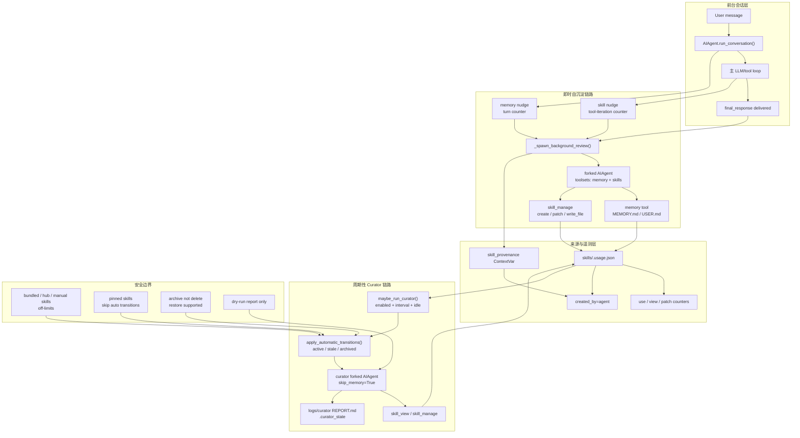
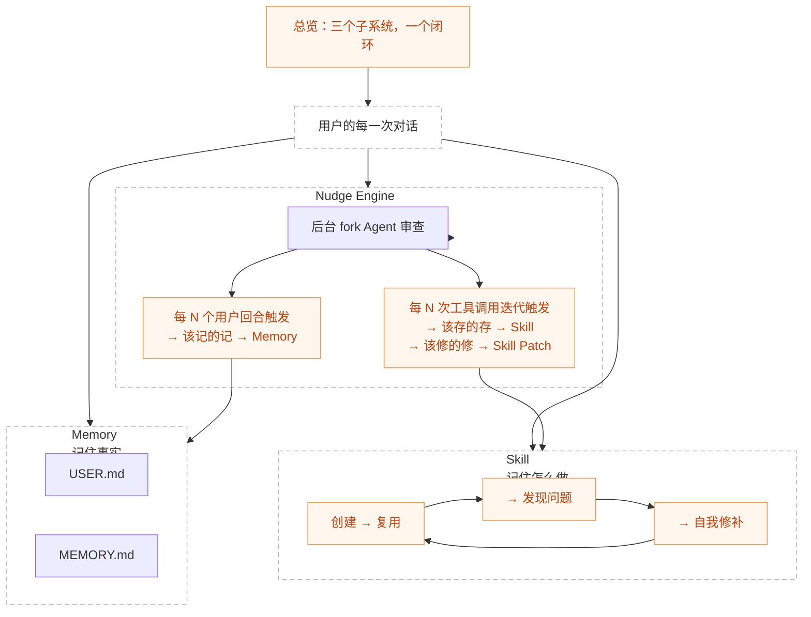
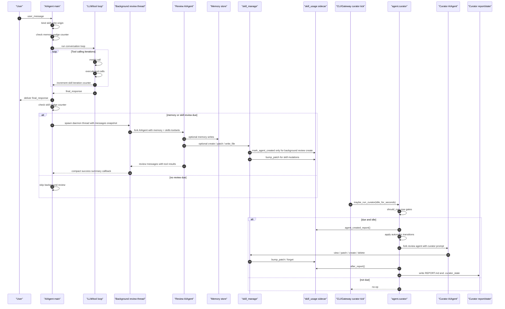
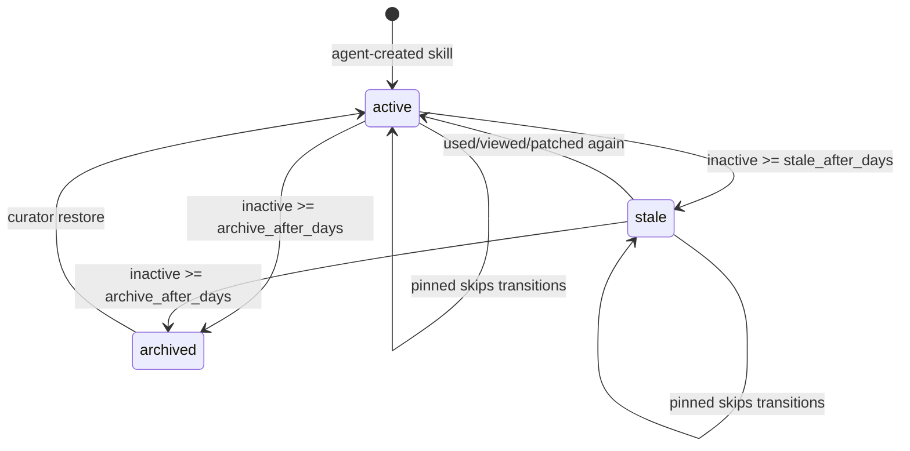

# 第六阶段：自进化机制深度分析

> 目标：深入分析 Hermes Agent 的“自进化机制”：会话结束后的即时自沉淀、后台 Curator 周期整理、技能使用 telemetry、写入来源 provenance、安全边界与人工控制面。
>
> 本阶段承接：
>
> - [[phase0_source_structure_analysis]]
> - [[phase2_main_loop_analysis]]
> - [[phase3_tool_execution_subsystem]]
> - [[phase4_tool_registration_exposure_chain]]
> - [[phase5_memory_deep_analysis]]

---

## 1. 结论先行

Hermes 的“自进化”不是一个单独的 `self_evolve.py`，而是由两条后台链路共同组成：

1. **即时自沉淀链路**
   - 入口：`run_agent.py::run_conversation()`
   - 触发：每轮会话结束后，根据 memory turn nudge 与 skill tool-iteration nudge 判断是否需要 review。
   - 执行：`_spawn_background_review()` fork 一个安静的 `AIAgent`，只启用 `memory` 与 `skills` toolset。
   - 输出：把 durable 用户偏好写进 memory，把可复用工作流写成 / patch 成 skill。
   - 特点：不阻塞用户响应，不修改主会话消息历史，只在成功写入后打印简短摘要。

2. **周期性技能库整理链路**
   - 入口：`agent/curator.py::maybe_run_curator()`
   - 触发：CLI 启动、gateway ticker，经过 `curator.enabled`、`paused`、`interval_hours`、`min_idle_hours` 闸门。
   - 执行：先做无 LLM 的自动状态迁移，再 fork 一个 Curator `AIAgent` 做 umbrella consolidation。
   - 输出：标记 stale、archive、patch、create、delete/consolidate skills，并写 `REPORT.md` 与 `.curator_state`。
   - 特点：只处理 agent 自主创建的 skill；不自动删除用户或 bundled/hub skill；archive 可恢复；pinned 可豁免。

一句话：

```text
每轮后台 review 负责“把本次对话学到的东西沉淀下来”；
Curator 负责“定期整理 agent 自己沉淀出来的技能库，避免越长越乱”。
```

---

## 2. 源码跳转索引

以下链接使用 Obsidian URI，可在 Obsidian 中直接打开源码文件。行号写在“关键位置”列中，便于配合编辑器跳转。

| 模块 | 作用 | 关键位置 | Obsidian 链接 |
| --- | --- | --- | --- |
| `run_agent.py` | 主会话循环、后台 memory/skill review、写入来源绑定 | `3582`、`3792`、`11017`、`11142`、`14677` | [run_agent.py](obsidian://open?path=/Users/chenglin.pu/Project/github/hermes-agent/run_agent.py) |
| `agent/curator.py` | Curator 调度、自动状态迁移、LLM 整理 pass、报告写入 | `1`、`198`、`255`、`1278`、`1515`、`1656` | [curator.py](obsidian://open?path=/Users/chenglin.pu/Project/github/hermes-agent/agent/curator.py) |
| `tools/skill_usage.py` | skill telemetry、agent-created provenance、archive/restore、report | `1`、`216`、`377`、`405`、`479`、`592` | [skill_usage.py](obsidian://open?path=/Users/chenglin.pu/Project/github/hermes-agent/tools/skill_usage.py) |
| `tools/skill_manager_tool.py` | `skill_manage` 写技能、patch 技能、delete/consolidate 技能 | `557`、`713`、`765`、`800`、`915` | [skill_manager_tool.py](obsidian://open?path=/Users/chenglin.pu/Project/github/hermes-agent/tools/skill_manager_tool.py) |
| `tools/skill_provenance.py` | 区分 foreground skill 写入与 background-review 自主写入 | `1`、`37`、`75` | [skill_provenance.py](obsidian://open?path=/Users/chenglin.pu/Project/github/hermes-agent/tools/skill_provenance.py) |
| `tools/skills_tool.py` | `skill_view` 后 bump view/use telemetry | `1500` | [skills_tool.py](obsidian://open?path=/Users/chenglin.pu/Project/github/hermes-agent/tools/skills_tool.py) |
| `agent/skill_commands.py` | slash skill / preloaded skill bump use telemetry | `432`、`479` | [skill_commands.py](obsidian://open?path=/Users/chenglin.pu/Project/github/hermes-agent/agent/skill_commands.py) |
| `hermes_cli/curator.py` | `hermes curator` 命令控制面 | `39`、`471` | [curator.py](obsidian://open?path=/Users/chenglin.pu/Project/github/hermes-agent/hermes_cli/curator.py) |
| `hermes_cli/config.py` | Curator 默认配置与迁移 | `1088` | [config.py](obsidian://open?path=/Users/chenglin.pu/Project/github/hermes-agent/hermes_cli/config.py) |
| `cli.py` | CLI 启动时触发 Curator | `10473` | [cli.py](obsidian://open?path=/Users/chenglin.pu/Project/github/hermes-agent/cli.py) |
| `gateway/run.py` | Gateway ticker 中触发 Curator | `15339` | [run.py](obsidian://open?path=/Users/chenglin.pu/Project/github/hermes-agent/gateway/run.py) |

---

## 3. 总体架构图



### 3.1 总览：三个子系统，一个闭环

用户给的图可以落到源码里的三个子系统：

- **Memory**：记录事实，落到 `USER.md` / `MEMORY.md`，由 memory nudge 触发后台审查。
- **Skill**：记录“怎么做”，通过 `skill_manage` 创建、复用、发现问题、自我修补。
- **Nudge Engine**：计数内省触发器，按对话轮数和工具调用轮数决定是否 fork 后台 review agent。



这张图表达的是“每轮对话不应该失忆”的闭环：普通 Agent 做完一次任务后，Hermes 会用计数器判断是否需要启动后台审查；后台审查再把稳定事实写入 Memory，把可复用流程或纠错经验写入 Skill。后续会话启动时，Memory 通过 system prompt 回到模型上下文，Skill 通过 skill index / skill_view / skill_manage 回到可复用工作流，形成持续学习闭环。

---

### 3.2 Nudge 是什么：计数触发的后台自省机制

在 Hermes Agent 里，**Nudge** 不是一个用户直接调用的工具，也不是聊天里的普通提示词，而是一组“计数触发的后台自省机制”。

它解决的问题是：

```text
一次对话完成后，哪些信息不应该随着上下文结束而丢失？

该记住的事实       -> 写入 Memory
该复用的流程       -> 创建 Skill
该修正的经验       -> Patch 既有 Skill
```

所以 Nudge 更像是 Hermes 自进化闭环里的“后台提醒器”：主 Agent 先正常完成用户任务；任务完成前后，主循环根据计数器判断是否需要 fork 一个后台 review agent；后台 review agent 再审查本轮对话，决定是否调用 memory / skill 工具做沉淀。

源码里主要有两类自进化 Nudge：

| 类型 | 触发计数 | 关注对象 | 结果 |
| --- | --- | --- | --- |
| Memory Nudge | 用户 turn 数 | 用户事实、长期偏好、项目状态、稳定约束 | 写入 `USER.md` / `MEMORY.md` |
| Skill Nudge | tool-calling iteration 数 | 可复用流程、排障步骤、验证方法、已存在 skill 的缺陷 | 创建 skill 或 patch skill |

它们的计数点不同：

```python
# run_agent.py:11139
# Track memory nudge trigger (turn-based, checked here).
# Skill trigger is checked AFTER the agent loop completes, based on
# how many tool iterations THIS turn used.
_should_review_memory = False
if (self._memory_nudge_interval > 0
        and "memory" in self.valid_tool_names
        and self._memory_store):
    self._turns_since_memory += 1
    if self._turns_since_memory >= self._memory_nudge_interval:
        _should_review_memory = True
        self._turns_since_memory = 0
```

```python
# run_agent.py:11422
# Track tool-calling iterations for skill nudge.
# Counter resets whenever skill_manage is actually used.
if (self._skill_nudge_interval > 0
        and "skill_manage" in self.valid_tool_names):
    self._iters_since_skill += 1
```

```python
# run_agent.py:14660
# Check skill trigger NOW — based on how many tool iterations THIS turn used.
_should_review_skills = False
if (self._skill_nudge_interval > 0
        and self._iters_since_skill >= self._skill_nudge_interval
        and "skill_manage" in self.valid_tool_names):
    _should_review_skills = True
    self._iters_since_skill = 0
```

这里有一个容易混淆的点：源码里还存在 **post-tool empty response nudge**，它是在工具调用后模型返回空内容时，用一条合成消息“轻推”模型继续回答。这属于主循环错误恢复，不属于本文讨论的 Memory/Skill 自进化 Nudge。

对比一下：

| 名称 | 所在链路 | 目的 | 是否触发后台 review |
| --- | --- | --- | --- |
| Memory Nudge | 自进化链路 | 定期审查是否该写入长期记忆 | 是 |
| Skill Nudge | 自进化链路 | 定期审查是否该创建/修补技能 | 是 |
| Empty-response Nudge | 主循环恢复链路 | 模型工具调用后空响应时，推动继续输出 | 否 |

一句话总结：

```text
Nudge = Hermes 在合适的计数点提醒自己：
这轮经验可能值得沉淀，不要只回答完就忘掉。
```

---

## 4. 完整时序图



---

## 5. 概念模型：Hermes 的四段式自进化闭环

为了理解源码，可以把自进化拆成四段：

```text
触发 -> 自主写入 -> 遥测归档 -> 周期治理
```

| 段 | 负责模块 | 解决的问题 |
| --- | --- | --- |
| 触发 | `run_agent.py`、`cli.py`、`gateway/run.py` | 什么时候该进行自我改进？ |
| 自主写入 | `_spawn_background_review()`、`memory`、`skill_manage` | 把对话中的可复用知识写到哪里？ |
| 遥测归档 | `skill_usage.py`、`skill_provenance.py` | 哪些技能是 agent 自己创建的？最近有没有被用过？ |
| 周期治理 | `agent/curator.py`、`hermes_cli/curator.py` | 技能库变大后如何合并、归档、恢复、人工控制？ |

这个模型解释了为什么 Hermes 不把所有“记忆”都塞进 `MEMORY.md`：用户偏好和事实进入 memory；可复用工作流进入 skill；skill 的生命周期再由 usage sidecar 与 Curator 管理。

---

## 6. 即时自沉淀：后台 Review Prompt

源码位置：[run_agent.py:3582](obsidian://open?path=/Users/chenglin.pu/Project/github/hermes-agent/run_agent.py)

`AIAgent` 内置三类 review prompt：

1. `_MEMORY_REVIEW_PROMPT`：只检查是否需要保存 memory。
2. `_SKILL_REVIEW_PROMPT`：只检查是否需要更新技能库。
3. `_COMBINED_REVIEW_PROMPT`：同时检查 memory 与 skills。

关键源码：

```python
# run_agent.py:3582
# ------------------------------------------------------------------
# Background memory/skill review
# ------------------------------------------------------------------

_MEMORY_REVIEW_PROMPT = (
    "Review the conversation above and consider saving to memory if appropriate.\n\n"
    "Focus on:\n"
    "1. Has the user revealed things about themselves — their persona, desires, "
    "preferences, or personal details worth remembering?\n"
    "2. Has the user expressed expectations about how you should behave, their work "
    "style, or ways they want you to operate?\n\n"
    "If something stands out, save it using the memory tool. "
    "If nothing is worth saving, just say 'Nothing to save.' and stop."
)
```

技能 review prompt 的核心不是“保存当前任务”，而是要求沉淀成 **class-level skill**：

```python
# run_agent.py:3597
_SKILL_REVIEW_PROMPT = (
    "Review the conversation above and update the skill library. Be "
    "ACTIVE — most sessions produce at least one skill update, even if "
    "small. A pass that does nothing is a missed learning opportunity, "
    "not a neutral outcome.\n\n"
    "Target shape of the library: CLASS-LEVEL skills, each with a rich "
    "SKILL.md and a `references/` directory for session-specific detail. "
    "Not a long flat list of narrow one-session-one-skill entries. This "
    "shapes HOW you update, not WHETHER you update.\n\n"
    "Signals to look for (any one of these warrants action):\n"
    "  • User corrected your style, tone, format, legibility, or "
    "verbosity. Frustration signals like 'stop doing X', 'this is too "
    "verbose', 'don't format like this', 'why are you explaining', "
    "'just give me the answer', 'you always do Y and I hate it', or an "
    "explicit 'remember this' are FIRST-CLASS skill signals, not just "
    "memory signals. Update the relevant skill(s) to embed the "
    "preference so the next session starts already knowing.\n"
)
```

这里有一个非常重要的设计判断：

```text
Memory 记录“用户是谁、偏好是什么、当前状态是什么”；
Skill 记录“这一类任务以后应该怎么做”。
```

所以用户说“以后别这样格式化回答”时，它既可能是 memory，也可能应该 patch 某个 task-specific skill。

---

## 7. 即时自沉淀触发：Memory Nudge

源码位置：[run_agent.py:11142](obsidian://open?path=/Users/chenglin.pu/Project/github/hermes-agent/run_agent.py)

Memory review 是按用户 turn 数触发的：

```python
# run_agent.py:11139
# Track memory nudge trigger (turn-based, checked here).
# Skill trigger is checked AFTER the agent loop completes, based on
# how many tool iterations THIS turn used.
_should_review_memory = False
if (self._memory_nudge_interval > 0
        and "memory" in self.valid_tool_names
        and self._memory_store):
    self._turns_since_memory += 1
    if self._turns_since_memory >= self._memory_nudge_interval:
        _should_review_memory = True
        self._turns_since_memory = 0
```

触发条件说明：

1. `self._memory_nudge_interval > 0`：配置允许 memory review。
2. `"memory" in self.valid_tool_names`：当前 Agent 真的暴露了 memory 工具。
3. `self._memory_store`：内置 memory store 已初始化。
4. `_turns_since_memory >= interval`：达到 turn 间隔。

这意味着 memory 自进化不是每轮都跑，而是按 turn 采样，避免每个短对话都额外消耗一次 LLM 调用。

---

## 8. 即时自沉淀触发：Skill Nudge

源码位置：[run_agent.py:11422](obsidian://open?path=/Users/chenglin.pu/Project/github/hermes-agent/run_agent.py) 与 [run_agent.py:14660](obsidian://open?path=/Users/chenglin.pu/Project/github/hermes-agent/run_agent.py)

Skill review 不是按用户 turn，而是按工具调用 loop 的 iteration 累计：

```python
# run_agent.py:11422
# Track tool-calling iterations for skill nudge.
# Counter resets whenever skill_manage is actually used.
if (self._skill_nudge_interval > 0
        and "skill_manage" in self.valid_tool_names):
    self._iters_since_skill += 1
```

会话结束后再判断是否触发：

```python
# run_agent.py:14660
# Check skill trigger NOW — based on how many tool iterations THIS turn used.
_should_review_skills = False
if (self._skill_nudge_interval > 0
        and self._iters_since_skill >= self._skill_nudge_interval
        and "skill_manage" in self.valid_tool_names):
    _should_review_skills = True
    self._iters_since_skill = 0
```

这个设计把“是否值得更新 skill”绑定到工作复杂度上。工具调用越多，越可能出现新的 workaround、排错路径、用户偏好、验证方法，也就越值得沉淀成 skill。

---

## 9. 后台 Review Fork：不阻塞主响应

源码位置：[run_agent.py:14675](obsidian://open?path=/Users/chenglin.pu/Project/github/hermes-agent/run_agent.py) 与 [run_agent.py:3792](obsidian://open?path=/Users/chenglin.pu/Project/github/hermes-agent/run_agent.py)

主响应已经交付后，才触发后台 review：

```python
# run_agent.py:14675
# Background memory/skill review — runs AFTER the response is delivered
# so it never competes with the user's task for model attention.
if final_response and not interrupted and (_should_review_memory or _should_review_skills):
    try:
        self._spawn_background_review(
            messages_snapshot=list(messages),
            review_memory=_should_review_memory,
            review_skills=_should_review_skills,
        )
    except Exception:
        pass  # Background review is best-effort
```

`_spawn_background_review()` 的关键职责：

```python
# run_agent.py:3792
def _spawn_background_review(
    self,
    messages_snapshot: List[Dict],
    review_memory: bool = False,
    review_skills: bool = False,
) -> None:
    """Spawn a background thread to review the conversation for memory/skill saves.

    Creates a full AIAgent fork with the same model, tools, and context as the
    main session. The review prompt is appended as the next user turn in the
    forked conversation. Writes directly to the shared memory/skill stores.
    Never modifies the main conversation history or produces user-visible output.
    """
    import threading

    if review_memory and review_skills:
        prompt = self._COMBINED_REVIEW_PROMPT
    elif review_memory:
        prompt = self._MEMORY_REVIEW_PROMPT
    else:
        prompt = self._SKILL_REVIEW_PROMPT
```

注意源码注释里的不变量：

```text
forked conversation 继承 messages_snapshot；
review prompt 作为 fork 后的新 user turn；
写入共享 memory/skill store；
不修改主会话 history；
不产生日常用户可见输出。
```

---

## 10. Review Agent 的权限边界

源码位置：[run_agent.py:3845](obsidian://open?path=/Users/chenglin.pu/Project/github/hermes-agent/run_agent.py)

Review fork 继承主 Agent 的 runtime credentials，但只启用 `memory` 和 `skills`：

```python
# run_agent.py:3845
_parent_runtime = self._current_main_runtime()
review_agent = AIAgent(
    model=self.model,
    max_iterations=16,
    quiet_mode=True,
    platform=self.platform,
    provider=self.provider,
    api_mode=_parent_runtime.get("api_mode") or None,
    base_url=_parent_runtime.get("base_url") or None,
    api_key=_parent_runtime.get("api_key") or None,
    credential_pool=getattr(self, "_credential_pool", None),
    parent_session_id=self.session_id,
    enabled_toolsets=["memory", "skills"],
)
review_agent._memory_write_origin = "background_review"
review_agent._memory_write_context = "background_review"
review_agent._memory_store = self._memory_store
review_agent._memory_enabled = self._memory_enabled
review_agent._user_profile_enabled = self._user_profile_enabled
review_agent._memory_nudge_interval = 0
review_agent._skill_nudge_interval = 0
review_agent.suppress_status_output = True
```

这里有几个关键边界：

| 边界 | 源码表现 | 目的 |
| --- | --- | --- |
| 工具边界 | `enabled_toolsets=["memory", "skills"]` | 后台 review 只能写 memory/skill，不应执行业务工具 |
| 迭代边界 | `max_iterations=16` | 避免 review 自己陷入长循环 |
| 递归边界 | `_memory_nudge_interval = 0`、`_skill_nudge_interval = 0` | 避免 review fork 再触发 review |
| 输出边界 | `quiet_mode=True`、`suppress_status_output=True` | 避免后台噪声污染前台 |
| provenance 边界 | `_memory_write_origin = "background_review"` | 让 skill_manage 知道这是 agent 自主沉淀 |

---

## 11. 背景 Review 的成功摘要

源码位置：[run_agent.py:3729](obsidian://open?path=/Users/chenglin.pu/Project/github/hermes-agent/run_agent.py)

Review fork 完成后，主 Agent 不直接展示完整 review 对话，而是扫描 tool result 中的成功动作：

```python
# run_agent.py:3729
@staticmethod
def _summarize_background_review_actions(
    review_messages: List[Dict],
    prior_snapshot: List[Dict],
) -> List[str]:
    """Build the human-facing action summary for a background review pass.

    Walks the review agent's session messages and collects "successful tool
    action" descriptions to surface to the user (e.g. "Memory updated").
    Tool messages already present in ``prior_snapshot`` are skipped so we
    don't re-surface stale results from the prior conversation that the
    review agent inherited via ``conversation_history`` (issue #14944).
    """
```

最终只输出类似：

```python
# run_agent.py:3891
if actions:
    summary = " · ".join(dict.fromkeys(actions))
    self._safe_print(
        f"  💾 Self-improvement review: {summary}"
    )
```

这个细节说明 Hermes 把自进化当成 **后台副作用**，不是主会话回答的一部分。

---

## 12. 写入来源 Provenance：区分“用户要求创建”和“Agent 自主创建”

源码位置：[run_agent.py:11017](obsidian://open?path=/Users/chenglin.pu/Project/github/hermes-agent/run_agent.py) 与 [tools/skill_provenance.py:1](obsidian://open?path=/Users/chenglin.pu/Project/github/hermes-agent/tools/skill_provenance.py)

每次 `run_conversation()` 开始时，都会把当前 Agent 的写入来源绑定到 `ContextVar`：

```python
# run_agent.py:11017
# Bind the skill write-origin ContextVar for this thread so tool
# handlers (e.g. skill_manage create) can tell whether they are
# running inside the background self-improvement review fork vs.
# a foreground user-directed turn.
from tools.skill_provenance import set_current_write_origin
set_current_write_origin(getattr(self, "_memory_write_origin", "assistant_tool"))
```

`tools/skill_provenance.py` 的注释把边界说得很清楚：

```python
# tools/skill_provenance.py:1
"""Skill write-origin provenance — ContextVar for distinguishing agent-sediment skill writes from foreground user-directed writes.

The curator only consolidates/prunes skills it autonomously created via the
background self-improvement review fork. Skills a user asks a foreground
agent to write belong to the user and must never be auto-curated.
"""
```

实现非常小，但非常关键：

```python
# tools/skill_provenance.py:37
_write_origin: contextvars.ContextVar[str] = contextvars.ContextVar(
    "skill_write_origin",
    default="foreground",
)

BACKGROUND_REVIEW = "background_review"

def is_background_review() -> bool:
    """Convenience: True iff the current write origin is the background
    review fork."""
    return get_current_write_origin() == BACKGROUND_REVIEW
```

这解决了一个核心风险：

```text
用户显式要求创建的 skill 属于用户；
后台 review 自主创建的 skill 属于 agent 自进化产物；
Curator 只能整理后者，不能擅自整理前者。
```

---

## 13. `skill_manage`：技能写入与遥测更新入口

源码位置：[tools/skill_manager_tool.py:713](obsidian://open?path=/Users/chenglin.pu/Project/github/hermes-agent/tools/skill_manager_tool.py)

`skill_manage` 是自进化技能写入的统一工具入口：

```python
# tools/skill_manager_tool.py:713
def skill_manage(
    action: str,
    name: str,
    content: str = None,
    category: str = None,
    file_path: str = None,
    file_content: str = None,
    old_string: str = None,
    new_string: str = None,
    replace_all: bool = False,
    absorbed_into: str = None,
) -> str:
    """
    Manage user-created skills. Dispatches to the appropriate action handler.

    Returns JSON string with results.
    """
    if action == "create":
        result = _create_skill(name, content, category)
    elif action == "edit":
        result = _edit_skill(name, content)
    elif action == "patch":
        result = _patch_skill(name, old_string, new_string, file_path, replace_all)
    elif action == "delete":
        result = _delete_skill(name, absorbed_into=absorbed_into)
    elif action == "write_file":
        result = _write_file(name, file_path, file_content)
    elif action == "remove_file":
        result = _remove_file(name, file_path)
```

成功后会清 prompt cache，并更新 Curator telemetry：

```python
# tools/skill_manager_tool.py:765
if result.get("success"):
    try:
        from agent.prompt_builder import clear_skills_system_prompt_cache
        clear_skills_system_prompt_cache(clear_snapshot=True)
    except Exception:
        pass

    try:
        from tools.skill_usage import bump_patch, forget, mark_agent_created
        from tools.skill_provenance import is_background_review
        if action == "create":
            if is_background_review():
                mark_agent_created(name)
        elif action in ("patch", "edit", "write_file", "remove_file"):
            bump_patch(name)
        elif action == "delete":
            forget(name)
    except Exception:
        pass
```

这里的规则很精确：

| action | telemetry 行为 | 含义 |
| --- | --- | --- |
| `create` | 只有 background review 下才 `mark_agent_created(name)` | 前台用户创建的 skill 不纳入 Curator 自动治理 |
| `patch/edit/write_file/remove_file` | `bump_patch(name)` | 记录 skill 被维护过，延后 stale/archive |
| `delete` | `forget(name)` | 删除后移除 telemetry 记录 |

---

## 14. Delete 不是简单删除：`absorbed_into` 表达合并语义

源码位置：[tools/skill_manager_tool.py:557](obsidian://open?path=/Users/chenglin.pu/Project/github/hermes-agent/tools/skill_manager_tool.py)

Curator 做 umbrella consolidation 时，删除一个窄 skill 可能代表“已经合并进另一个 umbrella skill”。源码用 `absorbed_into` 显式声明意图：

```python
# tools/skill_manager_tool.py:557
def _delete_skill(name: str, absorbed_into: Optional[str] = None) -> Dict[str, Any]:
    """Delete a skill.

    ``absorbed_into`` declares intent:
      - ``None`` / missing  → caller didn't declare (legacy / non-curator path);
        accepted for backward compat but logs a warning because the curator
        classification pipeline can't tell consolidation from pruning without it.
      - ``""`` (empty)      → explicit "truly pruned, no forwarding target".
      - ``"<skill-name>"``  → content was absorbed into that umbrella; the
        target must exist on disk. Validated here so the model can't claim an
        umbrella that doesn't exist.
    """
```

schema 也强制把语义告诉模型：

```python
# tools/skill_manager_tool.py:807
"On delete, pass `absorbed_into=<umbrella>` when you're merging this "
"skill's content into another one, or `absorbed_into=\"\"` when you're "
"pruning it with no forwarding target. This lets the curator tell "
"consolidation from pruning without guessing, so downstream consumers "
"(cron jobs that reference the old skill name, etc.) get updated "
"correctly. The target you name in `absorbed_into` must already "
"exist — create/patch the umbrella first, then delete.\n\n"
```

这个字段非常关键：它让报告、cron skill reference rewrite、用户恢复决策都能知道“这是合并”还是“这是废弃”。

---

## 15. Skill Usage Sidecar：自进化的事实账本

源码位置：[tools/skill_usage.py:1](obsidian://open?path=/Users/chenglin.pu/Project/github/hermes-agent/tools/skill_usage.py)

`skill_usage.py` 是 Curator 的事实来源。它把 telemetry 放在 sidecar JSON，而不是写进 `SKILL.md`：

```python
# tools/skill_usage.py:1
"""Skill usage telemetry + provenance tracking for the Curator feature.

Tracks per-skill usage metadata in a sidecar JSON file (~/.hermes/skills/.usage.json)
keyed by skill name. Counters are bumped by the existing skill tools (skill_view,
skill_manage); the curator orchestrator reads the derived activity timestamp to
decide lifecycle transitions.

Design notes:
  - Sidecar, not frontmatter. Keeps operational telemetry out of user-authored
    SKILL.md content and avoids conflict pressure for bundled/hub skills.
  - Atomic writes via tempfile + os.replace (same pattern as .bundled_manifest).
  - All counter bumps are best-effort: failures log at DEBUG and return silently.
    A broken sidecar never breaks the underlying tool call.
  - Provenance filter: curator-managed skills are explicitly marked when
    created through skill_manage. Bundled / hub-installed skills stay
    off-limits, and manually authored skills are not inferred from location.
"""
```

生命周期状态：

```python
# tools/skill_usage.py:52
STATE_ACTIVE = "active"
STATE_STALE = "stale"
STATE_ARCHIVED = "archived"
```

sidecar 默认记录结构：

```python
# tools/skill_usage.py:304
def _empty_record() -> Dict[str, Any]:
    return {
        "created_by": None,
        "use_count": 0,
        "view_count": 0,
        "last_used_at": None,
        "last_viewed_at": None,
        "patch_count": 0,
        "last_patched_at": None,
        "created_at": _now_iso(),
        "state": STATE_ACTIVE,
        "pinned": False,
        "archived_at": None,
    }
```

这份账本支持 Curator 回答三个问题：

1. 这个 skill 是 agent 自己创建的吗？
2. 它最近是否被使用、查看、patch 过？
3. 它现在是 active、stale、archived，还是 pinned？

---

## 16. Curator 只处理 Agent 自主创建的 Skill

源码位置：[tools/skill_usage.py:216](obsidian://open?path=/Users/chenglin.pu/Project/github/hermes-agent/tools/skill_usage.py)

Curator 的候选集不是扫描所有 `~/.hermes/skills/**/SKILL.md` 后直接处理，而是先过滤 bundled / hub / 非 agent-created：

```python
# tools/skill_usage.py:216
def list_agent_created_skill_names() -> List[str]:
    """Enumerate skills explicitly authored by the agent.

    The curator operates exclusively on this set. Skills are only eligible
    after ``skill_manage(action="create")`` marks them in ``.usage.json``;
    manually authored skills must not be inferred from filesystem location.
    Bundled / hub skills are maintained by their upstream sources and must
    never be pruned here.
    """
    bundled = _read_bundled_manifest_names()
    hub = _read_hub_installed_names()
    off_limits = bundled | hub
    usage = load_usage()

    names: List[str] = []
    for skill_md in base.rglob("SKILL.md"):
        name = _read_skill_name(skill_md, fallback=skill_md.parent.name)
        if name in off_limits:
            continue
        if not _is_curator_managed_record(usage.get(name)):
            continue
        names.append(name)
    return sorted(set(names))
```

真正的 curator-managed 标记只认两个字段：

```python
# tools/skill_usage.py:293
def _is_curator_managed_record(record: Any) -> bool:
    """Return True when a usage record opts a skill into curator management."""
    if not isinstance(record, dict):
        return False
    return record.get("created_by") == "agent" or record.get("agent_created") is True
```

这个设计避免了一个危险行为：

```text
不能因为一个 skill 位于 ~/.hermes/skills/，就假设它是 agent 可以整理、合并、归档的资产。
```

---

## 17. Skill 使用、查看、Patch 如何计入活跃度

源码位置：[tools/skill_usage.py:405](obsidian://open?path=/Users/chenglin.pu/Project/github/hermes-agent/tools/skill_usage.py)

Curator 判断 stale/archive 用的是 `last_activity_at`，activity 包含 use、view、patch：

```python
# tools/skill_usage.py:120
def latest_activity_at(record: Dict[str, Any]) -> Optional[str]:
    """Return the newest actual activity timestamp for a usage record.

    "Activity" means a skill was used, viewed, or patched. Creation time is
    intentionally excluded so callers can still distinguish never-active skills;
    lifecycle code can fall back to ``created_at`` as its own anchor.
    """
    for key in ("last_used_at", "last_viewed_at", "last_patched_at"):
        ...
```

计数入口：

```python
# tools/skill_usage.py:405
def bump_view(skill_name: str) -> None:
    """Bump view_count and last_viewed_at. Called from skill_view()."""

def bump_use(skill_name: str) -> None:
    """Bump use_count and last_used_at. Called when a skill is actively used
    (e.g. loaded into the prompt path or referenced from an assistant turn)."""

def bump_patch(skill_name: str) -> None:
    """Bump patch_count and last_patched_at. Called from skill_manage (patch/edit)."""
```

`skill_view` 成功后会同时计入 view 和 use：

```python
# tools/skills_tool.py:1500
def _skill_view_with_bump(args, **kw):
    result = skill_view(
        name, file_path=args.get("file_path"), task_id=kw.get("task_id")
    )
    try:
        parsed = json.loads(result)
        if isinstance(parsed, dict) and parsed.get("success"):
            resolved = parsed.get("name") or name
            if resolved:
                from tools.skill_usage import bump_use, bump_view
                bump_view(str(resolved))
                bump_use(str(resolved))
    except Exception:
        pass
    return result
```

slash skill / preloaded skill 也计入 use：

```python
# agent/skill_commands.py:432
# Track active usage for Curator lifecycle management (#17782)
try:
    from tools.skill_usage import bump_use
    bump_use(skill_name)
except Exception:
    pass  # Non-critical — skill invocation proceeds regardless
```

所以一个 skill 被查看、加载、修补，都会延后它进入 stale/archive。

---

## 18. Curator：周期性技能库治理器

源码位置：[agent/curator.py:1](obsidian://open?path=/Users/chenglin.pu/Project/github/hermes-agent/agent/curator.py)

文件头注释已经定义了 Curator 的定位：

```python
# agent/curator.py:1
"""Curator — background skill maintenance orchestrator.

The curator is an auxiliary-model task that periodically reviews agent-created
skills and maintains the collection. It runs inactivity-triggered (no cron
daemon): when the agent is idle and the last curator run was longer than
``interval_hours`` ago, ``maybe_run_curator()`` spawns a forked AIAgent to do
the review.

Responsibilities:
  - Auto-transition lifecycle states based on derived skill activity timestamps
  - Spawn a background review agent that can pin / archive / consolidate /
    patch agent-created skills via skill_manage
  - Persist curator state (last_run_at, paused, etc.) in .curator_state

Strict invariants:
  - Only touches agent-created skills (see tools/skill_usage.is_agent_created)
  - Never auto-deletes — only archives. Archive is recoverable.
  - Pinned skills bypass all auto-transitions
  - Uses the auxiliary client; never touches the main session's prompt cache
"""
```

默认节奏：

```python
# agent/curator.py:56
DEFAULT_INTERVAL_HOURS = 24 * 7  # 7 days
DEFAULT_MIN_IDLE_HOURS = 2
DEFAULT_STALE_AFTER_DAYS = 30
DEFAULT_ARCHIVE_AFTER_DAYS = 90
```

状态文件：

```python
# agent/curator.py:66
def _state_file() -> Path:
    return get_hermes_home() / "skills" / ".curator_state"

def _default_state() -> Dict[str, Any]:
    return {
        "last_run_at": None,
        "last_run_duration_seconds": None,
        "last_run_summary": None,
        "last_report_path": None,
        "paused": False,
        "run_count": 0,
    }
```

---

## 19. Curator 调度闸门

源码位置：[agent/curator.py:198](obsidian://open?path=/Users/chenglin.pu/Project/github/hermes-agent/agent/curator.py)

`should_run_now()` 只处理静态闸门，idle 闸门由调用处传入：

```python
# agent/curator.py:198
def should_run_now(now: Optional[datetime] = None) -> bool:
    """Return True if the curator should run immediately.

    Gates:
      - curator.enabled == True
      - not paused
      - last_run_at present AND older than interval_hours

    First-run behavior: when there is no ``last_run_at`` (fresh install, or
    install that predates the curator), we DO NOT run immediately.
    """
    if not is_enabled():
        return False
    if is_paused():
        return False

    state = load_state()
    last = _parse_iso(state.get("last_run_at"))
    if last is None:
        state["last_run_at"] = now.isoformat()
        state["last_run_summary"] = (
            "deferred first run — curator seeded, will run after one "
            "interval; use `hermes curator run --dry-run` to preview now"
        )
        save_state(state)
        return False

    interval = timedelta(hours=get_interval_hours())
    return (now - last) >= interval
```

公开入口：

```python
# agent/curator.py:1656
def maybe_run_curator(
    *,
    idle_for_seconds: Optional[float] = None,
    on_summary: Optional[Callable[[str], None]] = None,
) -> Optional[Dict[str, Any]]:
    """Best-effort: run a curator pass if all gates pass."""
    try:
        if not should_run_now():
            return None
        if idle_for_seconds is not None:
            min_idle_s = get_min_idle_hours() * 3600.0
            if idle_for_seconds < min_idle_s:
                return None
        return run_curator_review(on_summary=on_summary)
    except Exception as e:
        logger.debug("maybe_run_curator failed: %s", e, exc_info=True)
        return None
```

这说明 Curator 是 best-effort 后台维护，不应该破坏 CLI/gateway 的主路径。

---

## 20. Curator 触发点：CLI 与 Gateway

CLI 启动时触发：

```python
# cli.py:10473
# Curator — kick off a background skill-maintenance pass on startup
# if the schedule says we're due.  Runs in a daemon thread so it
# never blocks the interactive loop.
try:
    from agent.curator import maybe_run_curator
    maybe_run_curator(
        idle_for_seconds=float("inf"),  # CLI startup = fully idle
        on_summary=lambda msg: self._console_print(
            f"[dim #6b7684]💾 {msg}[/]"
        ),
    )
except Exception:
    pass
```

Gateway 长驻进程通过 ticker 触发：

```python
# gateway/run.py:15339
# Curator — piggy-back on the existing cron ticker so long-running
# gateways get weekly skill maintenance without needing restarts.
if tick_count % CURATOR_EVERY == 0:
    try:
        from agent.curator import maybe_run_curator
        maybe_run_curator(
            idle_for_seconds=float("inf"),
            on_summary=lambda msg: logger.info("curator: %s", msg),
        )
    except Exception as e:
        logger.debug("Curator tick error: %s", e)
```

注意：Gateway 的 `CURATOR_EVERY` 是 poll rate，真正是否执行仍由 `maybe_run_curator()` 内部的 `interval_hours` 决定。

---

## 21. Curator 自动状态迁移

源码位置：[agent/curator.py:255](obsidian://open?path=/Users/chenglin.pu/Project/github/hermes-agent/agent/curator.py)

Curator 先做不依赖 LLM 的状态迁移：

```python
# agent/curator.py:255
def apply_automatic_transitions(now: Optional[datetime] = None) -> Dict[str, int]:
    """Walk every agent-created skill and move active/stale/archived based on
    the latest real activity timestamp. Pinned skills are never touched.
    Returns a counter dict describing what changed."""
    from tools import skill_usage as _u

    stale_cutoff = now - timedelta(days=get_stale_after_days())
    archive_cutoff = now - timedelta(days=get_archive_after_days())

    counts = {"marked_stale": 0, "archived": 0, "reactivated": 0, "checked": 0}

    for row in _u.agent_created_report():
        counts["checked"] += 1
        name = row["name"]
        if row.get("pinned"):
            continue

        last_activity = _parse_iso(row.get("last_activity_at"))
        anchor = last_activity or _parse_iso(row.get("created_at")) or now
        current = row.get("state", _u.STATE_ACTIVE)

        if anchor <= archive_cutoff and current != _u.STATE_ARCHIVED:
            ok, _msg = _u.archive_skill(name)
            if ok:
                counts["archived"] += 1
        elif anchor <= stale_cutoff and current == _u.STATE_ACTIVE:
            _u.set_state(name, _u.STATE_STALE)
            counts["marked_stale"] += 1
        elif anchor > stale_cutoff and current == _u.STATE_STALE:
            _u.set_state(name, _u.STATE_ACTIVE)
            counts["reactivated"] += 1
```

状态机可以抽象为：



核心策略：

1. `pinned` 直接跳过自动迁移。
2. `last_activity_at` 优先，缺失时用 `created_at` 兜底。
3. `archive_skill()` 是移动到 `.archive/`，不是不可恢复删除。
4. stale skill 再次被使用会自动 reactivated。

---

## 22. Archive / Restore 是可恢复设计

源码位置：[tools/skill_usage.py:479](obsidian://open?path=/Users/chenglin.pu/Project/github/hermes-agent/tools/skill_usage.py)

archive 的实现是移动目录：

```python
# tools/skill_usage.py:479
def archive_skill(skill_name: str) -> Tuple[bool, str]:
    """Move an agent-created skill directory to ~/.hermes/skills/.archive/.

    Returns (ok, message). Never archives bundled or hub skills — callers are
    responsible for checking provenance, but we double-check here as a safety net.
    """
    if not is_agent_created(skill_name):
        return False, f"skill '{skill_name}' is bundled or hub-installed; never archive"

    skill_dir = _find_skill_dir(skill_name)
    if skill_dir is None:
        return False, f"skill '{skill_name}' not found"

    archive_root = _archive_dir()
    dest = archive_root / skill_dir.name
    if dest.exists():
        dest = archive_root / f"{skill_dir.name}-{datetime.now(timezone.utc).strftime('%Y%m%d%H%M%S')}"

    skill_dir.rename(dest)
    set_state(skill_name, STATE_ARCHIVED)
    return True, f"archived to {dest}"
```

restore 同样是移动回来：

```python
# tools/skill_usage.py:518
def restore_skill(skill_name: str) -> Tuple[bool, str]:
    """Move an archived skill back to ~/.hermes/skills/. Restores to the flat
    top-level layout; original category nesting is NOT reconstructed.
    """
    if not is_agent_created(skill_name):
        return False, (
            f"skill '{skill_name}' is now bundled or hub-installed; "
            "restore would shadow the upstream version"
        )
    ...
    src.rename(dest)
    set_state(skill_name, STATE_ACTIVE)
    return True, f"restored to {dest}"
```

这也是为什么源码反复强调 Curator “never auto-deletes”。

---

## 23. Curator Review Pass：先自动迁移，再 LLM 整理

源码位置：[agent/curator.py:1278](obsidian://open?path=/Users/chenglin.pu/Project/github/hermes-agent/agent/curator.py)

`run_curator_review()` 是完整 pass 的编排入口：

```python
# agent/curator.py:1278
def run_curator_review(
    on_summary: Optional[Callable[[str], None]] = None,
    synchronous: bool = False,
    dry_run: bool = False,
) -> Dict[str, Any]:
    """Execute a single curator review pass.

    Steps:
      1. Apply automatic state transitions (pure, no LLM).
      2. If there are agent-created skills, spawn a forked AIAgent that runs
         the LLM review prompt against the current candidate list.
      3. Update .curator_state with last_run_at and a one-line summary.
      4. Invoke *on_summary* with a user-visible description.
    """
```

真实 run 会先做 pre-run snapshot，再自动迁移：

```python
# agent/curator.py:1315
try:
    from agent import curator_backup
    snap = curator_backup.snapshot_skills(reason="pre-curator-run")
    if snap is not None and on_summary:
        on_summary(f"curator: snapshot created ({snap.name})")
except Exception as e:
    logger.debug("Curator pre-run snapshot failed: %s", e, exc_info=True)
counts = apply_automatic_transitions(now=start)
```

dry-run 不改状态，只生成候选统计与报告：

```python
# agent/curator.py:1301
if dry_run:
    # Count candidates without mutating state.
    report = skill_usage.agent_created_report()
    counts = {
        "checked": len(report),
        "marked_stale": 0,
        "archived": 0,
        "reactivated": 0,
    }
```

LLM pass 会拿到 candidate list：

```python
# agent/curator.py:1363
try:
    candidate_list = _render_candidate_list()
    if "No agent-created skills" in candidate_list:
        final_summary = f"{prefix}{auto_summary}; llm: skipped (no candidates)"
    else:
        if dry_run:
            prompt = (
                f"{CURATOR_DRY_RUN_BANNER}\n\n"
                f"{CURATOR_REVIEW_PROMPT}\n\n"
                f"{candidate_list}"
            )
        else:
            prompt = f"{CURATOR_REVIEW_PROMPT}\n\n{candidate_list}"
        llm_meta = _run_llm_review(prompt)
```

---

## 24. Curator Review Agent：高迭代上限但禁用 memory

源码位置：[agent/curator.py:1515](obsidian://open?path=/Users/chenglin.pu/Project/github/hermes-agent/agent/curator.py)

Curator 的 review agent 与每轮即时 review agent 不同：它可能要扫描大量 skill，所以 iteration 上限很高：

```python
# agent/curator.py:1515
def _run_llm_review(prompt: str) -> Dict[str, Any]:
    """Spawn an AIAgent fork to run the curator review prompt.

    Returns a dict with:
      - final: full final response from the reviewer
      - summary: short summary suitable for state file
      - model, provider: what the fork actually ran on
      - tool_calls: list of every tool call made during the pass
      - error: set if the pass failed mid-run
    """
```

fork 参数：

```python
# agent/curator.py:1582
review_agent = AIAgent(
    model=_model_name,
    provider=_resolved_provider,
    api_key=_api_key,
    base_url=_base_url,
    api_mode=_api_mode,
    max_iterations=9999,
    quiet_mode=True,
    platform="curator",
    skip_context_files=True,
    skip_memory=True,
)
# Disable recursive nudges — the curator must never spawn its own review.
review_agent._memory_nudge_interval = 0
review_agent._skill_nudge_interval = 0
```

关键设计：

1. `platform="curator"`：把这类后台任务与前台平台区分开。
2. `skip_context_files=True`：避免加载工作目录上下文干扰技能库治理。
3. `skip_memory=True`：Curator 不需要用户 memory 注入，减少提示词污染。
4. `max_iterations=9999`：允许大规模技能库整理，但实际由工具链、模型和任务完成情况约束。
5. 禁用 recursive nudges：Curator 不能再触发自沉淀 review。

---

## 25. Curator Prompt 的目标：Umbrella-Building

源码位置：[agent/curator.py:329](obsidian://open?path=/Users/chenglin.pu/Project/github/hermes-agent/agent/curator.py)

Curator prompt 的核心目标不是找重复文件，而是把 narrow session skill 合并成 class-level umbrella skill：

```python
# agent/curator.py:329
CURATOR_REVIEW_PROMPT = (
    "You are running as Hermes' background skill CURATOR. This is an "
    "UMBRELLA-BUILDING consolidation pass, not a passive audit and not a "
    "duplicate-finder.\n\n"
    "The goal of the skill collection is a LIBRARY OF CLASS-LEVEL "
    "INSTRUCTIONS AND EXPERIENTIAL KNOWLEDGE. A collection of hundreds of "
    "narrow skills where each one captures one session's specific bug is "
    "a FAILURE of the library — not a feature. An agent searching skills "
    "matches on descriptions, not on exact names; one broad umbrella "
    "skill with labeled subsections beats five narrow siblings for "
    "discoverability, not the other way around.\n\n"
)
```

这与即时 review prompt 的“class-level skills”目标一致：

```text
即时 review 负责产生/修补知识；
Curator 负责把散落知识整理成更好的检索单元。
```

---

## 26. Curator 报告与审计

源码位置：[agent/curator.py:1401](obsidian://open?path=/Users/chenglin.pu/Project/github/hermes-agent/agent/curator.py)

每次 Curator pass 都会记录前后状态、LLM final、tool calls，并写报告：

```python
# agent/curator.py:1401
elapsed = (datetime.now(timezone.utc) - start).total_seconds()
state2 = load_state()
state2["last_run_duration_seconds"] = elapsed
state2["last_run_summary"] = final_summary

try:
    after_report = skill_usage.agent_created_report()
except Exception:
    after_report = []
try:
    report_path = _write_run_report(
        started_at=start,
        elapsed_seconds=elapsed,
        auto_counts=counts,
        auto_summary=auto_summary,
        before_report=before_report,
        before_names=before_names,
        after_report=after_report,
        llm_meta=llm_meta,
    )
    if report_path is not None:
        state2["last_report_path"] = str(report_path)
except Exception as e:
    logger.debug("Curator report write failed: %s", e, exc_info=True)

save_state(state2)
```

报告中会突出几类变化：

| 报告分类 | 含义 |
| --- | --- |
| Consolidated into umbrella skills | 窄 skill 被吸收进 umbrella skill |
| Pruned | 没有合并目标，因陈旧或无价值被归档 |
| New skills this run | Curator 创建了新的 class-level umbrella |
| State transitions | active / stale / archived 状态变化 |
| Cron job skill references rewritten | cron job 引用的 skill 名称被同步改写 |
| Recovery | 提供 restore 路径和 `run.json` 审计入口 |

---

## 27. 人工控制面：`hermes curator`

源码位置：[hermes_cli/curator.py:1](obsidian://open?path=/Users/chenglin.pu/Project/github/hermes-agent/hermes_cli/curator.py)

Curator CLI 是 `agent/curator.py` 与 `tools/skill_usage.py` 的薄封装：

```python
# hermes_cli/curator.py:1
"""CLI subcommand: `hermes curator <subcommand>`.

Thin shell around agent/curator.py and tools/skill_usage.py. Renders a status
table, triggers a run, pauses/resumes, and pins/unpins skills.
"""
```

命令注册：

```python
# hermes_cli/curator.py:471
def register_cli(parent: argparse.ArgumentParser) -> None:
    """Attach `curator` subcommands to *parent*."""
    parent.set_defaults(func=lambda a: (parent.print_help(), 0)[1])
    subs = parent.add_subparsers(dest="curator_command")

    p_status = subs.add_parser("status", help="Show curator status and skill stats")
    p_run = subs.add_parser("run", help="Trigger a curator review now")
    p_run.add_argument("--dry-run", dest="dry_run", action="store_true")
    p_pause = subs.add_parser("pause", help="Pause the curator until resumed")
    p_resume = subs.add_parser("resume", help="Resume a paused curator")
    p_pin = subs.add_parser("pin", help="Pin a skill so the curator never auto-transitions it")
    p_unpin = subs.add_parser("unpin", help="Unpin a skill")
    p_restore = subs.add_parser("restore", help="Restore an archived skill")
    subs.add_parser("list-archived", help="List archived skills")
```

控制面覆盖了几个关键风险操作：

| 命令 | 作用 |
| --- | --- |
| `hermes curator status` | 看 enabled/paused、last run、last report、skill 状态统计 |
| `hermes curator run --dry-run` | 只生成报告，不修改 skill 库 |
| `hermes curator run` | 手动触发真实整理 |
| `hermes curator pause/resume` | 全局暂停/恢复 Curator |
| `hermes curator pin/unpin <skill>` | 让关键 skill 跳过自动迁移 |
| `hermes curator archive/restore <skill>` | 手动归档/恢复 |
| `hermes curator rollback` | 从 pre-run snapshot 回滚 |

---

## 28. 配置面

源码位置：[hermes_cli/config.py:1088](obsidian://open?path=/Users/chenglin.pu/Project/github/hermes-agent/hermes_cli/config.py)

默认配置：

```python
# hermes_cli/config.py:1088
"curator": {
    "enabled": True,
    # How long to wait between curator runs (hours).  Default: 7 days.
    "interval_hours": 24 * 7,
    # Only run when the agent has been idle at least this long (hours).
    "min_idle_hours": 2,
    # Mark a skill as "stale" after this many days without use.
    "stale_after_days": 30,
    # Archive a skill (move to skills/.archive/) after this many days
    # without use. Archived skills are recoverable — no auto-deletion.
    "archive_after_days": 90,
    "backup": {
        "enabled": True,
        "keep": 5,
    },
},
```

配置含义：

| 配置 | 默认 | 作用 |
| --- | --- | --- |
| `curator.enabled` | `true` | 是否启用 Curator |
| `curator.interval_hours` | `168` | 两次 Curator pass 的最小间隔 |
| `curator.min_idle_hours` | `2` | 至少空闲多久才允许后台整理 |
| `curator.stale_after_days` | `30` | 多久未活动标记 stale |
| `curator.archive_after_days` | `90` | 多久未活动移动到 `.archive/` |
| `curator.backup.enabled` | `true` | 真实整理前是否快照 skill 目录 |
| `curator.backup.keep` | `5` | 保留最近多少个快照 |

---

## 29. 两条自进化链路的对比

| 维度 | 即时后台 review | Curator |
| --- | --- | --- |
| 入口 | `run_conversation()` 结束后 | `maybe_run_curator()` |
| 触发条件 | memory turn nudge / skill iteration nudge | enabled + interval + idle |
| 执行线程 | `bg-review` daemon thread | `curator-review` daemon thread 或 CLI sync |
| Agent 配置 | `max_iterations=16`，`enabled_toolsets=["memory","skills"]` | `max_iterations=9999`，`platform="curator"`，`skip_memory=True` |
| 主要动作 | 写 memory、create/patch/write_file skill | stale/archive/reactivate、合并、patch、create、delete |
| 处理范围 | 当前会话快照 | 所有 agent-created skills |
| 安全边界 | 不阻塞主响应、不修改主 history、禁用 recursive nudge | 只碰 agent-created、pinned 跳过、archive 可恢复、dry-run |
| 产物 | memory files、skill files、简短 summary | skill files、`.usage.json`、`.curator_state`、REPORT.md |

---

## 30. 关键不变量

1. **主会话优先**
   - 用户的 final response 先返回，自进化后台跑。
   - 后台失败只记录 warning，不破坏主会话。

2. **Review fork 不能递归触发 review**
   - 即时 review 与 Curator 都会把 `_memory_nudge_interval`、`_skill_nudge_interval` 设为 `0`。

3. **用户资产与 agent 资产分离**
   - 前台用户要求创建的 skill 不自动 `mark_agent_created`。
   - Curator 只处理 `.usage.json` 中 `created_by=agent` 的 skill。

4. **Bundled / hub skills 不进入自动治理**
   - `list_agent_created_skill_names()` 会读取 `.bundled_manifest` 与 `.hub/lock.json`，排除这些 skill。

5. **Pinned skills 不自动迁移**
   - `apply_automatic_transitions()` 遇到 `row.get("pinned")` 直接 `continue`。

6. **Archive 可恢复，不做不可逆自动删除**
   - 自动状态迁移调用的是 `archive_skill()`，移动到 `.archive/`。
   - CLI 提供 `restore` 与 `rollback`。

7. **Telemetry 是 best-effort**
   - `bump_use`、`bump_view`、`bump_patch` 失败不会影响原工具调用。

8. **Curator 是治理，不是记忆注入**
   - Curator fork 使用 `skip_memory=True`，避免用户 memory 污染技能库治理。

---

## 31. 设计评价

### 31.1 优点

1. **把“学习”从主路径剥离**
   - 主会话响应不被学习逻辑阻塞。
   - 后台 review 失败不会让用户任务失败。

2. **memory 与 skill 分工清晰**
   - durable user facts/preferences 进入 memory。
   - reusable procedural knowledge 进入 skill。

3. **provenance 边界严谨**
   - 只有 background review create 的 skill 才会被 Curator 自动治理。
   - 用户显式创建、bundled、hub-installed skill 不被自动整理。

4. **生命周期治理有审计与恢复**
   - `.usage.json`、`.curator_state`、REPORT.md、pre-run backup 共同形成审计链。
   - archive/restore/rollback 减少误整理风险。

5. **支持技能库规模化**
   - 即时 review 会不断沉淀经验。
   - Curator 定期把窄 skill 收敛成 umbrella skill，避免技能库碎片化。

### 31.2 代价

1. **后台 LLM 成本增加**
   - 即时 review 和 Curator 都可能额外调用模型。

2. **行为更难直接观察**
   - 自进化发生在后台，需要看 summary、report、`.usage.json` 才能完整理解。

3. **sidecar 与真实文件可能短暂不一致**
   - telemetry 是 best-effort，外部手动移动 skill 目录也可能让 report 需要重新对齐。

4. **Curator 依赖 LLM 判断质量**
   - 自动 stale/archive 是规则确定的；umbrella consolidation 仍依赖模型判断。
   - 因此 dry-run、pin、backup、rollback 都是必要配套。

---

## 32. 调试建议

### 32.1 看即时自沉淀是否触发

关注：

- `run_agent.py:11142` memory nudge 是否满足。
- `run_agent.py:11424` skill iteration counter 是否累计。
- `run_agent.py:14677` 是否进入 `_spawn_background_review()`。
- 前台是否出现 `Self-improvement review: ...` 摘要。

### 32.2 看某个 skill 是否会被 Curator 管

检查：

```text
$HERMES_HOME/skills/.usage.json
```

对应 skill 需要满足：

```json
{
  "created_by": "agent"
}
```

同时不能出现在：

```text
$HERMES_HOME/skills/.bundled_manifest
$HERMES_HOME/skills/.hub/lock.json
```

### 32.3 看 Curator 为什么没跑

检查：

1. `curator.enabled`
2. `.curator_state.paused`
3. `.curator_state.last_run_at`
4. `curator.interval_hours`
5. `curator.min_idle_hours`
6. 是否有 agent-created candidates

命令：

```bash
hermes curator status
hermes curator run --dry-run
```

### 32.4 防止重要 skill 被归档

使用：

```bash
hermes curator pin <skill>
```

源码效果：

```python
# agent/curator.py:270
if row.get("pinned"):
    continue
```

---

## 33. 本阶段核心源码地图

```text
run_agent.py
  ├─ _MEMORY_REVIEW_PROMPT / _SKILL_REVIEW_PROMPT / _COMBINED_REVIEW_PROMPT
  ├─ run_conversation()
  │   ├─ bind skill_provenance ContextVar
  │   ├─ memory turn nudge
  │   ├─ skill iteration nudge
  │   └─ _spawn_background_review()
  └─ _summarize_background_review_actions()

tools/skill_provenance.py
  └─ ContextVar: foreground vs background_review

tools/skill_manager_tool.py
  ├─ skill_manage()
  ├─ _delete_skill(absorbed_into)
  └─ telemetry: mark_agent_created / bump_patch / forget

tools/skill_usage.py
  ├─ .usage.json sidecar
  ├─ list_agent_created_skill_names()
  ├─ bump_use / bump_view / bump_patch
  ├─ archive_skill / restore_skill
  └─ agent_created_report()

agent/curator.py
  ├─ should_run_now()
  ├─ apply_automatic_transitions()
  ├─ run_curator_review()
  ├─ _run_llm_review()
  └─ maybe_run_curator()

hermes_cli/curator.py
  └─ status / run / dry-run / pause / resume / pin / restore / rollback

cli.py / gateway/run.py
  └─ trigger maybe_run_curator()
```

---

## 34. 最终理解

Hermes 的自进化机制可以概括为：

```text
主 Agent 完成任务后，把“值得长期保存的事实”交给 memory，
把“值得复用的做法”交给 skills；
skill 写入带上 provenance 与 telemetry；
Curator 再周期性根据 telemetry 管理 agent 自己创建的 skill，
把碎片化经验整理为 class-level umbrella library。
```

它不是无约束自修改，而是带有明确闸门的后台维护系统：

- 触发有间隔；
- 工具有边界；
- 来源可追踪；
- 资产有归属；
- 归档可恢复；
- 用户可 dry-run、pause、pin、restore、rollback。

所以更准确地说，Hermes 的“自进化”是 **受约束的经验沉淀与技能库治理机制**，而不是任意修改自身源码的自动编程系统。
