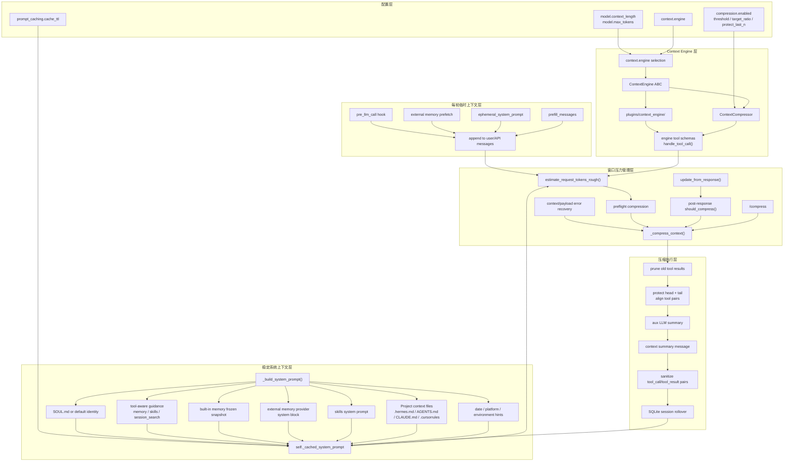
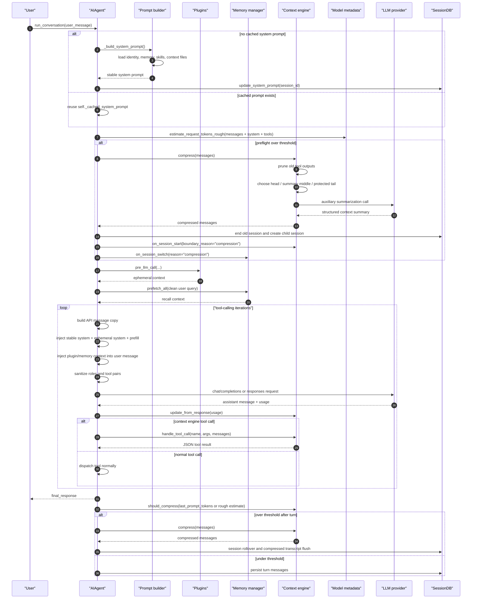

# 第七阶段：Context 管理深度分析

> 目标：深入分析 Hermes Agent 的 Context 管理体系：系统提示词构建、项目上下文文件加载、插件/Memory 临时上下文注入、Context Engine 抽象、自动压缩、手动压缩、上下文长度探测、prompt cache 稳定性与 session rollover。
>
> 本阶段承接：
>
> - [[phase0_source_structure_analysis]]
> - [[phase2_main_loop_analysis]]
> - [[phase3_tool_execution_subsystem]]
> - [[phase4_tool_registration_exposure_chain]]
> - [[phase5_memory_deep_analysis]]
> - [[phase6_self_evolution_mechanism_analysis]]

---

## 1. 结论先行

Hermes 的 Context 管理不是“把所有东西拼进 prompt”这么简单，而是分成四条互相配合的链路：

1. **稳定系统上下文链路**
   - 入口：`run_agent.py::_build_system_prompt()`
   - 内容：身份、工具行为指导、Memory frozen snapshot、Skills index、项目上下文文件、平台提示、时间戳。
   - 特点：每个 session 只构建一次，缓存在 `self._cached_system_prompt`，只有压缩、切模型、reset 等事件才重建。

2. **临时用户上下文链路**
   - 入口：`pre_llm_call` plugin hook、external memory prefetch、ephemeral system prompt、prefill messages。
   - 内容：插件上下文、外部 memory recall、一次性系统提示、few-shot prefill。
   - 特点：尽量注入 user message 或 API-call-time copy，不写入稳定 system prompt，保护 prompt cache prefix。

3. **上下文窗口压力管理链路**
   - 入口：`ContextEngine` 抽象，默认实现是 `ContextCompressor`。
   - 动作：估算请求 tokens、追踪 provider usage、preflight 压缩、API 错误压缩、响应后自动压缩、手动 `/compress`。
   - 特点：先便宜剪裁旧工具输出，再用辅助模型总结中间消息，保护 head 与 tail。

4. **可插拔 Context Engine 链路**
   - 入口：`context.engine` 配置。
   - 实现：`plugins/context_engine/<name>/` 或 general plugin 注册。
   - 能力：替代默认 compressor，也可以暴露 context 工具，例如 `lcm_grep`、`lcm_describe`、`lcm_expand`。

一句话：

```text
Hermes 用稳定 system prompt 承载长期规则；
用 user-message 级 ephemeral injection 承载每轮动态上下文；
用 ContextEngine 在窗口接近上限时压缩或替换历史；
用 prompt cache 约束所有上下文注入的位置和时机。
```

---

## 2. 源码跳转索引

以下链接使用 Obsidian URI，可在 Obsidian 中直接打开源码文件。行号写在“关键位置”列中，便于配合编辑器跳转。

| 模块 | 作用 | 关键位置 | Obsidian 链接 |
| --- | --- | --- | --- |
| `run_agent.py` | Context 管理主入口：系统 prompt、preflight、压缩、工具路由、prompt cache | `2011`、`5275`、`9589`、`11213`、`11556`、`14074` | [run_agent.py](obsidian://open?path=/Users/chenglin.pu/Project/github/hermes-agent/run_agent.py) |
| `agent/prompt_builder.py` | 系统 prompt 片段构建、上下文文件发现与注入防护 | `1`、`55`、`1269`、`1394` | [prompt_builder.py](obsidian://open?path=/Users/chenglin.pu/Project/github/hermes-agent/agent/prompt_builder.py) |
| `agent/context_engine.py` | 可插拔 Context Engine 抽象接口 | `1`、`65`、`100`、`151` | [context_engine.py](obsidian://open?path=/Users/chenglin.pu/Project/github/hermes-agent/agent/context_engine.py) |
| `agent/context_compressor.py` | 默认上下文压缩器：剪裁、摘要、head/tail 保护、反抖动 | `1`、`404`、`493`、`519`、`766`、`1317` | [context_compressor.py](obsidian://open?path=/Users/chenglin.pu/Project/github/hermes-agent/agent/context_compressor.py) |
| `agent/model_metadata.py` | context length 解析、缓存、token 粗估算 | `1240`、`1445`、`1533` | [model_metadata.py](obsidian://open?path=/Users/chenglin.pu/Project/github/hermes-agent/agent/model_metadata.py) |
| `plugins/context_engine/__init__.py` | repo-shipped context engine 插件发现与加载 | `1`、`33`、`79`、`100` | [plugins/context_engine/\_\_init\_\_.py](obsidian://open?path=/Users/chenglin.pu/Project/github/hermes-agent/plugins/context_engine/__init__.py) |
| `agent/prompt_caching.py` | Anthropic prompt cache marker 注入 | `1`、`41` | [prompt_caching.py](obsidian://open?path=/Users/chenglin.pu/Project/github/hermes-agent/agent/prompt_caching.py) |
| `cli.py` | CLI 手动 `/compress` | `7997` | [cli.py](obsidian://open?path=/Users/chenglin.pu/Project/github/hermes-agent/cli.py) |
| `gateway/run.py` | Gateway 手动 `/compress` | `9960` | [run.py](obsidian://open?path=/Users/chenglin.pu/Project/github/hermes-agent/gateway/run.py) |
| `hermes_cli/config.py` | context/compression/prompt_caching 默认配置 | `673`、`969` | [config.py](obsidian://open?path=/Users/chenglin.pu/Project/github/hermes-agent/hermes_cli/config.py) |

---

## 3. 总体架构图



---

## 4. 完整时序图



---

## 5. Context 管理的四层模型

Hermes 的 Context 可以按“稳定性”拆成四层：

```text
稳定系统层 -> 每轮临时层 -> 会话历史层 -> 压缩治理层
```

| 层 | 典型内容 | 写入位置 | 生命周期 | 关键原则 |
| --- | --- | --- | --- | --- |
| 稳定系统层 | identity、memory snapshot、skills index、context files、platform hints | `system` message | session 级缓存 | 尽量稳定，保护 prompt cache |
| 每轮临时层 | plugin hook context、external memory recall、ephemeral prompt、prefill | user/API message copy | 单轮或单次 API call | 不污染 system prompt |
| 会话历史层 | user/assistant/tool messages、reasoning、tool results | `messages` / SessionDB | 多轮持续增长 | 保持 OpenAI message 格式 |
| 压缩治理层 | context summary、pruned tool results、session rollover | compressed messages + child session | 超阈值触发 | 保 head/tail，压 middle |

这个分层解释了很多源码里的选择：例如 `pre_llm_call` context 不进 system prompt，`memory` frozen snapshot 进 system prompt，external memory recall 进 user message，压缩后要创建 child session。

---

## 6. 系统 Prompt 构建：一次构建，多轮复用

源码位置：[run_agent.py:5275](obsidian://open?path=/Users/chenglin.pu/Project/github/hermes-agent/run_agent.py)

`_build_system_prompt()` 是稳定系统上下文的总装入口：

```python
# run_agent.py:5275
def _build_system_prompt(self, system_message: str = None) -> str:
    """
    Assemble the full system prompt from all layers.

    Called once per session (cached on self._cached_system_prompt) and only
    rebuilt after context compression events. This ensures the system prompt
    is stable across all turns in a session, maximizing prefix cache hits.
    """
    # Layers (in order):
    #   1. Agent identity — SOUL.md when available, else DEFAULT_AGENT_IDENTITY
    #   2. User / gateway system prompt (if provided)
    #   3. Persistent memory (frozen snapshot)
    #   4. Skills guidance (if skills tools are loaded)
    #   5. Context files (AGENTS.md, .cursorrules — SOUL.md excluded here when used as identity)
    #   6. Current date & time (frozen at build time)
    #   7. Platform-specific formatting hint
```

最重要的不变量在 docstring 中：

```text
system prompt 每个 session 只构建一次；
缓存到 self._cached_system_prompt；
压缩等边界事件才重建；
这样多轮对话才能最大化 prefix cache hit。
```

---

## 7. 系统 Prompt 的组成顺序

源码位置：[run_agent.py:5292](obsidian://open?path=/Users/chenglin.pu/Project/github/hermes-agent/run_agent.py)

身份层优先使用 `SOUL.md`：

```python
# run_agent.py:5292
_soul_loaded = False
if self.load_soul_identity or not self.skip_context_files:
    _soul_content = load_soul_md()
    if _soul_content:
        prompt_parts = [_soul_content]
        _soul_loaded = True

if not _soul_loaded:
    prompt_parts = [DEFAULT_AGENT_IDENTITY]
```

工具感知指导按当前可用工具注入：

```python
# run_agent.py:5309
tool_guidance = []
if "memory" in self.valid_tool_names:
    tool_guidance.append(MEMORY_GUIDANCE)
if "session_search" in self.valid_tool_names:
    tool_guidance.append(SESSION_SEARCH_GUIDANCE)
if "skill_manage" in self.valid_tool_names:
    tool_guidance.append(SKILLS_GUIDANCE)
if "kanban_show" in self.valid_tool_names:
    tool_guidance.append(KANBAN_GUIDANCE)
if tool_guidance:
    prompt_parts.append(" ".join(tool_guidance))
```

内置 memory 与外部 memory provider 都进入稳定 system prompt：

```python
# run_agent.py:5375
if self._memory_store:
    if self._memory_enabled:
        mem_block = self._memory_store.format_for_system_prompt("memory")
        if mem_block:
            prompt_parts.append(mem_block)
    if self._user_profile_enabled:
        user_block = self._memory_store.format_for_system_prompt("user")
        if user_block:
            prompt_parts.append(user_block)

# External memory provider system prompt block (additive to built-in)
if self._memory_manager:
    _ext_mem_block = self._memory_manager.build_system_prompt()
    if _ext_mem_block:
        prompt_parts.append(_ext_mem_block)
```

Skills index 和项目上下文文件随后进入：

```python
# run_agent.py:5395
has_skills_tools = any(name in self.valid_tool_names for name in ['skills_list', 'skill_view', 'skill_manage'])
if has_skills_tools:
    skills_prompt = build_skills_system_prompt(
        available_tools=self.valid_tool_names,
        available_toolsets=avail_toolsets,
    )
if skills_prompt:
    prompt_parts.append(skills_prompt)

if not self.skip_context_files:
    _context_cwd = os.getenv("TERMINAL_CWD") or None
    context_files_prompt = build_context_files_prompt(
        cwd=_context_cwd, skip_soul=_soul_loaded)
    if context_files_prompt:
        prompt_parts.append(context_files_prompt)
```

最后加时间、session、model、provider、环境和平台提示：

```python
# run_agent.py:5424
now = _hermes_now()
timestamp_line = f"Conversation started: {now.strftime('%A, %B %d, %Y %I:%M %p')}"
if self.pass_session_id and self.session_id:
    timestamp_line += f"\nSession ID: {self.session_id}"
if self.model:
    timestamp_line += f"\nModel: {self.model}"
if self.provider:
    timestamp_line += f"\nProvider: {self.provider}"
prompt_parts.append(timestamp_line)

_env_hints = build_environment_hints()
if _env_hints:
    prompt_parts.append(_env_hints)
```

---

## 8. Project Context Files 加载策略

源码位置：[agent/prompt_builder.py:1394](obsidian://open?path=/Users/chenglin.pu/Project/github/hermes-agent/agent/prompt_builder.py)

项目上下文文件不是全部递归加载，而是“优先级 first found wins”：

```python
# agent/prompt_builder.py:1394
def build_context_files_prompt(cwd: Optional[str] = None, skip_soul: bool = False) -> str:
    """Discover and load context files for the system prompt.

    Priority (first found wins — only ONE project context type is loaded):
      1. .hermes.md / HERMES.md  (walk to git root)
      2. AGENTS.md / agents.md   (cwd only)
      3. CLAUDE.md / claude.md   (cwd only)
      4. .cursorrules / .cursor/rules/*.mdc  (cwd only)

    SOUL.md from HERMES_HOME is independent and always included when present.
    Each context source is capped at 20,000 chars.
    """
    if cwd is None:
        cwd = os.getcwd()

    cwd_path = Path(cwd).resolve()
    sections = []

    project_context = (
        _load_hermes_md(cwd_path)
        or _load_agents_md(cwd_path)
        or _load_claude_md(cwd_path)
        or _load_cursorrules(cwd_path)
    )
```

优先级的实际意义：

| 优先级 | 文件 | 搜索范围 | 说明 |
| --- | --- | --- | --- |
| 1 | `.hermes.md` / `HERMES.md` | 从 cwd 向上到 git root | Hermes 原生项目指令最高优先 |
| 2 | `AGENTS.md` / `agents.md` | cwd only | 兼容 agent 生态 |
| 3 | `CLAUDE.md` / `claude.md` | cwd only | 兼容 Claude Code 项目指令 |
| 4 | `.cursorrules` / `.cursor/rules/*.mdc` | cwd only | 兼容 Cursor |

这避免了多个项目规则文件同时进入 system prompt 后互相冲突。

---

## 9. Context File 安全扫描与截断

源码位置：[agent/prompt_builder.py:55](obsidian://open?path=/Users/chenglin.pu/Project/github/hermes-agent/agent/prompt_builder.py)

Context 文件进入 system prompt 前会做 prompt injection 风险扫描：

```python
# agent/prompt_builder.py:55
def _scan_context_content(content: str, filename: str) -> str:
    """Scan context file content for injection. Returns sanitized content."""
    findings = []

    for char in _CONTEXT_INVISIBLE_CHARS:
        if char in content:
            findings.append(f"invisible unicode U+{ord(char):04X}")

    for pattern, pid in _CONTEXT_THREAT_PATTERNS:
        if re.search(pattern, content, re.IGNORECASE):
            findings.append(pid)

    if findings:
        logger.warning("Context file %s blocked: %s", filename, ", ".join(findings))
        return f"[BLOCKED: {filename} contained potential prompt injection ({', '.join(findings)}). Content not loaded.]"

    return content
```

单个 context source 还会做 head/tail 截断：

```python
# agent/prompt_builder.py:1269
def _truncate_content(content: str, filename: str, max_chars: int = CONTEXT_FILE_MAX_CHARS) -> str:
    """Head/tail truncation with a marker in the middle."""
    if len(content) <= max_chars:
        return content
    head_chars = int(max_chars * CONTEXT_TRUNCATE_HEAD_RATIO)
    tail_chars = int(max_chars * CONTEXT_TRUNCATE_TAIL_RATIO)
    marker = f"\n\n[...truncated {filename}: kept {head_chars}+{tail_chars} of {len(content)} chars. Use file tools to read the full file.]\n\n"
    return head + marker + tail
```

因此 context files 的原则是：

```text
可以作为强规则进入 system prompt；
但必须先扫描；
必须有大小上限；
文件太大时提示模型用 file tools 读取完整内容。
```

---

## 10. 临时上下文：插件 Hook 只能注入 User Message

源码位置：[run_agent.py:11281](obsidian://open?path=/Users/chenglin.pu/Project/github/hermes-agent/run_agent.py)

每轮进入 tool-calling loop 前，Hermes 会调用 `pre_llm_call` hooks：

```python
# run_agent.py:11281
# Plugin hook: pre_llm_call
# Fired once per turn before the tool-calling loop.  Plugins can
# return a dict with a ``context`` key (or a plain string) whose
# value is appended to the current turn's user message.
#
# Context is ALWAYS injected into the user message, never the
# system prompt.  This preserves the prompt cache prefix — the
# system prompt stays identical across turns so cached tokens
# are reused.  The system prompt is Hermes's territory; plugins
# contribute context alongside the user's input.
#
# All injected context is ephemeral (not persisted to session DB).
_plugin_user_context = ""
```

这是 Context 管理里最重要的 prompt-cache 设计之一：

```text
插件上下文每轮可能变化；
如果放进 system prompt，会破坏 system prefix cache；
所以插件上下文追加到当前 user message，并且不持久化。
```

---

## 11. 临时上下文：External Memory Prefetch

源码位置：[run_agent.py:11354](obsidian://open?path=/Users/chenglin.pu/Project/github/hermes-agent/run_agent.py)

外部 memory provider 的 recall context 也是每轮预取一次，缓存给整个 tool loop 使用：

```python
# run_agent.py:11354
# External memory provider: prefetch once before the tool loop.
# Reuse the cached result on every iteration to avoid re-calling
# prefetch_all() on each tool call (10 tool calls = 10x latency + cost).
# Use original_user_message (clean input) — user_message may contain
# injected skill content that bloats / breaks provider queries.
_ext_prefetch_cache = ""
if self._memory_manager:
    try:
        _query = original_user_message if isinstance(original_user_message, str) else ""
        _ext_prefetch_cache = self._memory_manager.prefetch_all(_query) or ""
    except Exception:
        pass
```

关键点：

1. prefetch 使用干净的 `original_user_message`，避免 skill 注入内容污染检索 query。
2. 每轮只 prefetch 一次，避免 tool loop 中反复检索。
3. recall context 属于当前 turn 的动态上下文，不应该写入 system prompt。

---

## 12. API Call 时的 Context 装配

源码位置：[run_agent.py:11556](obsidian://open?path=/Users/chenglin.pu/Project/github/hermes-agent/run_agent.py)

模型请求前，Hermes 会在 API message copy 上装配稳定 system 与临时内容：

```python
# run_agent.py:11556
# Build the final system message: cached prompt + ephemeral system prompt.
# Ephemeral additions are API-call-time only (not persisted to session DB).
# External recall context is injected into the user message, not the system
# prompt, so the stable cache prefix remains unchanged.
effective_system = active_system_prompt or ""
if self.ephemeral_system_prompt:
    effective_system = (effective_system + "\n\n" + self.ephemeral_system_prompt).strip()
if effective_system:
    api_messages = [{"role": "system", "content": effective_system}] + api_messages

# Inject ephemeral prefill messages right after the system prompt
# but before conversation history. Same API-call-time-only pattern.
if self.prefill_messages:
    sys_offset = 1 if effective_system else 0
    for idx, pfm in enumerate(self.prefill_messages):
        api_messages.insert(sys_offset + idx, pfm.copy())
```

随后应用 prompt caching、消息修复和规范化：

```python
# run_agent.py:11577
if self._use_prompt_caching:
    api_messages = apply_anthropic_cache_control(
        api_messages,
        cache_ttl=self._cache_ttl,
        native_anthropic=self._use_native_cache_layout,
    )

api_messages = self._sanitize_api_messages(api_messages)
api_messages = self._drop_thinking_only_and_merge_users(api_messages)
```

再做 prefix 稳定化：

```python
# run_agent.py:11607
# Normalize message whitespace and tool-call JSON for consistent
# prefix matching. Ensures bit-perfect prefixes across turns,
# which enables KV cache reuse on local inference servers
# and improves cache hit rates for cloud providers.
for am in api_messages:
    if isinstance(am.get("content"), str):
        am["content"] = am["content"].strip()
```

这里可以看到 Hermes 把“上下文装配”和“会话历史持久化”分开：`api_messages` 是发送给模型的副本，原始 `messages` 保留更多 UI/DB 需要的信息。

---

## 13. Prompt Cache：为什么 System Prompt 要稳定

源码位置：[agent/prompt_caching.py:1](obsidian://open?path=/Users/chenglin.pu/Project/github/hermes-agent/agent/prompt_caching.py)

Anthropic prompt caching 的策略是 system + 最近 3 条非 system 消息：

```python
# agent/prompt_caching.py:1
"""Anthropic prompt caching (system_and_3 strategy).

Reduces input token costs by ~75% on multi-turn conversations by caching
the conversation prefix. Uses 4 cache_control breakpoints (Anthropic max):
  1. System prompt (stable across all turns)
  2-4. Last 3 non-system messages (rolling window)
"""
```

实现：

```python
# agent/prompt_caching.py:41
def apply_anthropic_cache_control(
    api_messages: List[Dict[str, Any]],
    cache_ttl: str = "5m",
    native_anthropic: bool = False,
) -> List[Dict[str, Any]]:
    """Apply system_and_3 caching strategy to messages for Anthropic models."""
    messages = copy.deepcopy(api_messages)
    marker = {"type": "ephemeral"}
    if cache_ttl == "1h":
        marker["ttl"] = "1h"

    if messages[0].get("role") == "system":
        _apply_cache_marker(messages[0], marker, native_anthropic=native_anthropic)

    non_sys = [i for i in range(len(messages)) if messages[i].get("role") != "system"]
    for idx in non_sys[-remaining:]:
        _apply_cache_marker(messages[idx], marker, native_anthropic=native_anthropic)
```

这也是为什么源码反复强调：

```text
动态 context 不要进入 system prompt；
system prompt 是 Hermes 内部稳定前缀；
插件和 recall context 应注入 user message；
压缩后才允许重建 system prompt。
```

---

## 14. Context Engine 抽象

源码位置：[agent/context_engine.py:1](obsidian://open?path=/Users/chenglin.pu/Project/github/hermes-agent/agent/context_engine.py)

`ContextEngine` 是上下文窗口管理的插件抽象：

```python
# agent/context_engine.py:1
"""Abstract base class for pluggable context engines.

A context engine controls how conversation context is managed when
approaching the model's token limit. The built-in ContextCompressor
is the default implementation. Third-party engines (e.g. LCM) can
replace it via the plugin system or by being placed in the
``plugins/context_engine/<name>/`` directory.

Selection is config-driven: ``context.engine`` in config.yaml.
Default is ``"compressor"`` (the built-in). Only one engine is active.
"""
```

生命周期：

```python
# agent/context_engine.py:18
Lifecycle:
  1. Engine is instantiated and registered
  2. on_session_start() called when a conversation begins
  3. update_from_response() called after each API response with usage data
  4. should_compress() checked after each turn
  5. compress() called when should_compress() returns True
  6. on_session_end() called at real session boundaries
```

核心接口：

```python
# agent/context_engine.py:65
@abstractmethod
def update_from_response(self, usage: Dict[str, Any]) -> None:
    """Update tracked token usage from an API response."""

@abstractmethod
def should_compress(self, prompt_tokens: int = None) -> bool:
    """Return True if compaction should fire this turn."""

@abstractmethod
def compress(
    self,
    messages: List[Dict[str, Any]],
    current_tokens: int = None,
    focus_topic: str = None,
) -> List[Dict[str, Any]]:
    """Compact the message list and return the new message list."""
```

可选工具接口：

```python
# agent/context_engine.py:151
def get_tool_schemas(self) -> List[Dict[str, Any]]:
    """Return tool schemas this engine provides to the agent."""
    return []

def handle_tool_call(self, name: str, args: Dict[str, Any], **kwargs) -> str:
    """Handle a tool call from the agent."""
```

所以 `context_compressor` 这个字段名在 `run_agent.py` 里有点历史包袱：它实际可以是任何 `ContextEngine`，不一定是默认压缩器。

---

## 15. Context Engine 选择与工具暴露

源码位置：[run_agent.py:2165](obsidian://open?path=/Users/chenglin.pu/Project/github/hermes-agent/run_agent.py)

Agent 初始化时按配置选择 engine：

```python
# run_agent.py:2165
# Select context engine: config-driven (like memory providers).
# 1. Check config.yaml context.engine setting
# 2. Check plugins/context_engine/<name>/ directory (repo-shipped)
# 3. Check general plugin system (user-installed plugins)
# 4. Fall back to built-in ContextCompressor
_engine_name = "compressor"
_ctx_cfg = _agent_cfg.get("context", {}) if isinstance(_agent_cfg, dict) else {}
_engine_name = _ctx_cfg.get("engine", "compressor") or "compressor"

if _engine_name != "compressor":
    from plugins.context_engine import load_context_engine
    _selected_engine = load_context_engine(_engine_name)
    if _selected_engine is None:
        from hermes_cli.plugins import get_plugin_context_engine
        _candidate = get_plugin_context_engine()
```

如果没有插件 engine，就创建默认 `ContextCompressor`：

```python
# run_agent.py:2225
self.context_compressor = ContextCompressor(
    model=self.model,
    threshold_percent=compression_threshold,
    protect_first_n=3,
    protect_last_n=compression_protect_last,
    summary_target_ratio=compression_target_ratio,
    summary_model_override=None,
    quiet_mode=self.quiet_mode,
    base_url=self.base_url,
    api_key=getattr(self, "api_key", ""),
    config_context_length=_config_context_length,
    provider=self.provider,
    api_mode=self.api_mode,
)
```

Context engine 可以向模型暴露专用工具：

```python
# run_agent.py:2254
# Inject context engine tool schemas (e.g. lcm_grep, lcm_describe, lcm_expand).
self._context_engine_tool_names: set = set()
if hasattr(self, "context_compressor") and self.context_compressor and self.tools is not None:
    _existing_tool_names = {
        t.get("function", {}).get("name")
        for t in self.tools
        if isinstance(t, dict)
    }
    for _schema in self.context_compressor.get_tool_schemas():
        _tname = _schema.get("name", "")
        if _tname and _tname in _existing_tool_names:
            continue
        _wrapped = {"type": "function", "function": _schema}
        self.tools.append(_wrapped)
        if _tname:
            self.valid_tool_names.add(_tname)
            self._context_engine_tool_names.add(_tname)
```

工具调用时单独路由给 engine：

```python
# run_agent.py:10570
elif self._context_engine_tool_names and function_name in self._context_engine_tool_names:
    # Context engine tools (lcm_grep, lcm_describe, lcm_expand, etc.)
    try:
        function_result = self.context_compressor.handle_tool_call(
            function_name, function_args, messages=messages
        )
    except Exception as tool_error:
        function_result = json.dumps({"error": f"Context engine tool '{function_name}' failed: {tool_error}"})
```

---

## 16. Context Engine 插件发现

源码位置：[plugins/context_engine/\_\_init\_\_.py:1](obsidian://open?path=/Users/chenglin.pu/Project/github/hermes-agent/plugins/context_engine/__init__.py)

repo-shipped context engine 是独立发现系统：

```python
# plugins/context_engine/__init__.py:1
"""Context engine plugin discovery.

Scans ``plugins/context_engine/<name>/`` directories for context engine
plugins. Each subdirectory must contain ``__init__.py`` with a class
implementing the ContextEngine ABC.

Context engines are separate from the general plugin system — they live
in the repo and are always available without user installation. Only ONE
can be active at a time, selected via ``context.engine`` in config.yaml.
"""
```

加载过程支持两种形态：

```python
# plugins/context_engine/__init__.py:100
def _load_engine_from_dir(engine_dir: Path) -> Optional["ContextEngine"]:
    """Import an engine module and extract the ContextEngine instance.

    The module must have either:
    - A register(ctx) function (plugin-style) — we simulate a ctx
    - A top-level class that extends ContextEngine — we instantiate it
    """
```

如果模块提供 `register(ctx)`，用 `_EngineCollector` 捕获：

```python
# plugins/context_engine/__init__.py:175
if hasattr(mod, "register"):
    collector = _EngineCollector()
    mod.register(collector)
    if collector.engine:
        return collector.engine

class _EngineCollector:
    def register_context_engine(self, engine):
        self.engine = engine
```

这使 Context Engine 和普通工具插件解耦：普通插件可以注册 hook/tool，context engine 则替换上下文治理策略。

---

## 17. Context Length 解析

源码位置：[agent/model_metadata.py:1240](obsidian://open?path=/Users/chenglin.pu/Project/github/hermes-agent/agent/model_metadata.py)

Context 管理的第一步是知道模型窗口有多大：

```python
# agent/model_metadata.py:1240
def get_model_context_length(
    model: str,
    base_url: str = "",
    api_key: str = "",
    config_context_length: int | None = None,
    provider: str = "",
    custom_providers: list | None = None,
) -> int:
    """Get the context length for a model.

    Resolution order:
    0. Explicit config override (model.context_length or custom_providers per-model)
    1. Persistent cache (previously discovered via probing)
    1b. AWS Bedrock static table
    2. Active endpoint metadata (/models for explicit custom endpoints)
    3. Local server query
    4. Anthropic /v1/models API
    5. OpenRouter live API metadata
    6. Nous suffix-match via OpenRouter cache
    7. models.dev registry lookup
    8. Thin hardcoded defaults
    9. Default fallback (256K)
    """
```

Agent 初始化时先读显式覆盖：

```python
# run_agent.py:2075
# Read explicit context_length override from model config
if isinstance(_model_cfg, dict):
    _config_context_length = _model_cfg.get("context_length")
...
self._config_context_length = _config_context_length
```

低于最低窗口的模型会被拒绝：

```python
# run_agent.py:2241
# Reject models whose context window is below the minimum required
# for reliable tool-calling workflows (64K tokens).
from agent.model_metadata import MINIMUM_CONTEXT_LENGTH
_ctx = getattr(self.context_compressor, "context_length", 0)
if _ctx and _ctx < MINIMUM_CONTEXT_LENGTH:
    raise ValueError(
        f"Model {self.model} has a context window of {_ctx:,} tokens, "
        f"which is below the minimum {MINIMUM_CONTEXT_LENGTH:,} required "
        f"by Hermes Agent."
    )
```

---

## 18. Token 粗估算：为什么要把 Tools 也算进去

源码位置：[agent/model_metadata.py:1445](obsidian://open?path=/Users/chenglin.pu/Project/github/hermes-agent/agent/model_metadata.py)

基础估算是约 4 chars/token：

```python
# agent/model_metadata.py:1445
def estimate_tokens_rough(text: str) -> int:
    """Rough token estimate (~4 chars/token) for pre-flight checks."""
    if not text:
        return 0
    return (len(text) + 3) // 4
```

message 估算会特殊处理图片，避免把 base64 当成真实 token：

```python
# agent/model_metadata.py:1457
def estimate_messages_tokens_rough(messages: List[Dict[str, Any]]) -> int:
    """Rough token estimate for a message list (pre-flight only).

    Image parts (base64 PNG/JPEG) are counted as a flat ~1500 tokens per
    image — the Anthropic pricing model — instead of counting raw base64
    character length.
    """
```

完整请求估算会把 system prompt 与 tool schemas 也算进去：

```python
# agent/model_metadata.py:1533
def estimate_request_tokens_rough(
    messages: List[Dict[str, Any]],
    *,
    system_prompt: str = "",
    tools: Optional[List[Dict[str, Any]]] = None,
) -> int:
    """Rough token estimate for a full chat-completions request.

    Includes the major payload buckets Hermes sends to providers:
    system prompt, conversation messages, and tool schemas. With 50+
    tools enabled, schemas alone can add 20-30K tokens.
    """
    total = 0
    if system_prompt:
        total += (len(system_prompt) + 3) // 4
    if messages:
        total += estimate_messages_tokens_rough(messages)
    if tools:
        total += (len(str(tools)) + 3) // 4
    return total
```

这解释了 `run_agent.py` 里多处注释强调“必须包含 tool schemas”：工具 schema 本身可能就是 20K-30K tokens，不算会导致压缩触发太晚。

---

## 19. 默认 ContextCompressor 初始化

源码位置：[agent/context_compressor.py:404](obsidian://open?path=/Users/chenglin.pu/Project/github/hermes-agent/agent/context_compressor.py)

默认 compressor 的核心参数：

```python
# agent/context_compressor.py:404
def __init__(
    self,
    model: str,
    threshold_percent: float = 0.50,
    protect_first_n: int = 3,
    protect_last_n: int = 20,
    summary_target_ratio: float = 0.20,
    quiet_mode: bool = False,
    summary_model_override: str = None,
    base_url: str = "",
    api_key: str = "",
    config_context_length: int | None = None,
    provider: str = "",
    api_mode: str = "",
):
    self.threshold_percent = threshold_percent
    self.protect_first_n = protect_first_n
    self.protect_last_n = protect_last_n
    self.summary_target_ratio = max(0.10, min(summary_target_ratio, 0.80))

    self.context_length = get_model_context_length(
        model, base_url=base_url, api_key=api_key,
        config_context_length=config_context_length,
        provider=provider,
    )
    self.threshold_tokens = max(
        int(self.context_length * threshold_percent),
        MINIMUM_CONTEXT_LENGTH,
    )
```

默认配置来自：

```python
# hermes_cli/config.py:673
"compression": {
    "enabled": True,
    "threshold": 0.50,
    "target_ratio": 0.20,
    "protect_last_n": 20,
    "hygiene_hard_message_limit": 400,
},
```

含义：

| 参数 | 默认 | 作用 |
| --- | --- | --- |
| `threshold` | `0.50` | 请求达到 context window 的 50% 时压缩 |
| `target_ratio` | `0.20` | 压缩后近期 tail token budget 约为 threshold 的 20% |
| `protect_last_n` | `20` | 至少保护最近 20 条消息 |
| `protect_first_n` | `3` | 保护头部 system/早期上下文 |

---

## 20. 是否应该压缩：阈值与反抖动

源码位置：[agent/context_compressor.py:493](obsidian://open?path=/Users/chenglin.pu/Project/github/hermes-agent/agent/context_compressor.py)

`should_compress()` 不只是简单比较阈值，还带反抖动：

```python
# agent/context_compressor.py:493
def should_compress(self, prompt_tokens: int = None) -> bool:
    """Check if context exceeds the compression threshold.

    Includes anti-thrashing protection: if the last two compressions
    each saved less than 10%, skip compression to avoid infinite loops.
    """
    tokens = prompt_tokens if prompt_tokens is not None else self.last_prompt_tokens
    if tokens < self.threshold_tokens:
        return False
    if self._ineffective_compression_count >= 2:
        logger.warning(
            "Compression skipped — last %d compressions saved <10%% each.",
            self._ineffective_compression_count,
        )
        return False
    return True
```

压缩后会统计 savings：

```python
# agent/context_compressor.py:1497
new_estimate = estimate_messages_tokens_rough(compressed)
saved_estimate = display_tokens - new_estimate
savings_pct = (saved_estimate / display_tokens * 100) if display_tokens > 0 else 0
self._last_compression_savings_pct = savings_pct
if savings_pct < 10:
    self._ineffective_compression_count += 1
else:
    self._ineffective_compression_count = 0
```

这是防止“每次只省一点点，然后无限压缩”的保护。

---

## 21. Preflight 压缩：API Call 前主动处理

源码位置：[run_agent.py:11213](obsidian://open?path=/Users/chenglin.pu/Project/github/hermes-agent/run_agent.py)

如果加载历史时已经超阈值，Hermes 会在第一次 API call 前压缩：

```python
# run_agent.py:11213
# Preflight context compression
# Before entering the main loop, check if the loaded conversation
# history already exceeds the model's context threshold.
if (
    self.compression_enabled
    and len(messages) > self.context_compressor.protect_first_n
                        + self.context_compressor.protect_last_n + 1
):
    _preflight_tokens = estimate_request_tokens_rough(
        messages,
        system_prompt=active_system_prompt or "",
        tools=self.tools or None,
    )

    if _preflight_tokens >= self.context_compressor.threshold_tokens:
        for _pass in range(3):
            _orig_len = len(messages)
            messages, active_system_prompt = self._compress_context(
                messages, system_message, approx_tokens=_preflight_tokens,
                task_id=effective_task_id,
            )
```

preflight 的目标是：

```text
用户切到小 context 模型或 resume 大历史时，
不要等 provider 报 400/413 才处理；
先主动压缩，最多连续三轮。
```

---

## 22. API 响应后压缩：基于真实 Usage

源码位置：[run_agent.py:12286](obsidian://open?path=/Users/chenglin.pu/Project/github/hermes-agent/run_agent.py) 与 [run_agent.py:14048](obsidian://open?path=/Users/chenglin.pu/Project/github/hermes-agent/run_agent.py)

每次 provider 返回 usage 后，更新 context engine：

```python
# run_agent.py:12286
usage_dict = {
    "prompt_tokens": prompt_tokens,
    "completion_tokens": completion_tokens,
    "total_tokens": total_tokens,
}
self.context_compressor.update_from_response(usage_dict)
```

本轮结束后，用真实 prompt tokens 或 rough estimate 判断：

```python
# run_agent.py:14048
_compressor = self.context_compressor
if _compressor.last_prompt_tokens > 0:
    # Only use prompt_tokens — completion/reasoning tokens don't consume context window space.
    _real_tokens = _compressor.last_prompt_tokens
else:
    _real_tokens = estimate_request_tokens_rough(
        messages, tools=self.tools or None
    )

if self.compression_enabled and _compressor.should_compress(_real_tokens):
    self._safe_print("  ⟳ compacting context…")
    messages, active_system_prompt = self._compress_context(
        messages, system_message,
        approx_tokens=self.context_compressor.last_prompt_tokens,
        task_id=effective_task_id,
    )
```

这里有一个重要细节：

```text
只用 prompt_tokens 判断上下文窗口压力；
completion/reasoning tokens 不占下一轮输入窗口；
否则 thinking model 会因为 reasoning tokens 很大而过早压缩。
```

---

## 23. 错误恢复压缩：Context / Payload Overflow

源码位置：[run_agent.py:12977](obsidian://open?path=/Users/chenglin.pu/Project/github/hermes-agent/run_agent.py) 与 [run_agent.py:13136](obsidian://open?path=/Users/chenglin.pu/Project/github/hermes-agent/run_agent.py)

当 provider 返回 long context tier 或 payload too large，Hermes 会压缩后重试：

```python
# run_agent.py:12977
# Anthropic Sonnet long-context tier gate
if classified.reason == FailoverReason.long_context_tier:
    _reduced_ctx = 200000
    compressor = self.context_compressor
    old_ctx = compressor.context_length
    if old_ctx > _reduced_ctx:
        compressor.update_model(
            model=self.model,
            context_length=_reduced_ctx,
            base_url=self.base_url,
            api_key=getattr(self, "api_key", ""),
            provider=self.provider,
        )

    compression_attempts += 1
    if compression_attempts <= max_compression_attempts:
        messages, active_system_prompt = self._compress_context(
            messages, system_message,
            approx_tokens=approx_tokens,
            task_id=effective_task_id,
        )
```

413 payload too large 也会走压缩：

```python
# run_agent.py:13136
self._emit_status(f"⚠️  Request payload too large (413) — compression attempt {compression_attempts}/{max_compression_attempts}...")

original_len = len(messages)
messages, active_system_prompt = self._compress_context(
    messages, system_message, approx_tokens=approx_tokens,
    task_id=effective_task_id,
)
```

这条链路补足了 preflight 的不确定性：即使估算漏掉了某些 provider-specific token，也可以靠真实错误信号恢复。

---

## 24. `_compress_context()`：压缩编排与 Session Rollover

源码位置：[run_agent.py:9589](obsidian://open?path=/Users/chenglin.pu/Project/github/hermes-agent/run_agent.py)

`_compress_context()` 是 Agent 层的压缩编排入口：

```python
# run_agent.py:9589
def _compress_context(self, messages: list, system_message: str, *, approx_tokens: int = None, task_id: str = "default", focus_topic: str = None) -> tuple:
    """Compress conversation context and split the session in SQLite.

    Args:
        focus_topic: Optional focus string for guided compression.

    Returns:
        (compressed_messages, new_system_prompt) tuple
    """
```

压缩前先通知 external memory provider：

```python
# run_agent.py:9608
# Notify external memory provider before compression discards context
if self._memory_manager:
    try:
        self._memory_manager.on_pre_compress(messages)
    except Exception:
        pass
```

调用 active context engine：

```python
# run_agent.py:9615
try:
    compressed = self.context_compressor.compress(
        messages, current_tokens=approx_tokens, focus_topic=focus_topic
    )
except TypeError:
    compressed = self.context_compressor.compress(messages, current_tokens=approx_tokens)
```

压缩后会重建 system prompt：

```python
# run_agent.py:9652
self._invalidate_system_prompt()
new_system_prompt = self._build_system_prompt(system_message)
self._cached_system_prompt = new_system_prompt
```

并把 SQLite session 切成 parent/child：

```python
# run_agent.py:9656
if self._session_db:
    old_title = self._session_db.get_session_title(self.session_id)
    self.commit_memory_session(messages)
    self._session_db.end_session(self.session_id, "compression")
    old_session_id = self.session_id
    self.session_id = f"{datetime.now().strftime('%Y%m%d_%H%M%S')}_{uuid.uuid4().hex[:6]}"
    self._session_db.create_session(
        session_id=self.session_id,
        source=self.platform or os.environ.get("HERMES_SESSION_SOURCE", "cli"),
        model=self.model,
        model_config=self._session_init_model_config,
        parent_session_id=old_session_id,
    )
```

最后通知 context engine 与 memory manager session 已切换：

```python
# run_agent.py:9689
if _old_sid and hasattr(self.context_compressor, "on_session_start"):
    self.context_compressor.on_session_start(
        self.session_id or "",
        boundary_reason="compression",
        old_session_id=_old_sid,
    )

# run_agent.py:9705
if _old_sid and self._memory_manager:
    self._memory_manager.on_session_switch(
        self.session_id or "",
        parent_session_id=_old_sid,
        reset=False,
        reason="compression",
    )
```

这说明压缩不是“就地替换 messages”这么简单，而是会产生一个新的 continuation session，旧 session 仍保留完整历史用于搜索和审计。

---

## 25. 默认压缩算法：Prune + Summarize + Protect Tail

源码位置：[agent/context_compressor.py:1317](obsidian://open?path=/Users/chenglin.pu/Project/github/hermes-agent/agent/context_compressor.py)

`ContextCompressor.compress()` 的算法注释非常直接：

```python
# agent/context_compressor.py:1317
def compress(self, messages: List[Dict[str, Any]], current_tokens: int = None, focus_topic: str = None) -> List[Dict[str, Any]]:
    """Compress conversation messages by summarizing middle turns.

    Algorithm:
      1. Prune old tool results (cheap pre-pass, no LLM call)
      2. Protect head messages (system prompt + first exchange)
      3. Find tail boundary by token budget (~20K tokens of recent context)
      4. Summarize middle turns with structured LLM prompt
      5. On re-compression, iteratively update the previous summary

    After compression, orphaned tool_call / tool_result pairs are cleaned
    up so the API never receives mismatched IDs.
    """
```

执行阶段：

```python
# agent/context_compressor.py:1356
# Phase 1: Prune old tool results (cheap, no LLM call)
messages, pruned_count = self._prune_old_tool_results(
    messages, protect_tail_count=self.protect_last_n,
    protect_tail_tokens=self.tail_token_budget,
)

# Phase 2: Determine boundaries
compress_start = self.protect_first_n
compress_start = self._align_boundary_forward(messages, compress_start)
compress_end = self._find_tail_cut_by_tokens(messages, compress_start)

turns_to_summarize = messages[compress_start:compress_end]

# Phase 3: Generate structured summary
summary = self._generate_summary(turns_to_summarize, focus_topic=focus_topic)

# Phase 4: Assemble compressed message list
compressed = []
```

压缩区域是：

```text
head protected messages
+ summary of middle messages
+ protected recent tail messages
```

这保证开头规则、当前任务和近期上下文尽量不丢。

---

## 26. 旧工具输出剪裁：便宜的第一道压缩

源码位置：[agent/context_compressor.py:519](obsidian://open?path=/Users/chenglin.pu/Project/github/hermes-agent/agent/context_compressor.py)

在调用辅助模型总结前，先剪裁旧工具输出：

```python
# agent/context_compressor.py:519
def _prune_old_tool_results(
    self, messages: List[Dict[str, Any]], protect_tail_count: int,
    protect_tail_tokens: int | None = None,
) -> tuple[List[Dict[str, Any]], int]:
    """Replace old tool result contents with informative 1-line summaries.

    Also deduplicates identical tool results and truncates large tool_call
    arguments in assistant messages outside the protected tail.
    """
```

它做三件事：

1. **重复 tool result 去重**

```python
# agent/context_compressor.py:597
# Pass 1: Deduplicate identical tool results.
if h in content_hashes:
    result[i] = {**msg, "content": "[Duplicate tool output — same content as a more recent call]"}
    pruned += 1
```

2. **旧 tool result 替换成一行摘要**

```python
# agent/context_compressor.py:623
# Pass 2: Replace old tool results with informative summaries
if len(content) > 200:
    call_id = msg.get("tool_call_id", "")
    tool_name, tool_args = call_id_to_tool.get(call_id, ("unknown", ""))
    summary = _summarize_tool_result(tool_name, tool_args, content)
    result[i] = {**msg, "content": summary}
    pruned += 1
```

3. **旧 assistant tool_call arguments 截断**

```python
# agent/context_compressor.py:659
# Pass 3: Truncate large tool_call arguments in assistant messages
if len(args) > 500:
    new_args = _truncate_tool_call_args_json(args)
    if new_args != args:
        tc = {**tc, "function": {**tc["function"], "arguments": new_args}}
```

这一步非常重要：大量 token 往往不在自然语言对话，而在旧的 terminal/file/search 工具输出里。

---

## 27. 摘要生成：结构化 Handoff，不是重新执行指令

源码位置：[agent/context_compressor.py:766](obsidian://open?path=/Users/chenglin.pu/Project/github/hermes-agent/agent/context_compressor.py)

摘要生成会先序列化中间消息，并做敏感信息脱敏：

```python
# agent/context_compressor.py:711
def _serialize_for_summary(self, turns: List[Dict[str, Any]]) -> str:
    """Serialize conversation turns into labeled text for the summarizer.

    Includes tool call arguments and result content so the summarizer can
    preserve specific details like file paths, commands, and outputs.

    All content is redacted before serialization to prevent secrets
    from leaking into the summary that gets sent to the auxiliary model
    and persisted across compactions.
    """
```

摘要 prompt 明确要求这是 context checkpoint，不是要回答旧问题：

```python
# agent/context_compressor.py:766
def _generate_summary(self, turns_to_summarize: List[Dict[str, Any]], focus_topic: str = None) -> Optional[str]:
    """Generate a structured summary of conversation turns.

    Uses a structured template (Goal, Progress, Decisions, Resolved/Pending
    Questions, Files, Remaining Work) with explicit preamble telling the
    summarizer not to answer questions. When a previous summary exists,
    generates an iterative update instead of summarizing from scratch.
    """
```

摘要前缀也强调只作为 reference：

```python
# agent/context_compressor.py:37
SUMMARY_PREFIX = (
    "[CONTEXT COMPACTION — REFERENCE ONLY] Earlier turns were compacted "
    "into the summary below. This is a handoff from a previous context "
    "window — treat it as background reference, NOT as active instructions. "
    "Do NOT answer questions or fulfill requests mentioned in this summary; "
    "they were already addressed. "
)
```

这避免模型把压缩摘要里的旧用户请求当成新任务重复执行。

---

## 28. Summary 插入：避免破坏消息角色交替

源码位置：[agent/context_compressor.py:1410](obsidian://open?path=/Users/chenglin.pu/Project/github/hermes-agent/agent/context_compressor.py)

压缩后会重组消息。首先保留 head，并给 system 增加压缩说明：

```python
# agent/context_compressor.py:1410
compressed = []
for i in range(compress_start):
    msg = messages[i].copy()
    if i == 0 and msg.get("role") == "system":
        _compression_note = "[Note: Some earlier conversation turns have been compacted into a handoff summary to preserve context space. ...]"
        if _compression_note not in _content_text_for_contains(existing):
            msg["content"] = _append_text_to_content(existing, "\n\n" + _compression_note)
    compressed.append(msg)
```

如果 summary 生成失败，会插入 fallback marker：

```python
# agent/context_compressor.py:1424
if not summary:
    n_dropped = compress_end - compress_start
    self._last_summary_dropped_count = n_dropped
    self._last_summary_fallback_used = True
    summary = (
        f"{SUMMARY_PREFIX}\n"
        f"Summary generation was unavailable. {n_dropped} message(s) were "
        f"removed to free context space but could not be summarized."
    )
```

再选择 summary 的 role，必要时合并进 tail，避免 consecutive same-role：

```python
# agent/context_compressor.py:1440
_merge_summary_into_tail = False
last_head_role = messages[compress_start - 1].get("role", "user")
first_tail_role = messages[compress_end].get("role", "user")

if last_head_role in ("assistant", "tool"):
    summary_role = "user"
else:
    summary_role = "assistant"

if summary_role == first_tail_role:
    flipped = "assistant" if summary_role == "user" else "user"
    if flipped != last_head_role:
        summary_role = flipped
    else:
        _merge_summary_into_tail = True
```

最后清理 tool pairs：

```python
# agent/context_compressor.py:1493
self.compression_count += 1
compressed = self._sanitize_tool_pairs(compressed)
```

这部分处理的是很多 LLM API 的硬约束：`assistant.tool_calls` 和 `tool` result 必须成对，消息角色也不能出现 provider 不接受的形态。

---

## 29. 消息发送前 Sanitizer

源码位置：[run_agent.py:5499](obsidian://open?path=/Users/chenglin.pu/Project/github/hermes-agent/run_agent.py)

Hermes 在每次 API call 前都会修复消息：

```python
# run_agent.py:5499
def _sanitize_api_messages(messages: List[Dict[str, Any]]) -> List[Dict[str, Any]]:
    """Fix orphaned tool_call / tool_result pairs before every LLM call.

    Runs unconditionally — not gated on whether the context compressor
    is present — so orphans from session loading or manual message
    manipulation are always caught.
    """
```

调用位置：

```python
# run_agent.py:11591
# Safety net: strip orphaned tool results / add stubs for missing
# results before sending to the API.
api_messages = self._sanitize_api_messages(api_messages)
api_messages = self._drop_thinking_only_and_merge_users(api_messages)
```

这说明 Context 管理不只关注 token 数，也关注“消息序列是否合法”。压缩、恢复 session、手工修改 history 都可能造成 orphan tool result，所以发送前必须兜底。

---

## 30. 手动压缩：CLI `/compress <focus>`

源码位置：[cli.py:7997](obsidian://open?path=/Users/chenglin.pu/Project/github/hermes-agent/cli.py)

CLI 支持用户手动压缩，并可传入 focus topic：

```python
# cli.py:7997
def _manual_compress(self, cmd_original: str = ""):
    """Manually trigger context compression on the current conversation.

    Accepts an optional focus topic: ``/compress <focus>`` guides the
    summariser to preserve information related to *focus* while being
    more aggressive about discarding everything else.
    """
```

它会估算完整请求 token，而不是只看 transcript：

```python
# cli.py:8027
from agent.model_metadata import estimate_request_tokens_rough
_sys_prompt = getattr(self.agent, "_cached_system_prompt", "") or ""
_tools = getattr(self.agent, "tools", None) or None
approx_tokens = estimate_request_tokens_rough(
    original_history,
    system_prompt=_sys_prompt,
    tools=_tools,
)
```

然后调用同一个 `_compress_context()`：

```python
# cli.py:8053
compressed, _ = self.agent._compress_context(
    original_history,
    None,
    approx_tokens=approx_tokens,
    focus_topic=focus_topic or None,
)
```

所以手动压缩不是另一套逻辑，而是复用主 Agent 的压缩编排，只是由用户主动触发。

---

## 31. 手动压缩：Gateway `/compress <focus>`

源码位置：[gateway/run.py:9960](obsidian://open?path=/Users/chenglin.pu/Project/github/hermes-agent/gateway/run.py)

Gateway 的 `/compress` 会临时创建一个 Agent 来处理当前 gateway session：

```python
# gateway/run.py:9960
async def _handle_compress_command(self, event: MessageEvent) -> str:
    """Handle /compress command -- manually compress conversation context.

    Accepts an optional focus topic: ``/compress <focus>`` guides the
    summariser to preserve information related to *focus*.
    """
```

核心流程：

```python
# gateway/run.py:9996
tmp_agent = AIAgent(
    **runtime_kwargs,
    model=model,
    max_iterations=4,
    quiet_mode=True,
    skip_memory=True,
    enabled_toolsets=["memory"],
    session_id=session_entry.session_id,
)

compressor = tmp_agent.context_compressor
if not compressor.has_content_to_compress(msgs):
    return "Nothing to compress yet..."

compressed, _ = await loop.run_in_executor(
    None,
    lambda: tmp_agent._compress_context(
        msgs, "", approx_tokens=approx_tokens, focus_topic=focus_topic
    )
)
```

压缩后更新 gateway 的 session id 和 transcript：

```python
# gateway/run.py:10028
# _compress_context already calls end_session() on the old session
# and creates a new session_id for the continuation.
new_session_id = tmp_agent.session_id
if new_session_id != session_entry.session_id:
    session_entry.session_id = new_session_id
    self.session_store._save()

self.session_store.rewrite_transcript(new_session_id, compressed)
```

这保证 gateway 里的 `/compress` 与 CLI 一样会保留 parent session，并继续在 child session 上对话。

---

## 32. Context 配置面

源码位置：[hermes_cli/config.py:673](obsidian://open?path=/Users/chenglin.pu/Project/github/hermes-agent/hermes_cli/config.py) 与 [hermes_cli/config.py:969](obsidian://open?path=/Users/chenglin.pu/Project/github/hermes-agent/hermes_cli/config.py)

压缩默认配置：

```python
# hermes_cli/config.py:673
"compression": {
    "enabled": True,
    "threshold": 0.50,
    "target_ratio": 0.20,
    "protect_last_n": 20,
    "hygiene_hard_message_limit": 400,
},
```

Context engine 选择配置：

```python
# hermes_cli/config.py:969
# Context engine -- controls how the context window is managed when
# approaching the model's token limit.
# "compressor" = built-in lossy summarization (default).
# Set to a plugin name to activate an alternative engine (e.g. "lcm"
# for Lossless Context Management).
"context": {
    "engine": "compressor",
},
```

Prompt caching 配置：

```python
# hermes_cli/config.py:681
"prompt_caching": {
    "cache_ttl": "5m",
},
```

模型窗口配置：

```yaml
model:
  context_length: 256000
  max_tokens: 8192
```

配置分工：

| 配置 | 控制对象 | 影响 |
| --- | --- | --- |
| `model.context_length` | 当前模型窗口 | 覆盖自动探测，直接影响 threshold |
| `model.max_tokens` | 输出上限 | 影响 provider 请求的 output cap |
| `context.engine` | 上下文治理实现 | 选择 compressor 或插件 engine |
| `compression.enabled` | 是否自动压缩 | 关闭后仍可能手动或错误恢复路径受限 |
| `compression.threshold` | 触发阈值 | 默认 50% context window |
| `compression.target_ratio` | summary/tail 预算 | 默认保留 threshold 的 20% 作为近期 tail |
| `compression.protect_last_n` | 最近消息保护 | 默认最近 20 条不压缩 |
| `prompt_caching.cache_ttl` | Anthropic cache TTL | 5m 或 1h |

---

## 33. 三条压缩触发路径对比

| 触发路径 | 入口 | 判断依据 | 使用场景 |
| --- | --- | --- | --- |
| Preflight | `run_conversation()` 进入 loop 前 | `estimate_request_tokens_rough(messages + system + tools)` | resume 大历史、切到小窗口模型 |
| Error recovery | provider 异常处理 | context overflow、payload too large、long-context tier | 估算不准或 provider 拒绝请求 |
| Post-turn | final response 后 | `last_prompt_tokens` 或 rough estimate | 正常对话增长后自动 compact |
| Manual | CLI/Gateway `/compress` | 用户主动触发 | 用户知道要整理上下文，或想 focus 某主题 |

这四条路径最终都汇聚到：

```text
run_agent.py::_compress_context()
  -> context_engine.compress()
  -> session rollover
```

---

## 34. 关键不变量

1. **System prompt 是稳定前缀**
   - `_build_system_prompt()` 每 session 构建一次。
   - 动态上下文尽量不写 system prompt。
   - 保护 prompt cache 与本地 KV cache。

2. **项目 context 文件有优先级，不是全部加载**
   - `.hermes.md` / `HERMES.md` 优先。
   - `AGENTS.md`、`CLAUDE.md`、`.cursorrules` 只加载第一类命中的项目 context。

3. **Context 文件先扫描再注入**
   - prompt injection、隐藏 unicode、读 secret/exfil pattern 会被 block。
   - 大文件 head/tail 截断，并提示用 file tools 读完整文件。

4. **动态 context 注入 user message**
   - plugin hook 和 external recall context 都不应破坏 system prompt cache prefix。

5. **估算必须包含 tools**
   - tool schemas 可能占 20K-30K tokens。
   - 只估算 messages 会导致压缩触发太晚。

6. **压缩保护 head 与 tail**
   - head 保留身份/早期关键上下文。
   - tail 按 token budget 和最小消息数保护当前任务。

7. **旧工具输出先便宜剪裁**
   - 重复输出去重。
   - 大工具输出替换成一行摘要。
   - 大 tool_call arguments 保持 JSON 合法地缩短。

8. **摘要是 reference，不是新任务**
   - `SUMMARY_PREFIX` 明确禁止回答旧摘要里的请求。
   - user-role summary 会加 END marker。

9. **压缩会切 session**
   - old session 以 `compression` 原因结束。
   - child session 记录 compressed continuation。
   - parent/child 关系让历史仍可搜索。

10. **Context Engine 可替换**
   - 默认是 lossy summarization compressor。
   - 插件 engine 可以实现 lossless/DAG/retrieval 方案，并暴露自己的工具。

---

## 35. 调试建议

### 35.1 为什么没有加载项目规则

检查：

1. `skip_context_files` 是否为 `True`。
2. `TERMINAL_CWD` 是否指向正确项目目录。
3. 是否存在更高优先级的 `.hermes.md` / `HERMES.md`。
4. 文件是否被 `_scan_context_content()` block。

相关源码：

- [run_agent.py:5413](obsidian://open?path=/Users/chenglin.pu/Project/github/hermes-agent/run_agent.py)
- [agent/prompt_builder.py:1394](obsidian://open?path=/Users/chenglin.pu/Project/github/hermes-agent/agent/prompt_builder.py)

### 35.2 为什么很早就压缩

检查：

1. `model.context_length` 是否配置过小。
2. `compression.threshold` 是否过低。
3. 当前启用工具是否很多，schema 本身是否很大。
4. 是否有大量旧 tool results 或图片。

相关源码：

- [agent/model_metadata.py:1533](obsidian://open?path=/Users/chenglin.pu/Project/github/hermes-agent/agent/model_metadata.py)
- [run_agent.py:11227](obsidian://open?path=/Users/chenglin.pu/Project/github/hermes-agent/run_agent.py)

### 35.3 为什么压缩后看起来“丢上下文”

检查：

1. summary 是否生成失败，是否插入 fallback marker。
2. `context_compressor._last_summary_error` 是否有值。
3. 是否已经多次压缩，`compression_count >= 2`。
4. 旧 session 是否可通过 session_search 找回完整历史。

相关源码：

- [run_agent.py:9622](obsidian://open?path=/Users/chenglin.pu/Project/github/hermes-agent/run_agent.py)
- [agent/context_compressor.py:1424](obsidian://open?path=/Users/chenglin.pu/Project/github/hermes-agent/agent/context_compressor.py)

### 35.4 为什么 context engine 工具没有暴露

检查：

1. `context.engine` 是否不是 `"compressor"`。
2. `plugins/context_engine/<name>/__init__.py` 是否存在。
3. engine 是否实现 `get_tool_schemas()`。
4. schema name 是否与已有工具重复，被 dedup 跳过。

相关源码：

- [run_agent.py:2165](obsidian://open?path=/Users/chenglin.pu/Project/github/hermes-agent/run_agent.py)
- [run_agent.py:2254](obsidian://open?path=/Users/chenglin.pu/Project/github/hermes-agent/run_agent.py)
- [plugins/context_engine/\_\_init\_\_.py:79](obsidian://open?path=/Users/chenglin.pu/Project/github/hermes-agent/plugins/context_engine/__init__.py)

---

## 36. 本阶段核心源码地图

```text
run_agent.py
  ├─ __init__()
  │   ├─ read compression/context/model config
  │   ├─ select ContextEngine
  │   ├─ inject context engine tool schemas
  │   └─ context_compressor.on_session_start()
  ├─ _build_system_prompt()
  │   ├─ identity / tool guidance
  │   ├─ memory snapshot / external memory system block
  │   ├─ skills index
  │   └─ context files / platform hints
  ├─ run_conversation()
  │   ├─ build or reuse _cached_system_prompt
  │   ├─ preflight compression
  │   ├─ pre_llm_call plugin context
  │   ├─ memory prefetch
  │   ├─ build api_messages
  │   ├─ apply prompt caching
  │   ├─ sanitize message sequence
  │   ├─ update context engine usage
  │   └─ post-turn compression
  └─ _compress_context()
      ├─ memory_manager.on_pre_compress()
      ├─ context_engine.compress()
      ├─ rebuild system prompt
      ├─ SessionDB parent/child rollover
      ├─ context_engine.on_session_start(boundary_reason="compression")
      └─ memory_manager.on_session_switch(reason="compression")

agent/prompt_builder.py
  ├─ _scan_context_content()
  ├─ _truncate_content()
  ├─ load_soul_md()
  └─ build_context_files_prompt()

agent/context_engine.py
  └─ ContextEngine ABC

agent/context_compressor.py
  ├─ should_compress()
  ├─ _prune_old_tool_results()
  ├─ _serialize_for_summary()
  ├─ _generate_summary()
  └─ compress()

agent/model_metadata.py
  ├─ get_model_context_length()
  ├─ parse_context_limit_from_error()
  ├─ estimate_messages_tokens_rough()
  └─ estimate_request_tokens_rough()

plugins/context_engine/__init__.py
  ├─ discover_context_engines()
  └─ load_context_engine()
```

---

## 37. 最终理解

Hermes 的 Context 管理核心不是“尽量塞更多上下文”，而是 **把不同稳定性的上下文放到不同位置**：

```text
稳定规则进 system prompt；
每轮动态上下文进 user/API message；
长历史进 conversation messages；
超窗口后把中间历史压成 handoff summary；
旧完整历史留在 parent session，供 session_search/审计使用。
```

这个设计同时服务三个目标：

1. **可靠性**
   - 消息角色合法、tool_call/tool_result 成对、旧工具输出可控。

2. **成本与性能**
   - system prompt 稳定，prompt cache 命中率更高。
   - preflight 与 post-turn compression 避免 provider 报错。

3. **长期连续性**
   - 压缩不删除完整历史，而是 session rollover。
   - Memory、skills、session_search、context summary 各自承担不同的长期上下文职责。

所以 Hermes 的 Context 管理可以概括为：

```text
稳定前缀 + 临时注入 + 可插拔压缩 + 可追溯会话切分。
```
